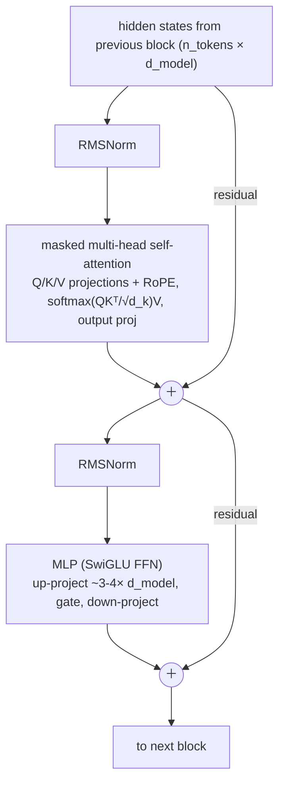

# 🧠 LLM & Transformer Fundamentals

This is the single most heavily tested topic in AI Engineer interviews: every frontier lab, big-tech AI team, and serious startup will probe whether you actually understand what happens inside the model you're building on, or whether you're just calling an API. Expect these questions at every level - screens use them to filter, onsites use them to calibrate depth, and system-design rounds assume this material as vocabulary. If you only have time to master one section of this repo, make it this one.

## Crash course

### The decoder-only transformer, top to bottom

Modern LLMs (GPT, Claude, Llama, Gemini, DeepSeek) are **decoder-only transformers**: a token embedding layer, a stack of N identical **decoder blocks**, a final norm, and an **LM head** (linear projection to vocab logits, often weight-tied to the embedding matrix). Each block does two things - mix information *across positions* (attention) and transform information *at each position* (MLP) - with residual connections around both:



Key design points interviewers probe:

- **Pre-norm vs post-norm.** The 2017 original applied LayerNorm *after* the residual add (post-norm); it trains poorly at depth without careful warmup because gradients must pass through every norm. Modern LLMs use **pre-norm** (norm inside the residual branch, before the sublayer): the residual stream is a clean identity path, gradients flow unimpeded, training is stable at 100+ layers.
- **RMSNorm** (used in Llama-family and most modern models) drops LayerNorm's mean-centring and bias - just rescale by the root-mean-square. Cheaper, equally effective.
- **The residual stream is the model's workspace**: attention and MLPs read from it, write updates into it. This framing (from interpretability work) makes many architecture questions easy to reason about.

### Self-attention in one screen

Each token emits a **query** ("what am I looking for?"), a **key** ("what do I contain?"), and a **value** ("what do I contribute?"). Attention scores are scaled dot products of queries with keys; a row-wise softmax turns them into weights over values.

```python
import numpy as np

def causal_self_attention(X, Wq, Wk, Wv):
    Q, K, V = X @ Wq, X @ Wk, X @ Wv          # each (n, d_k)
    scores = Q @ K.T / np.sqrt(K.shape[-1])    # (n, n); scale keeps softmax un-saturated
    mask = np.triu(np.ones_like(scores, dtype=bool), k=1)
    scores[mask] = -np.inf                     # causal: position i can't see j > i
    w = np.exp(scores - scores.max(-1, keepdims=True))
    w /= w.sum(-1, keepdims=True)              # row-wise softmax
    return w @ V                               # (n, d_k) weighted mix of values
```

- **Why √d_k?** Dot products of random d_k-dim vectors have variance ~d_k. Unscaled, large logits saturate the softmax into a near one-hot, gradients vanish, training destabilises. Dividing by √d_k keeps logit variance ~1.
- **Causal mask** = upper-triangular −∞ before softmax. It's what lets one forward pass over a training sequence produce a next-token prediction loss at *every* position.

### Heads: MHA → MQA → GQA

**Multi-head attention** splits d_model into h heads (e.g. 32 heads × 128 dims), each with its own Q/K/V projections, run in parallel and concatenated. Multiple heads let the model attend to different relations simultaneously (syntax here, coreference there) - one big head would average them into mush. Same total FLOPs as one full-width head.

The pressure that reshaped attention is the **KV cache** (below): its size scales with the number of KV heads.

- **MQA (multi-query)**: all query heads share *one* K/V head → cache shrinks ~h×, some quality loss.
- **GQA (grouped-query)**: groups of query heads share a KV head (e.g. 64 query heads, 8 KV heads) → ~8× cache reduction at near-MHA quality. The modern default (Llama 2/3 70B, Mistral, most 2024+ models). DeepSeek's MLA goes further by low-rank-compressing the KV cache.

### KV cache

During autoregressive generation, every past token's K and V vectors per layer are reused at each step. Caching them turns per-token cost from O(n²) recompute into O(n) lookups - this is why generation is feasible at all. What you pay is memory:

```
KV bytes per token = 2 (K and V) × n_layers × n_kv_heads × head_dim × bytes_per_elem
```

Example, a Llama-3-70B-shaped model (80 layers, 8 KV heads via GQA, head_dim 128, fp16): 2 × 80 × 8 × 128 × 2 ≈ **320 KB/token** → ~40 GB for a single 128k-token sequence. With full MHA (64 KV heads) it would be 8× that. This is why GQA, MLA, cache quantization, and paged allocation (vLLM's PagedAttention) exist, and why long-context serving is a memory problem, not a FLOPs problem.

### Attention cost and FlashAttention

Attention computes an n×n score matrix: **O(n²) time and (naively) memory** in sequence length. Consequences: prefill cost grows quadratically with prompt length; long-context serving is dominated by KV cache memory bandwidth at decode time.

**FlashAttention** doesn't approximate anything - it's an **IO-aware exact** implementation. Insight: on a GPU, attention is bottlenecked by reads/writes to HBM, not FLOPs. So: **tile** Q/K/V into blocks that fit in on-chip SRAM, compute attention block-by-block with an **online (streaming) softmax** that maintains running max and normalizer, and **never materialise the n×n matrix** (recompute it in the backward pass). Result: exact attention with O(n) memory and large wall-clock speedups. It's standard in every serving stack.

### Positional information

Attention is permutation-invariant - position must be injected.

- **Sinusoidal** (original transformer): fixed sin/cos of geometrically spaced frequencies added to embeddings. No learned params.
- **Learned absolute** (GPT-2, BERT): an embedding per position index. Simple, but hard-capped at trained length.
- **RoPE** (rotary, the modern default - Llama, Qwen, most open models): instead of adding position vectors, *rotate* each 2D pair of Q/K dimensions by an angle proportional to position, with per-pair frequencies. The dot product between a query at position m and key at position n then depends only on **m − n**: relative position, encoded multiplicatively, no extra params.
- **ALiBi**: no position embeddings at all; add a linear penalty −slope·|i−j| to attention scores (per-head slopes). Biases toward recency, extrapolates to longer sequences than trained.
- **Context extension**: naively running RoPE past trained length fails (unseen rotation angles). **Position interpolation** rescales positions to fit inside the trained range plus a short fine-tune; **YaRN** interpolates frequency bands unevenly (preserve high-frequency/local resolution, interpolate low-frequency) with an attention-temperature tweak - much less fine-tuning needed. This is how 8k-trained models became 128k+ models.

### Tokenization

Models see **token IDs**, not characters. Subwords are the compromise between word-level (huge vocab, OOV problem) and character-level (sequences too long, O(n²) attention makes that expensive).

- **BPE**: start from bytes/characters, repeatedly merge the most frequent adjacent pair into a new token until vocab size is reached. Merges are learned once; at inference they're applied deterministically.
- **Byte-level BPE** (GPT-2 onward): base alphabet is 256 bytes → *no* out-of-vocabulary strings, ever.
- **WordPiece** (BERT): like BPE but merges the pair that maximises training-data likelihood, not raw frequency.
- **SentencePiece**: a library (implementing BPE or unigram-LM) that treats raw text as a stream - spaces become a meta-symbol (▁) - so it's language-agnostic and needs no pre-tokenization; standard for multilingual/open models.

**Why classic failures are tokenizer failures:** "strawberry" is one or two tokens - the model never sees its letters, so counting r's requires memorised spelling knowledge, not perception. Arithmetic suffers because numbers chunk inconsistently ("1234" vs "12"+"34"). Non-Latin-script languages fragment into many more tokens per sentence → higher cost, less effective context, worse quality. Code models depend on whitespace-run tokens for indentation. **Vocab size tradeoff**: bigger vocab (Llama 2's 32k → Llama 3's 128k → ~200k in GPT-4o's tokenizer) = fewer tokens per text (cheaper, longer effective context) but a larger embedding matrix and rarer, under-trained tail tokens (glitch-token failure modes).

### Architectures and objectives

- **Encoder-only** (BERT): bidirectional attention, **masked-LM** objective. Great at understanding/embedding/classification; can't generate. Lives on in embedding & reranker models.
- **Decoder-only** (GPT/Llama/Claude): causal attention, **next-token prediction**. Every position yields a training signal, generation is native, and one architecture scales to everything - which is why it won.
- **Encoder-decoder** (T5, and speech/translation models like Whisper): encoder reads input bidirectionally, decoder generates with cross-attention. Still strong for fixed input→output transforms.

### The training pipeline

1. **Pretraining**: next-token prediction on trillions of tokens of web/code/books data. Produces a raw completion model - capable, not steerable.
2. **Mid-training / continued pretraining**: high-quality curated data, domain injection (code, math), context-length extension, data-mix annealing toward instruction-like formats.
3. **SFT**: supervised fine-tuning on (prompt, response) demonstrations → follows instructions, adopts chat format.
4. **RL from feedback**: RLHF with a learned reward model (PPO), or direct methods (**DPO**), or RL on *verifiable* rewards (**RLVR/GRPO** - math answers, passing tests) which is what trains reasoning models. Aligns behaviour with preferences and sharpens capabilities SFT can't reach.

### Scaling laws

**Kaplan et al. (2020)**: loss falls as a power law in compute; implied you should grow *parameters* much faster than data. **Chinchilla (Hoffmann et al., 2022)** corrected this: compute-optimal training scales params and tokens roughly equally, ~**20 tokens per parameter** (Chinchilla-70B on 1.4T tokens beat Gopher-280B on 300B). But compute-optimal ≠ deployment-optimal: **training cost is paid once, inference forever**, so modern models train far past Chinchilla (Llama 3 8B saw ~15T tokens ≈ ~1,900 tokens/param) to buy a smaller, cheaper-to-serve model at the same quality. **Emergent abilities** (sharp capability jumps with scale) are partly a measurement artifact - the "mirage" critique shows smooth improvement under continuous metrics - but the practical experience of thresholds remains real for discontinuous tasks.

### Mixture-of-Experts (MoE)

Replace each MLP with E expert MLPs plus a learned **router** that sends each token to the top-k experts (e.g. Mixtral: 8 experts, top-2, ~47B total / ~13B active params; DeepSeek-V3: 671B total / ~37B active). You buy **more capacity per FLOP**: quality of a much larger dense model at a fraction of the compute per token. Costs: routing must be **load-balanced** (auxiliary losses, router z-loss) or experts collapse; training is less stable; and at inference **all experts must sit in memory** - you pay memory for total params, FLOPs for active params, so MoE favours large, batched, memory-rich serving over single-GPU deployment.

### Decoding & sampling

The model outputs logits z; sampling shapes them. **Temperature** rescales before softmax: p_i = exp(z_i/T) / Σ_j exp(z_j/T). T→0 is greedy (argmax); T>1 flattens. **Top-k** keeps the k highest tokens; **top-p (nucleus)** keeps the smallest set with cumulative probability ≥ p (adapts to confidence); **min-p** keeps tokens with p ≥ min_p × p_max (adapts even better at high temperature). **Repetition/frequency/presence penalties** damp loops. **Beam search** maximises sequence likelihood - good for translation/ASR, degenerate (repetitive, bland) for open-ended generation. **Logprobs** from the API are your tool for confidence scoring, classification, perplexity evals, and hallucination heuristics.

### Long context, hallucination, reasoning models

- **Long context ≠ retrieval.** "Lost in the middle": accuracy on facts placed mid-context is systematically worse than at the start/end. A 1M-token window is not a database; RAG and context curation still matter.
- **Hallucination** is structural: the objective rewards plausible next tokens, not truth, and standard training/evals reward guessing over calibrated abstention. Mitigations: grounding (RAG + citations), tool use, abstention training, logprob/self-consistency confidence signals, verification layers - reduction, not elimination.
- **Reasoning models** (o1/R1-style) are trained with RL on verifiable rewards to emit long chains of thought, converting **test-time compute** into accuracy on math/code/planning. Tradeoff: 10-100× more output tokens, higher latency and cost. Use them for hard multi-step problems; use standard models for extraction, classification, and latency-sensitive paths. **Distillation** (training a small model on a large model's outputs or logits) is how reasoning behaviour gets compressed into cheap models.

## Interview questions

**[questions.md](questions.md)** - 41 questions with answers: 13 basic, 16 intermediate, 12 advanced.

## Red flags interviewers watch for

- Can't write or even sketch scaled dot-product attention, or hand-waves Q/K/V as "magic vectors" with no functional story of what each does.
- Says the √d_k division is "for normalization" without connecting it to softmax saturation and gradient flow.
- Believes FlashAttention is an approximation or "sparse attention" - it's exact; the win is IO, not fewer FLOPs.
- Explains the KV cache but can't estimate its size, or doesn't know why GQA/MQA exist - a sign of never having thought about serving.
- Blames "strawberry"-style failures on model stupidity rather than tokenization; more broadly, has never looked at how text actually tokenizes.
- Quotes "Chinchilla-optimal = 20 tokens/param" as a law for what to do, missing that inference economics push training far beyond it.
- Thinks a bigger context window removes the need for retrieval, or that advertised context length equals usable recall.
- Reaches for a reasoning model (or high temperature, or beam search) reflexively without articulating the cost/latency/quality tradeoff.

## Further reading

- [Attention Is All You Need (Vaswani et al., 2017)](https://arxiv.org/abs/1706.03762) - the original transformer paper.
- [The Illustrated Transformer (Jay Alammar)](https://jalammar.github.io/illustrated-transformer/) - the classic visual walkthrough.
- [Let's build GPT: from scratch, in code (Andrej Karpathy)](https://www.youtube.com/watch?v=kCc8FmEb1nY) - build a decoder-only transformer end to end.
- [FlashAttention: Fast and Memory-Efficient Exact Attention with IO-Awareness (Dao et al., 2022)](https://arxiv.org/abs/2205.14135)
- [RoFormer: Enhanced Transformer with Rotary Position Embedding (Su et al., 2021)](https://arxiv.org/abs/2104.09864) - RoPE.
- [Training Compute-Optimal Large Language Models (Hoffmann et al., 2022)](https://arxiv.org/abs/2203.15556) - Chinchilla.
- [Lost in the Middle: How Language Models Use Long Contexts (Liu et al., 2023)](https://arxiv.org/abs/2307.03172)
- [Are Emergent Abilities of Large Language Models a Mirage? (Schaeffer et al., 2023)](https://arxiv.org/abs/2304.15004)
