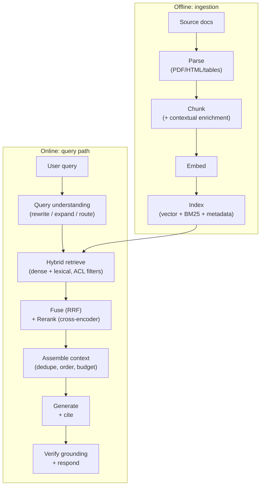

# 🔎 RAG & Retrieval

RAG is the most common LLM system that companies actually ship, so it shows up in almost every AI Engineer interview loop - as conceptual questions, as a system-design round ("build search over our docs"), and as debugging scenarios ("retrieval quality dropped, go"). Expect it whether you're interviewing at a frontier lab, a big-tech applied AI team, or a startup whose whole product is RAG; interviewers use it to separate people who have shipped retrieval systems from people who have only read about them.

## Crash course

### When RAG vs long-context vs fine-tuning

This is the classic opener. The decision axes:

| Axis | RAG | Long context | Fine-tuning |
|---|---|---|---|
| **Freshness** | Update index in minutes | Re-send docs every call | Retrain to update |
| **Corpus size** | Effectively unbounded | Bounded by window (~1M tokens ≈ a few thousand pages) | Baked into weights, lossy |
| **Cost per query** | Retrieve top-k, pay for ~2-10k context tokens | Pay for the whole corpus per call (caching helps but doesn't eliminate it) | Cheap at inference, expensive to train/maintain |
| **Attribution** | Natural - cite retrieved chunks | Possible but weaker | None - can't cite weights |
| **Access control** | Filter at retrieval time | Must pre-filter what you stuff in | Impossible per-user |
| **Best for** | Large/changing/permissioned knowledge | Small stable corpus, whole-document reasoning | Style, format, domain *behaviour* (not facts) |

Rule of thumb: **fine-tuning teaches skills and style; RAG supplies knowledge; long context is RAG's competitor only when the corpus fits and rarely changes.** They compose: many production systems fine-tune a small model *and* use RAG *and* exploit long context for the retrieved set.

### Pipeline anatomy



Interviewers want you to know **every stage is a failure point** and to name where quality is usually lost: parsing and chunking (offline) and retrieval recall (online) - almost never the vector DB choice.

### Parsing: the unglamorous bottleneck

Real corpora are PDFs with multi-column layouts, scanned pages, tables that turn to soup, headers/footers polluting every chunk. If parsing mangles a table, nothing downstream can recover. Modern practice: layout-aware parsers or VLM-based parsing (render page → vision model → markdown), tables extracted to markdown/HTML with a text summary embedded alongside. Budget more engineering time here than for anything else.

### Chunking

- **Fixed-size**: split every N tokens. Simple, breaks sentences mid-thought.
- **Recursive**: split on paragraphs → sentences → tokens until under limit. The sane default.
- **Structure-aware**: split on markdown headers / HTML sections; attach the heading path (`Doc > Section > Subsection`) to each chunk. Best when structure exists.
- **Semantic**: split where embedding similarity between adjacent sentences drops. Marginal gains, real cost.
- **Late chunking**: embed the *whole* document with a long-context embedder, then pool token embeddings per chunk - each chunk's vector sees full-document context.

Typical numbers: **256-1024 tokens per chunk, 10-20% overlap**. Small chunks → precise retrieval, fragmented context; large chunks → more context, diluted embeddings. Decouple when needed: retrieve small, return the parent ("small-to-big" / parent-document retrieval).

**Contextual retrieval** (popularized by Anthropic): before embedding, prepend a short LLM-generated blurb situating the chunk in its document ("This chunk is from ACME's Q2 filing, discussing..."). Fixes the "chunk says 'the company' - which company?" problem. Anthropic reported it cut top-20 retrieval failures by ~49% combined with contextual BM25, ~67% with reranking added. Cost is one cheap LLM call per chunk at index time - prompt caching makes it affordable.

### Embeddings

A **bi-encoder** embeds query and documents *independently* into one vector space; relevance ≈ cosine similarity. That independence is what makes pre-computation and ANN search possible - and what caps quality (no token-level interaction).

- **MTEB** is the standard embedding benchmark - useful for shortlisting, but it's public (training-data contamination is rampant) and your domain isn't in it. Always eval top candidates on your own retrieval set.
- **Dimensionality**: more dims → better quality, linearly more RAM and slower search. **Matryoshka embeddings** are trained so prefixes of the vector are themselves valid embeddings - truncate 3072→256 dims for cheap first-pass search, refine with full vectors (e.g., OpenAI's `text-embedding-3` `dimensions` parameter).
- **Fine-tuning embedders** (contrastive training on your query→doc pairs, often mined from logs) is one of the highest-ROI moves for jargon-heavy domains.

### Vector search: exact vs ANN

Exact (brute-force) search is fine to ~1M vectors - it's a matrix multiply. Beyond that, **ANN**:

- **HNSW**: multi-layer navigable-small-world graph; greedy search descends from sparse top layers to a dense bottom layer. `M` = edges per node (memory vs recall), `ef_search` = candidate beam width (recall vs latency, tune at query time), `ef_construction` = build-time quality. Great recall/latency, memory-hungry, everything in RAM.
- **IVF**: cluster vectors into cells; probe only the closest `nprobe` cells. Cheaper to build, needs training, recall suffers at cell boundaries.
- **Product quantization (PQ)**: compress vectors into subspace-codebook codes - 10-50× memory savings, lossy; usually paired with IVF or used with reranking on exact vectors.

Tradeoff triangle: **recall / latency / memory - pick two.** Report recall@k against exact search when tuning.

**Metadata filtering** breaks naive ANN: post-filtering can leave you with 3 of the requested 50 results after the filter; pre-filtering restricted to a rare tenant makes graph traversal degenerate. Good engines do *filter-aware* traversal; know that this is a hard problem and a real vendor differentiator.

**Vector DB selection**: "use pgvector until it hurts" - your data is already in Postgres, joins/filters/transactions work, one system to operate. It hurts at very large scale (~50-100M+ vectors), heavy filtered-ANN workloads, or when you need built-in hybrid search - then dedicated stores (Qdrant, Milvus, Weaviate, Vespa, Turbopuffer) or search engines (Elasticsearch/OpenSearch - best when you already run them and need mature BM25 + faceting).

### Hybrid search & fusion

Dense retrieval fails embarrassingly on **exact-match content: IDs, SKUs, error codes, names, fresh jargon the embedder never saw**. BM25 nails those. Run both, fuse with **Reciprocal Rank Fusion**:

```python
def rrf(rankings: list[list[str]], k: int = 60) -> dict[str, float]:
    scores = {}
    for ranking in rankings:
        for rank, doc_id in enumerate(ranking, start=1):
            scores[doc_id] = scores.get(doc_id, 0) + 1.0 / (k + rank)
    return scores  # sort desc
```

RRF uses *ranks*, not scores - BM25 scores and cosine similarities live on incomparable scales, so score mixing needs fragile normalization while rank fusion just works.

### Reranking

- **Bi-encoder** (first stage): query and doc encoded separately. Fast, scalable, shallow.
- **Cross-encoder** (reranker): query and doc concatenated through one transformer with full attention. Much more accurate, but O(candidates) forward passes - only feasible on the top ~50-200.
- **Late interaction (ColBERT)**: per-token embeddings, MaxSim at query time - a middle point: pre-computable like a bi-encoder, token-level matching like a cross-encoder, at ~10-100× storage cost.

Standard recipe: **hybrid retrieve top 100-200 → cross-encoder rerank → keep top 5-20.** Adds ~50-300ms and is usually the single best quality/effort tradeoff after fixing chunking.

### Query understanding

- **Rewriting**: strip conversational fluff; in multi-turn chat, rewrite "what about the pro plan?" into a standalone query using history (non-negotiable for conversational RAG).
- **Multi-query expansion**: generate 3-5 paraphrases, retrieve for all, RRF-fuse.
- **HyDE**: have the LLM hallucinate a hypothetical answer, embed *that* - answers embed closer to documents than questions do.
- **Decomposition**: split multi-hop questions into sub-queries.
- **Routing**: classify which corpus/index/tool a query needs before searching.

### Beyond single-shot: agentic RAG and GraphRAG

**Agentic RAG** = retrieval exposed as a tool the model calls in a loop: search → read → refine query → search again. Wins on multi-hop and exploratory questions; costs latency and tokens. Single-shot remains right for high-QPS, low-latency products. **GraphRAG** builds an entity/relationship graph (and community summaries) at index time - worth the significant indexing cost when questions are relational or global ("summarise themes across the corpus"), not for plain factoid lookup.

### Security: ACLs and multi-tenancy

**Enforce permissions in the retrieval filter, never via the LLM.** The model has no notion of authorization; anything in its context can be exfiltrated by prompt injection. Attach tenant/ACL metadata to every chunk, filter at query time with the *caller's* verified identity, and treat "the system prompt tells the model not to reveal other tenants' data" as an automatic interview fail.

### Evaluation & debugging

Two layers, measured separately:

- **Retrieval**: recall@k (did the gold chunk make top-k - the metric that gates everything), MRR (first relevant rank), nDCG (graded relevance across the list). Cheap, deterministic, run on every change.
- **Generation**: faithfulness (is every claim supported by retrieved context?), answer relevance, citation correctness - typically LLM-as-judge, RAGAS-style.

Build a **golden set** (even 50-100 real queries with labelled relevant chunks) from production logs; synthetic query generation over your corpus bootstraps it. **Triage rule**: for any bad answer, first check *was the right chunk retrieved?* If no → retrieval miss (fix chunking/embedding/query understanding). If yes → generation miss (fix prompt, ordering, model). Most "hallucination" bugs are retrieval misses wearing a costume.

### Latency, cost, caching

Typical online budget: query embed ~10-50ms, ANN search ~5-50ms, rerank ~50-300ms, **LLM generation 1-10s (dominates both latency and cost)**. So optimise generation first: smaller model, fewer/shorter chunks, streaming, prompt caching (static system prompt + stable context prefix), semantic caching of full answers for repeated queries (mind ACLs and freshness on cache hits!), and embedding caches at ingest.

## Interview questions

See [questions.md](questions.md) - 36 questions with detailed answers, from basics to production war stories.

## Red flags interviewers watch for

- Jumping straight to "which vector DB" while ignoring parsing and chunking - signals no production experience, since that's where quality is actually lost.
- Treating cosine similarity scores as calibrated relevance probabilities, or fusing BM25 and dense scores by raw addition.
- No triage method: can't articulate how to tell a retrieval miss from a generation miss when shown a bad answer.
- Proposing that the LLM enforce document permissions ("the prompt tells it not to show other users' data") - an instant security fail.
- Never mentioning hybrid/lexical search; unaware that dense retrieval whiffs on IDs, error codes, and exact phrases.
- Quoting MTEB rank as the whole embedding-selection story, with no plan for domain-specific evaluation.
- "We'll evaluate it by eyeballing outputs" - no golden set, no recall@k, no separation of retrieval vs generation metrics.
- Reciting the 2023 LangChain tutorial pipeline with no awareness of contextual retrieval, reranking, agentic retrieval, or the long-context tradeoff.

## Further reading

- [Retrieval-Augmented Generation for Knowledge-Intensive NLP Tasks](https://arxiv.org/abs/2005.11401) - Lewis et al., the original RAG paper.
- [Introducing Contextual Retrieval](https://www.anthropic.com/news/contextual-retrieval) - Anthropic's write-up on contextual embeddings + contextual BM25, with failure-rate numbers.
- [Efficient and robust approximate nearest neighbor search using Hierarchical Navigable Small World graphs](https://arxiv.org/abs/1603.09320) - Malkov & Yashunin, the HNSW paper.
- [ColBERT: Efficient and Effective Passage Search via Contextualized Late Interaction](https://arxiv.org/abs/2004.12832) - Khattab & Zaharia.
- [Precise Zero-Shot Dense Retrieval without Relevance Labels](https://arxiv.org/abs/2212.10496) - the HyDE paper.
- [MTEB: Massive Text Embedding Benchmark](https://arxiv.org/abs/2210.07316) - Muennighoff et al.
- [From Local to Global: A Graph RAG Approach to Query-Focused Summarization](https://arxiv.org/abs/2404.16130) - Microsoft's GraphRAG paper.
- [Lost in the Middle: How Language Models Use Long Contexts](https://arxiv.org/abs/2307.03172) - why context position matters when you assemble retrieved chunks.
