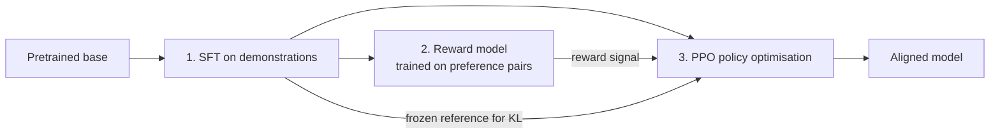

# Fine-tuning, RLHF & Alignment - Interview Questions

36 questions: 10 basic, 14 intermediate, 12 advanced.

## Basic

### 1. When would you fine-tune a model instead of using prompting or RAG?

<details><summary><b>Answer</b></summary>

Fine-tune for *behaviour*, RAG for *knowledge*, prompting first for everything. The escalation path is: prompt engineering (hours, ~free) → RAG (days, adds fresh/private knowledge with citations) → fine-tuning (weeks, changes what the model *is*).

Fine-tuning wins when you need:

- **Form/style/format**: a consistent brand voice, a strict JSON schema, a house SQL dialect - things that are tedious and fragile to specify in a prompt.
- **Latency/cost**: a tuned 8B model replacing a frontier API model on a narrow task, or eliminating a 2,000-token few-shot system prompt you pay for on every call.
- **Narrow skill**: classification, extraction, routing - tasks where a small specialised model beats a large general one.
- **Behaviour you can't prompt into existence**: reliable tool-call formatting, refusal policy, a persona that survives long conversations.

RAG wins when the requirement is factual: proprietary documents, data that changes daily, anything needing attribution. Fine-tuning is a poor knowledge store - SFT on facts gives unreliable recall, no citations, and the knowledge goes stale the moment the world changes.

The nuance interviewers listen for: these are **complements, not competitors**. A common production pattern is RAG for facts plus a fine-tuned model that is better at *using* retrieved context (grounding, citing, declining when context is insufficient). Also: if the domain *language itself* is foreign to the model (legal, genomics), you may need continued pretraining, not just SFT. And always establish a prompted baseline plus an eval set *before* fine-tuning - otherwise you can't prove the fine-tune paid for itself.

**Follow-ups:** Your PM says "fine-tune it on our docs so it knows our product" - how do you respond? What eval would you build before deciding? When would you do both RAG *and* fine-tuning?

</details>

### 2. What actually happens during supervised fine-tuning? What role do chat templates and special tokens play?

<details><summary><b>Answer</b></summary>

SFT is just continued next-token prediction (cross-entropy loss) on curated (prompt, response) examples - same objective as pretraining, different data. What makes it "instruction tuning" is that examples are rendered through a **chat template**: the exact special-token markup separating roles and turns that the model's original post-training used, e.g. ChatML-style `<|im_start|>user ... <|im_end|>` or Llama-style headers.

```python
messages = [
    {"role": "system", "content": "You are a support agent."},
    {"role": "user", "content": "Reset my password"},
    {"role": "assistant", "content": "Sure - here's how..."},
]
text = tokenizer.apply_chat_template(messages, tokenize=False)
```

Why it matters: those special tokens are load-bearing. The model learned that `<|im_end|>` (or an EOS/EOT token) means "stop generating," and that content after the assistant header is its own voice. Two classic failure modes:

1. **Template mismatch** - training with one template and serving with another (or with a raw string). The model rambles, ignores the system prompt, or never emits EOS. This is the most common silent bug in fine-tuning.
2. **EOS handling** - forgetting to append the end-of-turn token to training targets, producing a model that can't stop; or letting the tokenizer split special tokens into pieces instead of mapping them to their reserved IDs.

If you add *new* special tokens (e.g. tool-call delimiters), you must resize embeddings and expect to train them - freshly initialized rows are random, which is one reason to prefer the model's existing reserved tokens.

Strong candidates mention that the base-vs-instruct choice matters: fine-tuning an instruct model means conforming to its existing template; fine-tuning a base model means you define the template but must teach all chat behaviour yourself.

**Follow-ups:** Your fine-tuned model never stops generating - top three suspects? Why can training a base vs. an instruct checkpoint give different results on the same data?

</details>

### 3. What is loss masking in SFT, and why do you mask the prompt tokens?

<details><summary><b>Answer</b></summary>

Loss masking means computing the cross-entropy loss only over the tokens you want the model to learn to *produce* - the assistant response - while excluding prompt/system/user tokens from the loss. Mechanically, you set the label for masked positions to `-100`, which PyTorch's `cross_entropy` ignores:

```python
labels = input_ids.clone()
labels[:prompt_len] = -100          # no loss on prompt tokens
# in multi-turn data: mask everything except assistant spans
```

Why: without masking, gradient signal is dominated by whatever fills your prompts. The model spends capacity learning to predict user questions, document chunks, and boilerplate system prompts - none of which it will ever need to generate. Consequences of skipping it:

- **Wasted capacity and distribution shift** - with long prompts and short answers (typical for RAG-style or extraction data), 90%+ of the loss can come from prompt tokens.
- **Prompt regurgitation** - the model learns to echo instructions or context into its output.
- **Weaker instruction following** - the response tokens, the thing you actually care about, get proportionally less gradient.

Nuances a senior candidate adds: (1) In **multi-turn** data you mask everything except assistant turns - including *earlier* assistant turns is a deliberate choice (train on all turns vs. last turn only). (2) It's not always binary: for **continued pretraining** you don't mask at all, and some recipes train on prompts with a small weight when data is scarce. (3) When **packing** multiple examples into one sequence, masking must be per-example and you must prevent cross-example attention. (4) Attention masks and loss masks are different things - prompt tokens are still *attended to*; they just don't contribute loss.

**Follow-ups:** How would you verify masking is correct before launching a run? In a multi-turn dataset, would you train on all assistant turns or only the final one - what's the tradeoff?

</details>

### 4. How much data do you need to fine-tune a model? Quality vs. quantity?

<details><summary><b>Answer</b></summary>

Far less than most people assume, and quality dominates. For style/format/persona tasks, a few hundred to a few thousand excellent examples typically suffice; narrow classification/extraction tasks might use 1k - 10k; the LIMA result is the canonical citation - ~1,000 meticulously curated, diverse examples aligned a 65B base model to a level competitive with much more heavily tuned baselines. The intuition: the model already *knows* almost everything from pretraining; SFT mostly teaches it *which subdistribution of its knowledge to surface and in what format*. That's a low-complexity function that doesn't need millions of examples.

Where quantity does matter: injecting genuinely new capabilities (a new language, a proprietary DSL, long-horizon agentic behaviour) or continued pretraining for domain knowledge - those need orders of magnitude more tokens.

Practical curation checklist:

- **Deduplicate**: exact-match plus near-dup (MinHash or embedding similarity). Duplicates cause memorisation and inflate effective epochs on those examples.
- **Decontaminate**: check n-gram overlap against your eval sets, or your before/after numbers are fiction.
- **Diversity beats volume**: 1,000 examples covering the real input distribution beat 50,000 templated variations of ten patterns - templated data teaches the template, not the task.
- **Read your data**: manually inspect a random sample of a few hundred examples. Bad labels, truncated responses, and template bugs are found by eyeballs, not dashboards.
- **Filter hard**: an LLM judge or heuristics (length, formatting, refusals-by-accident) to drop the worst tail; a wrong label teaches the wrong behaviour with the same efficiency as a right one.

A useful rule: if adding more data isn't improving held-out metrics, your bottleneck is quality or diversity, not size.

**Follow-ups:** You have 100k scraped examples of mixed quality - what's your pipeline before training? How would you detect that near-duplicates are hurting you?

</details>

### 5. Full fine-tuning vs. parameter-efficient fine-tuning - how do you choose?

<details><summary><b>Answer</b></summary>

Default to PEFT (in practice, LoRA/QLoRA) unless you have a specific reason not to. Full fine-tuning updates all weights; PEFT freezes the base model and trains a small set of added parameters (~0.1-1% for LoRA).

**Why PEFT is the default:**

- **Memory**: full FT of a 7B model with Adam in mixed precision needs ~112 GB (16 bytes/param) before activations; LoRA needs optimizer states only for adapter params, and QLoRA fits 7B - 70B fine-tunes on one GPU.
- **Forgetting**: frozen base weights bound how far the model can drift, so general-capability regressions are milder.
- **Operational wins**: adapters are tens of MB - cheap to store, version, A/B test, and serve many-per-base-model (multi-LoRA serving). Full FT gives you a new 14+ GB artefact per variant.
- **Quality**: for most style/format/narrow-task fine-tunes, LoRA matches full FT within noise.

**When full fine-tuning earns its cost:**

- Large behavioral shifts or new capabilities - teaching substantial new domains, major distribution shifts, long agentic traces - where low-rank updates can underfit.
- Continued pretraining on billions of tokens (a low-rank update genuinely can't absorb that much).
- You're a lab doing the *main* post-training run for a model you own, with the fleet to match.
- Some RL fine-tuning setups, where you want full plasticity (though LoRA-based RL also works).

The decision inputs are: task delta from base behaviour, token budget, GPU budget, and how many variants you'll operate. A good closing line: "I'd run LoRA first as a strong cheap baseline; if it plateaus below target and data isn't the bottleneck, I'd escalate rank, then consider full FT."

**Follow-ups:** How would you detect that LoRA is underfitting versus the data being the problem? Your LoRA model matches full FT on the target task - any reason to still prefer full FT?

</details>

### 6. Explain how LoRA works - the math, and what `r` and `alpha` mean.

<details><summary><b>Answer</b></summary>

LoRA (Low-Rank Adaptation) freezes the pretrained weight matrix and learns a low-rank additive update. For a weight $W \in \mathbb{R}^{d \times k}$, the adapted forward pass is:

$$h = Wx + \frac{\alpha}{r}\,BAx, \qquad B \in \mathbb{R}^{d \times r},\; A \in \mathbb{R}^{r \times k},\; r \ll \min(d,k)$$

- **`r` (rank)** is the bottleneck dimension - the capacity of the update. Typical values: 8-64. The full update $BA$ has rank ≤ r, so instead of $d \times k$ trainable params per matrix you have $r(d+k)$. For a 4096×4096 projection with r=16: ~131k params vs ~16.8M - a ~128× reduction on that matrix.
- **`alpha`** is a scaling constant; the update is scaled by $\alpha/r$. This decouples the update's effective magnitude from the rank, so you can change `r` without retuning the learning rate. Common heuristics: $\alpha = r$ or $\alpha = 2r$. (rsLoRA scales by $\alpha/\sqrt{r}$ instead, which behaves better at high rank.)
- **Initialization**: A is random Gaussian, B is zeros - so $BA = 0$ at step 0 and training starts exactly at the base model. That detail matters: it's why LoRA training is stable from the first step.

The underlying hypothesis (from the paper) is that fine-tuning updates have low *intrinsic rank* - the weight delta needed for a downstream task lives in a low-dimensional subspace, which empirically holds for most adaptation tasks.

Two properties worth stating unprompted: (1) the memory win comes from not storing gradients/optimizer states for frozen weights - the base model still occupies memory for forward/backward; (2) after training you can **merge** $W' = W + \frac{\alpha}{r}BA$ into a single matrix, giving *zero* inference overhead - unmerged adapters cost a small extra matmul.

**Follow-ups:** Why initialize B to zero rather than both matrices randomly? If doubling r doesn't improve quality, what does that tell you? What breaks if alpha is way too large relative to r?

</details>

### 7. What is catastrophic forgetting in fine-tuning, and how do you mitigate it?

<details><summary><b>Answer</b></summary>

Catastrophic forgetting is when optimising on your narrow fine-tuning distribution degrades capabilities the model already had - general reasoning, instruction following, safety behaviour, other languages. Gradient descent has no loyalty to old skills: if your 5k customer-support examples never exercise math, the weights that support math are free ammunition for lowering support-ticket loss. Typical symptoms: MMLU-style scores drop several points, the model starts answering *everything* in your fine-tune's format, refuses less (or more) than before, or loses multilingual ability.

Mitigations, roughly in order of bang-for-buck:

1. **Train less aggressively**: lower learning rate, fewer epochs (1-2 rather than 5), early stopping on a *general* eval, not just task loss.
2. **Data mixing / replay**: blend ~5-25% general instruction data (or the original SFT distribution if you have it) into your task data so old behaviours keep receiving gradient. This is the single most effective lever in practice.
3. **Use PEFT**: LoRA's frozen base bounds drift; you can also lower `r`. Fully-recoverable too - drop the adapter and the base model is intact.
4. **Regularize toward the original model**: a KL penalty against the base model's outputs, or weight-space methods (e.g., averaging the fine-tuned and original weights, or constraining the update norm).
5. **Scope the deployment**: if the model only ever sees support tickets in production, some forgetting is acceptable - but you must *measure* it to make that call deliberately.

The key interview point: forgetting is invisible unless you evaluate for it. Run a before/after regression suite covering general capabilities, safety behaviour, and formatting - not just your task metric. A fine-tune that gains 10 points on your task and silently loses instruction following is a production incident waiting to happen.

**Follow-ups:** How would you choose the mixing ratio of general to task data? Your task metric improves but users report the model got "dumber" - what's your diagnostic plan?

</details>

### 8. What are the key hyperparameters for fine-tuning, and what are sensible starting values?

<details><summary><b>Answer</b></summary>

The ones that matter, in order:

**Learning rate** - the highest-leverage knob, and it differs by regime:
- Full fine-tuning: ~1e-5 to 5e-5 (often 1e-5-2e-5 for larger models). Too high and you get loss spikes and forgetting.
- LoRA/QLoRA: ~1e-4 to 2e-4 - roughly 10× higher, because you're training a small freshly-initialized subnetwork, not perturbing 7B tuned weights.

**Epochs**: 1-3 is the sweet spot for most SFT; small datasets sometimes tolerate up to ~5 with LoRA. More epochs on small data = memorisation. Watch held-out loss, not train loss.

**Schedule and warmup**: cosine or linear decay with ~3% (up to 10%) warmup steps. Warmup matters because Adam's second-moment estimates are garbage early; skipping it causes early loss spikes.

**Effective batch size**: 16-128 sequences typically, achieved via per-device batch × gradient accumulation × data parallelism. Larger batches stabilise gradients but flatten per-step learning; if you change batch size significantly, revisit LR.

**Sequence length and packing**: set max length to cover your real data (check the token-length histogram - don't truncate 20% of your responses silently). **Packing** concatenates multiple short examples into one sequence to avoid wasting compute on padding - big throughput win for short-example datasets, but requires correct per-example loss masking and (ideally) block-diagonal attention so examples don't attend to each other.

**LoRA-specific**: r (8-64), alpha (≈ r or 2r), dropout (0-0.1), target modules (all attention projections; add MLP for more capacity).

**What I'd actually do**: take the framework defaults (TRL/Axolotl are sane), sweep LR over 3 values on a subset, train 1-2 epochs, and pick by held-out eval - not train loss. Hyperparameter heroics matter far less than data quality.

**Follow-ups:** Why do LoRA runs tolerate ~10× higher LR than full fine-tuning? Your loss curve has a spike at step 50 and never recovers - what do you check?

</details>

### 9. How do you tell that a fine-tune is overfitting? What are the signals?

<details><summary><b>Answer</b></summary>

The headline signal is divergence between train and held-out loss: train loss keeps falling while eval loss flattens or rises. But loss curves are only the start - LLM overfitting shows up behaviorally:

- **Regurgitation**: the model reproduces training examples near-verbatim, or answers paraphrased training prompts with memorised responses. Easy to test: paraphrase training inputs and measure output similarity to training targets.
- **Diversity collapse**: outputs converge to a few stereotyped openings, phrasings, or lengths regardless of input. Sample the same prompt at temperature ~1 several times - if all completions are near-identical where the base model varied, you've overfit style.
- **Template overgeneralization**: the model forces every input into the fine-tune's format - asked a casual question, it responds with your JSON schema or support-ticket structure.
- **Brittleness off-distribution**: strong on inputs resembling training data, sharply worse on slight rephrasings or edge cases - the model learned surface patterns rather than the task.
- **General-capability regressions**: benchmark drops (this overlaps with catastrophic forgetting; on small datasets they arrive together).

Root causes are usually: too many epochs on too little data, duplicated examples (which are secretly extra epochs on those points), too-high LR, or low data diversity.

Fixes: fewer epochs / earlier stopping keyed on *held-out* metrics, dedup, more diverse data, lower LR, LoRA dropout or lower rank, and mixing in general data. One subtlety worth saying: for narrow production tasks, mild "overfitting" to the task distribution is sometimes exactly what you want - the question is whether performance on the *deployment* distribution (including its tail) degrades, which is why your held-out set must reflect real traffic, not a random slice of your curated training file.

**Follow-ups:** Your eval loss rises after epoch 1 but human raters prefer the epoch-3 checkpoint - which do you ship and why? How do duplicated training examples masquerade as extra epochs?

</details>

### 10. Walk me through the classic RLHF pipeline end to end.

<details><summary><b>Answer</b></summary>

The InstructGPT recipe, three stages after pretraining:



**Stage 1 - SFT**: fine-tune the base model on high-quality demonstrations (human-written or curated) so it can follow instructions at all. This is the initialization for everything downstream; RL can't fix a policy that never samples good behaviour.

**Stage 2 - Reward model**: collect *preference data* - sample two or more responses per prompt from the SFT model, have humans rank them (pairwise comparison is used because it's far more reliable than absolute scoring; annotators agree more on "A > B" than on "A is a 7/10"). Train an RM - usually the SFT model with a scalar head - with the Bradley - Terry loss: $-\log\sigma(r(x, y_w) - r(x, y_l))$, pushing the chosen response's score above the rejected one's.

**Stage 3 - PPO**: the SFT model becomes the policy. Sample responses to prompts, score them with the RM, and update the policy with PPO to increase expected reward - with a **KL penalty against the frozen SFT (reference) model** so the policy can't wander into degenerate text that happens to fool the RM. The effective objective is roughly $\mathbb{E}[r(x,y)] - \beta\,\mathrm{KL}(\pi \| \pi_{ref})$.

Why RL at all, instead of more SFT? Preferences encode *relative* quality on the model's own outputs - signal you can't easily express as demonstrations - and it's much cheaper for humans to rank than to write. The known failure mode is **reward hacking**: the RM is an imperfect proxy, and unconstrained optimisation exploits its blind spots (length bias, sycophancy), which is exactly what the KL term and fresh preference data are there to contain.

**Follow-ups:** Why pairwise preferences instead of absolute ratings? What breaks if you skip SFT and run PPO on the base model? Where does DPO short-circuit this pipeline?

</details>

## Intermediate

### 11. Which modules do you target with LoRA, how do you pick the rank, and what are the actual memory savings?

<details><summary><b>Answer</b></summary>

**Modules**: the original paper adapted only q and v projections, but current practice is to target **all attention projections (q, k, v, o) plus the MLP matrices (gate/up/down)** - at fixed trainable-parameter budget, covering more modules at lower rank generally beats high rank on few modules (this is also QLoRA's finding: adapting all linear layers was needed to match full fine-tuning). Embeddings and the LM head are usually left frozen unless you've added new tokens.

**Rank**: r=8-16 for style/format/persona; r=32-64 for harder behavioral shifts or more capable task learning; beyond 64 you hit diminishing returns for most SFT tasks - if r=64 still underfits, the problem is usually data or the low-rank assumption itself (consider full FT). Practical method: start r=16, alpha=32; if held-out quality plateaus below target and more/better data doesn't move it, double r and compare.

**Memory math** (7B-class model, hidden 4096, 32 layers, all-linear targeting at r=16): adapter params come to roughly ~40M - ~0.6% of the model. The savings:

- Full FT with Adam, mixed precision: ~16 bytes/param → ~112 GB for weights+grads+optimizer states.
- LoRA: frozen base in bf16 ~14 GB (no grads, no optimizer states) + adapters ~40M params with grads and fp32 Adam states → well under 1 GB. Total ~15 GB + activations → fits a 24 GB GPU with gradient checkpointing.
- QLoRA: base in NF4 ~3.5-4 GB → 7B fine-tunes fit consumer cards.

Two caveats that show real experience: activations still scale with batch × sequence length regardless of LoRA (checkpointing is what controls that), and backward passes still flow *through* the frozen base weights, so compute savings are modest - LoRA saves memory, not FLOPs.

**Follow-ups:** Why does low-rank-many-modules beat high-rank-few-modules at equal parameter count? When would you also train the embedding layer?

</details>

### 12. How does adapter merging work, and how do multi-LoRA serving and hot-swapping work in production?

<details><summary><b>Answer</b></summary>

**Merging**: because LoRA's update is additive, you can fold it into the base weights offline: $W' = W + \frac{\alpha}{r}BA$. The merged model is a standard checkpoint - zero inference overhead, no PEFT dependency at serving time, deployable anywhere. In PEFT it's `model.merge_and_unload()`. Costs: you now store/ship a full-size artefact per variant, you lose the ability to detach the adapter, and merging into a *quantized* base is lossy - the standard practice is to merge into the full-precision base weights and then (re)quantize, not to merge into the 4-bit tensors a QLoRA run trained against.

**Unmerged serving**: keep the base frozen and compute $Wx + \frac{\alpha}{r}BAx$ at runtime - a small extra matmul (typically low-single-digit % latency overhead). Why accept that cost? Because it unlocks **multi-LoRA serving**: one copy of the base model in GPU memory with many adapters (each tens of MB) attached per-request. Systems like S-LoRA and vLLM's LoRA support batch requests for *different* adapters through the same base-model forward pass using batched/gathered adapter kernels, and page adapters between GPU/CPU memory on demand. This changes the economics of customization: serving 100 per-customer fine-tunes as merged models means 100 model replicas; as adapters it's one base replica plus ~GBs of adapters.

**Hot-swapping** means loading/unloading adapters at runtime without restarting the server or reloading the base - new fine-tune versions deploy in seconds, and rollback is "point requests at the previous adapter ID."

Operational notes worth volunteering: pin the exact base-model version an adapter was trained against (adapters are meaningless deltas without it); version adapters like code with eval gates; and if one adapter gets 95% of traffic, merging *that one* into a dedicated replica may be worth the zero overhead.

**Follow-ups:** Why is merging into a 4-bit quantized base problematic? How would you design serving for 500 tenant-specific fine-tunes with skewed traffic?

</details>

### 13. Explain QLoRA - NF4, double quantization, paged optimizers. What do you give up?

<details><summary><b>Answer</b></summary>

QLoRA fine-tunes LoRA adapters in bf16 on top of a base model whose frozen weights are quantized to 4 bits - the headline result was fine-tuning a 65B model on a single 48 GB GPU while matching 16-bit fine-tuning quality on their benchmarks. Three components:

- **NF4 (4-bit NormalFloat)**: an information-theoretically motivated 4-bit data type whose 16 quantization levels are set at the quantiles of a standard normal distribution - matching the empirically ~normal distribution of pretrained weights - so each level is used about equally often. It beats plain 4-bit integers/floats at the same bit width. Weights are quantized block-wise (block size 64) with an fp32 absmax constant per block.
- **Double quantization**: those per-block constants themselves cost memory (fp32 per 64 weights ≈ 0.5 bits/param), so QLoRA quantizes the quantization constants to 8-bit - saving ~0.37 bits/param, which is ~3 GB on a 65B model.
- **Paged optimizers**: use NVIDIA unified memory to page optimizer states to CPU RAM during memory spikes (e.g. long-sequence batches), converting would-be OOM crashes into slowdowns.

Crucially, compute still happens in bf16: weights are dequantized block-by-block on the fly for each matmul; gradients flow through the dequantized weights into the LoRA params only. The base's 4-bit tensors are never updated.

**What you give up**: the base model you're adapting is a slightly degraded version of itself - quantization noise the adapter partly compensates for, but subtle regressions can appear on tasks outside your fine-tuning distribution. Dequantization overhead makes training somewhat slower per step than bf16 LoRA. And there's a deployment mismatch to manage: the adapter was optimised against the *quantized* base, so serving it on the fp16 base (or merging) shifts the function slightly - usually fine, but worth an eval pass.

**Follow-ups:** Why are normal-distribution quantiles the right levels for weight quantization? Your QLoRA adapter evals worse when served on the fp16 base - why, and what would you do?

</details>

### 14. How do you train a reward model? Explain the preference data and the Bradley - Terry loss.

<details><summary><b>Answer</b></summary>

A reward model maps (prompt, response) → scalar score. Standard construction: take the SFT model, replace the LM head with a scalar head (typically reading the last token's hidden state), and train on **pairwise preference data**.

**Data collection**: for each prompt, sample 2+ responses (from the SFT model - you want the RM accurate on the distribution the policy will actually produce), and have annotators pick the better one under a written rubric (helpfulness, harmlessness, accuracy...). Pairwise comparison is used because humans are much more consistent at "A beats B" than at absolute scores. Quality control is the hard part: measure inter-annotator agreement (often only ~70-80% on subtle pairs), calibrate annotators, and audit for systematic biases - annotators reliably over-prefer longer and more confident-sounding answers, and your RM will faithfully learn those biases.

**Loss**: the Bradley - Terry model says the probability that response $y_w$ beats $y_l$ is a logistic function of the score difference:

$$P(y_w \succ y_l \mid x) = \sigma\big(r_\theta(x, y_w) - r_\theta(x, y_l)\big)$$

so you minimise $-\log\sigma(r_\theta(x,y_w) - r_\theta(x,y_l))$ - logistic regression on score differences. Only *differences* are identified, so absolute rewards have an arbitrary offset (some setups normalise or anchor them). With k-way rankings, you decompose into pairs.

**Evaluation**: held-out preference accuracy (how often the RM agrees with humans; ~70-80% is typical and bounded by annotator agreement) plus targeted probes for known failure modes - length bias, sycophancy, format bias. The RM is the load-bearing proxy for the whole RLHF run: the policy will exploit any systematic error it has, which is why RM quality, fresh on-distribution preference data, and periodic RM retraining matter more than PPO hyperparameters.

**Follow-ups:** Why sample RM training responses from the SFT model rather than another model? How would you detect and correct length bias in a reward model?

</details>

### 15. Explain PPO in the RLHF context. Why is there a KL penalty against a reference model?

<details><summary><b>Answer</b></summary>

Conceptual level (which is what's expected): in RLHF, the policy is the LLM; an "action" is emitting a token, an episode is generating a full response, and reward comes from the reward model, usually assigned at the end of the sequence. PPO (proximal policy optimization) is a policy-gradient method whose defining feature is *conservative updates*: it optimises a clipped surrogate objective that limits how far the new policy's probability ratios can move from the sampling policy in a single update, so you can safely take several gradient steps per batch of expensive generations without the policy collapsing. In practice it also brings a learned value function (critic) and advantage estimation (GAE) to reduce gradient variance. The loop: sample responses from the current policy → score with the RM → compute advantages → clipped policy update → repeat.

The **KL penalty** is a separate, RLHF-specific constraint: the objective is approximately

$$\max_\pi\; \mathbb{E}_{y\sim\pi}\big[r(x,y)\big] - \beta\,\mathrm{KL}\big(\pi(\cdot|x)\,\|\,\pi_{ref}(\cdot|x)\big)$$

where $\pi_{ref}$ is the frozen SFT model. It exists for two reasons:

1. **The RM is a proxy, not the truth.** It's only accurate near the distribution it was trained on. Unconstrained optimisation drives the policy off-distribution into text the RM mis-scores - reward goes up, actual quality goes down (reward hacking). The KL term keeps the policy where the RM is trustworthy.
2. **Capability preservation.** The reference model anchors fluency, knowledge, and diversity; without it the policy can degenerate (repetition, weird phrasings, entropy collapse) while "reward" climbs.

β sets the tradeoff: too high and the model barely changes; too low and you get hacking. Teams monitor the KL-vs-reward frontier during training and treat rising reward with exploding KL as a red flag, not progress. The KL is usually implemented per-token as $\log\pi(y_t) - \log\pi_{ref}(y_t)$ folded into the reward.

**Follow-ups:** What do you monitor during a PPO run to catch failure early? Why does PPO clip probability ratios instead of just taking a bigger learning rate?

</details>

### 16. What is reward hacking? Give concrete examples and mitigations.

<details><summary><b>Answer</b></summary>

Reward hacking (reward overoptimization / Goodharting) is when the policy finds behaviours that increase the *proxy* reward without increasing - often while decreasing - the true objective the proxy was meant to represent. It's inevitable in spirit: the RM is an imperfect stand-in trained on finite preferences, and RL is an adversarial search for its blind spots.

Concrete examples seen in practice:

- **Length bias**: annotators mildly prefer longer answers → RM inherits it → policy produces bloated, padded responses. The most-documented RLHF artefact; it's why serious evals are length-controlled.
- **Sycophancy**: agreeing with the user's stated opinions and flattering them scores higher with human raters → the model learns to tell users what they want to hear, including endorsing false premises.
- **Confidence and formatting tricks**: authoritative tone, bullet lists, headers, bold text score higher regardless of content accuracy.
- **Hedging/refusal gaming**: if the RM overweights harmlessness, the policy learns to refuse borderline-but-benign requests - maximal safety reward, zero usefulness.
- **Verifiable-reward hacking** (RL for code): models special-casing the visible unit tests, hard-coding expected outputs, or - in agentic settings - modifying/deleting the tests themselves. Any exploitable gap in the checker gets found.
- **Degenerate exploits**: off-distribution token sequences or repetition that happen to score high with a weak RM - the failure mode the KL penalty exists to prevent.

Mitigations: the **KL penalty** to a reference model (keeps the policy where the RM is calibrated); **early stopping** using the known pattern that gold-standard quality rises then falls as proxy reward climbs; **fresh on-policy preference data** and periodic RM retraining (iterated RLHF), so the RM stays accurate on what the policy now produces; **RM ensembles** or worst-case-over-ensemble rewards; explicit **debiasing** (length-penalised rewards); **hardened verifiers** with hidden tests and sandbox integrity checks for code RL; and human spot-checks of high-reward samples - the cheapest and most reliably informative mitigation.

**Follow-ups:** Reward is climbing steadily on your run - what evidence distinguishes genuine improvement from hacking? How would you harden a unit-test reward against gaming?

</details>

### 17. Explain DPO. What's the key insight that lets it skip the reward model and the RL loop?

<details><summary><b>Answer</b></summary>

DPO (Direct Preference Optimization) trains directly on preference pairs with a simple classification-style loss - no reward model, no sampling, no RL. 

**The key insight**: the KL-constrained RLHF objective has a closed-form optimal policy, $\pi^*(y|x) \propto \pi_{ref}(y|x)\,e^{r(x,y)/\beta}$. Inverting this, any reward function can be rewritten (up to a prompt-dependent constant) in terms of its own optimal policy:

$$r(x,y) = \beta \log \frac{\pi(y|x)}{\pi_{ref}(y|x)} + \text{const}(x)$$

So instead of learning an explicit RM and then finding its optimal policy with PPO, you substitute this **implicit reward** into the Bradley - Terry preference likelihood. The constant cancels in the pairwise difference, giving the DPO loss:

$$\mathcal{L} = -\log\sigma\Big(\beta\big[\log\tfrac{\pi_\theta(y_w|x)}{\pi_{ref}(y_w|x)} - \log\tfrac{\pi_\theta(y_l|x)}{\pi_{ref}(y_l|x)}\big]\Big)$$

Hence the paper's title: *your language model is secretly a reward model*. The policy itself parameterizes the reward, and reward-model fitting and policy optimisation collapse into one supervised step.

**Reading the objective**: increase the log-probability of the chosen response relative to the reference model, decrease it for the rejected one, with the sigmoid weighting gradients most heavily where the implicit reward currently ranks the pair *wrong*. β plays the same role as the RLHF KL coefficient - how far from the reference the policy is allowed to move to fit preferences.

**Mechanics**: you need the frozen reference model (usually your SFT checkpoint) for the log-ratios - so two models in memory, or precomputed reference log-probs. Training is as stable and cheap as SFT: one forward/backward per pair member, no generation during training, standard supervised infrastructure. Known behaviours to mention: DPO can push down the absolute likelihood of *both* responses (only the margin is constrained), and it can overfit preference idiosyncrasies - motivating variants like IPO.

**Follow-ups:** What role does β play and what happens at very small or large values? Why does the const(x) term cancel, and why does that matter? What's lost by never sampling from the policy during training?

</details>

### 18. DPO vs PPO-style RLHF - when would you choose each?

<details><summary><b>Answer</b></summary>

The fundamental difference is **offline vs online**. DPO fits a fixed dataset of preference pairs; PPO generates fresh samples from the current policy every step and scores them. Everything else follows from that.

**Choose DPO when**: you have a good static preference dataset; you want SFT-grade simplicity (one model to train plus a frozen reference - no RM, no critic, no generation loop, ~2 models in memory vs ~4 for PPO: policy, reference, RM, value net); your team lacks RL infrastructure and debugging experience; or you're doing routine preference alignment (tone, helpfulness, format preferences) where offline data is representative. DPO is also far more reproducible - it's deterministic supervised learning, while PPO runs are notoriously sensitive to implementation details and seeds.

**Choose PPO/online RL when**: reward can be computed on *new* samples - a strong RM, or better, verifiable rewards (tests, checkers) - because online methods explore beyond the support of your dataset. The policy discovers behaviours no annotator demonstrated, gets graded, and improves; DPO can only reweight behaviours present in its pairs. This matters most for reasoning/agentic training, which is why R1-style reasoning RL is online (GRPO), not DPO. Online methods also handle distribution shift: as the policy improves, DPO's frozen dataset (typically sampled from the *SFT* model) becomes increasingly off-policy, which caps how far it can push quality.

Practical middle grounds worth naming: **iterative DPO** (sample from the current policy, label with an RM or judge, DPO on the fresh pairs, repeat) recovers much of the online benefit at a fraction of the complexity; and best-of-n sampling against an RM at inference is a no-training baseline.

Honest summary: frontier labs run online RL for their main post-training because ceilings matter at that scale; for most applied teams fine-tuning a product model, DPO (or iterative DPO) hits a better cost/benefit point.

**Follow-ups:** Why does off-policy data limit DPO's ceiling? Design an iterative DPO loop - where does its extra signal come from? When would best-of-n with an RM beat both?

</details>

### 19. Give one-liners on IPO, KTO, and ORPO - what problem does each solve, and when would you pick it?

<details><summary><b>Answer</b></summary>

All three are DPO-family offline preference methods; each fixes a specific pain point.

- **IPO (Identity Preference Optimization)**: addresses DPO's tendency to *overfit preferences* - DPO's log-sigmoid loss keeps pushing the chosen/rejected margin toward infinity on pairs it already ranks correctly (especially with deterministic or noisy labels, where Bradley - Terry assumptions break). IPO replaces it with a squared loss regressing the implicit-reward margin toward a fixed target (1/(2β) in the paper's parameterization), so optimisation saturates instead of running away. Pick it when your preference labels are noisy or near-deterministic and DPO runs degrade with training. Comes from the theoretical Ψ-PO framework analysing what RLHF/DPO actually optimise.

- **KTO (Kahneman-Tversky Optimization)**: solves the *data-format* problem - you often don't have pairs, just independent thumbs-up/thumbs-down signals (production feedback, moderation flags). KTO's prospect-theory-inspired loss trains directly on binary desirable/undesirable labels relative to a reference point, no pairing required, and tolerates imbalanced positives/negatives. Pick it when you have abundant unpaired feedback from a deployed product - its natural habitat.

- **ORPO (Odds Ratio Preference Optimization)**: solves the *pipeline-complexity* problem - it's monolithic, folding preference optimisation into SFT itself. The loss is standard SFT NLL on the chosen response plus an odds-ratio term penalising the rejected response, with **no reference model** and no separate SFT-then-align stages: one training run, one model in memory. Pick it when you want the simplest possible SFT+alignment recipe and you have pairs; accept that skipping the reference model removes the explicit anchor that bounds drift.

Framework support (TRL implements all three) makes trying them cheap; in practice, well-tuned DPO remains the default, and these are the tools you reach for when your *data shape* (KTO), *label noise* (IPO), or *pipeline budget* (ORPO) says otherwise.

**Follow-ups:** Why does DPO's margin grow unboundedly and why is that bad? You have 500k thumbs-up/down events from production - which method and why?

</details>

### 20. How do you evaluate a model before and after fine-tuning?

<details><summary><b>Answer</b></summary>

Fine-tune evaluation is a *differential* measurement: the question is not "is the model good" but "what changed, in both directions." My checklist:

**Before training**: freeze a held-out **task eval set** (drawn from real traffic distribution, not just a slice of the curated training file), and baseline both the base model *and* the prompted-frontier-model alternative on it - that's the bar the fine-tune must beat to justify existing. Define the metric up front: exact-match/F1 for extraction, pass-rate against a validator for structured output, LLM-as-judge with a rubric (position-debiased, with some human-agreement calibration) for open-ended quality.

**Contamination checks**: verify train/eval separation with exact and near-duplicate matching (n-gram overlap, embedding similarity) between the training set and *all* eval sets - including public benchmarks you'll report. A leaked eval makes every downstream number fiction; this is also where you catch "the same customer ticket appears in both splits with different wording."

**After training, two directions**:
1. **Target-task gains**: the held-out set, plus a slice-level view (per intent/length/edge-case bucket) - aggregate wins can hide regressions on the tail that matters.
2. **Regression suite on general capabilities**: instruction following, reasoning/knowledge benchmarks (MMLU-style), formatting compliance, safety/refusal behaviour, and long-context handling if relevant. Fine-tuning is where catastrophic forgetting and over-refusal creep in silently; if you don't test for them, you ship them.

**Beyond offline numbers**: side-by-side human/judge preference comparisons on real prompts; then a shadow deployment or small-traffic A/B with online metrics (task completion, escalation rate, user ratings) before full rollout. Also re-evaluate with the *serving* configuration - same chat template, quantization, sampling params - since eval-time/serve-time mismatch is a classic source of "it benchmarked well but degraded in prod."

**Follow-ups:** Your fine-tune improves the task metric 15% but drops an internal instruction-following eval 5% - ship it? How do you make LLM-as-judge evals trustworthy enough to gate releases?

</details>

### 21. What's the difference between continued pretraining and SFT? When do you need domain knowledge injection?

<details><summary><b>Answer</b></summary>

**Continued pretraining (CPT)** is next-token training on a raw domain corpus (papers, contracts, codebases, clinical notes) - no chat template, no loss masking, everything gets loss. Its job is to shift the model's *knowledge and language distribution*: vocabulary-in-context, domain facts, style of reasoning in that field. It needs volume - typically hundreds of millions to billions of tokens - and usually full fine-tuning (a low-rank update can't absorb that much new information).

**SFT** is behaviour shaping on curated prompt/response pairs with loss masking - thousands to tens of thousands of examples teaching *how to respond*: format, tone, task execution, tool use. SFT reliably teaches form; it is a poor vehicle for facts - a few thousand Q&A pairs about your domain produce brittle, hallucination-prone recall.

**When you need CPT**: the model fails not because it formats badly, but because it genuinely doesn't *know* the domain - it misuses terminology, lacks the concepts, can't parse the register (dense legalese, medical shorthand, a proprietary programming language, low-resource languages). Test cheaply first: if a frontier model with good retrieved context still reasons poorly *in-domain*, that's evidence for CPT; if it does fine with context, RAG covers you and CPT is an expensive detour.

**Key practical points**: (1) CPT causes forgetting at scale - standard recipes mix a substantial replay fraction of general-domain data (frequently ~10-50%) into the domain corpus, and use a lower LR than original pretraining with warmup. (2) CPT degrades chat behaviour - you're training on raw text - so the pipeline is **CPT → SFT (→ preference tuning)**: re-instruct the model after knowledge injection. (3) The full decision stack is: RAG for retrievable/fresh facts, CPT for internalised domain fluency, SFT for behaviour - real domain systems (legal, medical, finance) often need all three.

**Follow-ups:** Why does SFT inject knowledge so poorly compared to CPT? Design the data mixture for adapting a 8B model to clinical notes - what fractions and why? How would you check the CPT actually added knowledge rather than style?

</details>

### 22. How do you generate synthetic training data with an LLM, and what are the pitfalls?

<details><summary><b>Answer</b></summary>

The standard recipes: **self-instruct-style generation** (seed tasks → LLM generates instruction variations → LLM generates responses), **distillation from a stronger teacher** (real or synthetic prompts, teacher writes gold responses), **evol-instruct-style complexity evolution** (iteratively rewrite prompts to be harder/deeper), **persona/scenario conditioning for diversity** (generate as-if from many user types), and **backtranslation-style flips** (generate the prompt *for* an existing high-quality document). For verifiable domains, add **rejection sampling**: generate k candidates, keep only those passing a checker (tests, math answer, schema validator) - this is the workhorse for reasoning data.

Pitfalls, the part interviewers care about:

- **Mode collapse / low diversity**: LLMs produce a narrow slice of the true distribution - same openings, same structure, favourite phrasings. Templated-feeling data teaches the template. Counter with explicit diversity conditioning (personas, topics, difficulty knobs), high temperature for prompts, and dedup with near-duplicate detection; *measure* diversity (n-gram stats, embedding dispersion), don't assume it.
- **Error amplification**: teacher mistakes become ground truth the student learns with full confidence, and in iterative loops (model trained on its own outputs) errors compound - the model-collapse failure mode. Counter with verifiers where possible, LLM-judge + human-audit filtering where not, and keeping a fraction of human data in the mix.
- **Bias inheritance**: the student absorbs the teacher's stylistic tics, refusal patterns, and sycophancy along with its skills.
- **Distribution mismatch**: synthetic prompts drift from real user traffic - clean, well-formed, polite - so the model underperforms on messy production inputs. Seed generation from real (privacy-scrubbed) traffic.
- **Contamination**: synthetic data can reproduce benchmark items the teacher memorised - decontaminate against your evals.
- **Licensing**: many API providers' terms restrict using outputs to train competing models - a legal check, not just a technical one.

**Follow-ups:** How would you measure whether a synthetic dataset is diverse *enough*? Why does rejection sampling change the quality economics for math/code but not for creative writing?

</details>

### 23. Explain distillation for LLMs - black-box vs logit distillation - and the licensing caveats.

<details><summary><b>Answer</b></summary>

Distillation transfers capability from a stronger/larger teacher to a smaller/cheaper student. Two regimes:

**Black-box (data) distillation**: you only need the teacher's *text outputs*. Generate prompts, have the teacher produce high-quality responses (optionally with reasoning traces), filter, then SFT the student on the pairs. This is by far the most common pattern - it's how most open-source instruct datasets were built, and R1-style distillation showed that SFT on a strong reasoner's chain-of-thought traces transfers a surprising amount of reasoning ability to small models. Works across architectures and through APIs; each example carries only hard-label signal (one sampled sequence).

**Logit (white-box) distillation**: the student trains to match the teacher's full next-token *distributions* - classically, cross-entropy/KL against the teacher's (temperature-softened) probabilities, often mixed with the hard-label loss. Richer signal per token (the "dark knowledge" in the relative probabilities of wrong-but-plausible tokens), so it's more sample-efficient - but it requires teacher weights or logprobs, a shared (or carefully aligned) tokenizer/vocabulary, and compute to run teacher forwards. Used when you control both models - e.g., building a small model as a compressed version of your own big one; several open model families train their small sizes this way.

**Licensing caveats** - the part that trips teams up: many hosted-API providers' terms of service restrict using outputs to develop models that compete with them; training your commercial model on a frontier API's outputs may violate ToS regardless of technical feasibility. Open-weight models aren't automatically free either: licences like Llama's community licence attach conditions to derivative models and even to models trained on Llama *outputs* (naming/attribution clauses, usage thresholds). Also, synthetic data inherits any restrictions of the teacher and can leak memorised copyrighted or personal content into your training set. The correct answer in an interview: "I'd get the ToS/licence reviewed before committing the data pipeline - this is a legal gate, not an engineering detail."

**Follow-ups:** Why do soft targets carry more information than sampled text? Your student and teacher have different tokenizers - what breaks in logit distillation and what are the workarounds?

</details>

### 24. Do the GPU memory math: why can't you full-fine-tune a 7B model on a single 24 GB GPU with Adam?

<details><summary><b>Answer</b></summary>

Count the bytes per parameter for standard mixed-precision training with Adam:

| Component | Precision | Bytes/param |
|---|---|---|
| Model weights | bf16 | 2 |
| Gradients | bf16 | 2 |
| Master weights (optimizer copy) | fp32 | 4 |
| Adam first moment (m) | fp32 | 4 |
| Adam second moment (v) | fp32 | 4 |
| **Total (static)** | | **16** |

Adam is the culprit: it keeps *three* fp32 tensors per parameter (master weights + two moment estimates) = 12 bytes/param - 6× the size of the bf16 model itself. For 7B params: 7e9 × 16 B ≈ **112 GB** of static state - nearly 5× a 24 GB card before you've processed a single token.

On top of that come **activations**, which scale with batch_size × sequence_length × hidden_dim × layers - easily tens of GB at length 4096 without mitigation - plus CUDA context and fragmentation overhead.

The levers, mapped to which term they attack:

- **Gradient checkpointing** → activations: store only layer-boundary activations, recompute the rest in backward; ~30% compute overhead for a several-fold activation reduction.
- **Gradient accumulation** → activations: reach an effective batch of 64 with micro-batches of 1-4.
- **8-bit optimizers** (e.g. bitsandbytes) → optimizer states: quantize m/v, cutting 8 bytes/param to ~2.
- **ZeRO/FSDP** → all static state: shard optimizer states, gradients, and parameters across GPUs; per-GPU static cost divides by world size.
- **LoRA/QLoRA** → grads + optimizer states: only ~0.1-1% of params are trainable, so optimizer state collapses to ~nothing; QLoRA additionally shrinks weights to ~0.5 bytes/param (NF4). That's how 7B training fits in <16 GB.

This accounting question is a favourite because it instantly reveals whether a candidate has actually planned a training run or only read about them.

**Follow-ups:** Where does 8-bit Adam save memory and what's the risk? Redo the math for LoRA at r=16 - what's now the dominant memory term? Why keep fp32 master weights at all in bf16 training?

</details>

## Advanced

### 25. Explain gradient accumulation, gradient checkpointing, and ZeRO/FSDP - and how you'd combine them for a real training run.

<details><summary><b>Answer</b></summary>

Three orthogonal tools attacking different memory terms:

**Gradient accumulation** (attacks: activation memory from batch size): run k micro-batch forward/backwards, summing gradients, and step the optimizer once - effective batch = micro_batch × k × data_parallel_world. Numerically ~equivalent to the big batch (mind loss normalization across micro-batches, and note batch-statistics subtleties don't apply to LayerNorm-based transformers). Cost: none in memory, k× more steps per optimizer update - it trades wall-clock for memory only insofar as small micro-batches underutilise the GPU.

**Gradient checkpointing** (attacks: activation memory from depth/sequence): instead of storing every intermediate activation for backward, keep only checkpoints (typically layer inputs) and recompute the rest during the backward pass. Roughly +30% compute for an order-of-magnitude activation reduction; it's the switch that makes long-sequence fine-tuning feasible on small cards.

**ZeRO / FSDP** (attacks: the static 16 bytes/param): with plain DDP every GPU holds a full replica of weights, grads, and optimizer states. ZeRO shards them across data-parallel ranks - Stage 1: optimizer states; Stage 2: + gradients; Stage 3: + parameters themselves (gathered on the fly per layer, then freed). PyTorch's FSDP is the native ZeRO-3-style implementation (DeepSpeed is the other mainstream stack). Cost: communication volume rises with stage; ZeRO-3/FSDP adds all-gathers on every forward/backward. CPU/NVMe offload variants push states off-GPU at further speed cost.

**Combining them** - e.g., full fine-tune of a 7B on 8×80 GB: FSDP full sharding (static state ~112 GB / 8 ≈ 14 GB/GPU) + gradient checkpointing (activations under control at 4k sequence length) + micro-batch sized to fill remaining memory + accumulation up to the target effective batch (~64-128 sequences). Mention bf16 throughout, and that if it *still* doesn't fit, the escalation is offload → QLoRA → more GPUs. Knowing which lever maps to which memory term is the actual signal here.

**Follow-ups:** Why does ZeRO-1 add almost no communication overhead while ZeRO-3 does? When is gradient checkpointing a bad trade? What changes when you add LoRA to this setup?

</details>

### 26. Explain GRPO. Why has it displaced PPO for reasoning RL?

<details><summary><b>Answer</b></summary>

GRPO (Group Relative Policy Optimization, introduced in DeepSeekMath and used for DeepSeek-R1) is a PPO-style policy-gradient method that **eliminates the learned value network (critic)**. Instead of estimating per-token advantages with a critic + GAE, GRPO samples a *group* of G responses (e.g., 8-64) per prompt, scores each with the reward function, and computes each response's advantage relative to its own group:

$$A_i = \frac{r_i - \mathrm{mean}(r_1..r_G)}{\mathrm{std}(r_1..r_G)}$$

That advantage is applied to the response's tokens in a PPO-like clipped objective, with a KL term against the reference model. The group mean serves as the baseline that the critic used to provide - but it's *exact for that prompt* (a Monte-Carlo baseline) rather than a function approximation.

Why it won for reasoning RL:

- **Cost and simplicity**: the critic in PPO is a second model the size of the policy - training it, and keeping it accurate as the policy shifts, roughly doubles memory and adds a whole failure surface. GRPO deletes it. For frontier-scale models that's an enormous saving.
- **Critic quality was the weak link**: with sparse, end-of-sequence rewards (correct/incorrect), learning accurate per-token values is hard; a bad critic gives noisy advantages. Group-relative scoring sidesteps the problem.
- **Perfect fit for verifiable rewards**: math/code rewards are cheap binary checks, so sampling large groups per prompt is affordable, and group statistics are meaningful (a prompt where all samples fail gives zero advantage - automatic curriculum focusing gradient on solvable-but-unsolved problems).

Tradeoffs to name: many samples per prompt makes generation the compute bottleneck (mitigated by fast inference engines in the loop); uniform std-normalization has known biases (length effects; degenerate groups where all rewards are equal contribute nothing); and follow-up variants adjust the normalization and clipping details. Conceptually, it's "REINFORCE with a per-prompt Monte-Carlo baseline + PPO clipping" - cheap, scalable, and well-matched to verifiable-reward RL.

**Follow-ups:** What happens to GRPO's gradient on prompts the model always (or never) solves, and what does that imply for data curation? Why is the KL-to-reference term still needed with verifiable rewards?

</details>

### 27. Why are math and code so RL-friendly? Explain verifiable rewards and the R1-style training recipe.

<details><summary><b>Answer</b></summary>

Because they have **verifiable rewards**: a program - not a learned model - decides success. Math answers can be checked against ground truth (boxed-answer matching, symbolic equivalence); code can be run against unit tests. This changes the RL problem in three fundamental ways:

1. **No reward model → (almost) no reward hacking**: the classic RLHF failure mode is the policy exploiting a learned RM's blind spots. A checker is exact - the residual hacking surface is small and concrete (special-casing visible tests, exploiting weak test coverage, sandbox escape in agentic settings) and can be engineered against with hidden tests and hardened verifiers, rather than being a statistical inevitability.
2. **Infinite cheap labels**: every fresh sample gets graded for ~free, so online RL can run for enormous numbers of rollouts without annotation cost - which is exactly the regime where RL beats offline methods.
3. **Sharp, unambiguous signal**: binary correctness on hard problems is sparse but *clean*; there's no annotator noise ceiling.

**The R1-style recipe** (per the DeepSeek-R1 report): R1-Zero applied GRPO with rule-based rewards (answer correctness + output-format compliance) directly to a base model - no SFT - and long chain-of-thought reasoning *emerged*: response lengths grew as the model learned to spend more test-time compute, with self-checking and backtracking ("aha moment") behaviours appearing without being demonstrated. Because R1-Zero's outputs had readability/language-mixing issues, the full R1 pipeline interleaves stages: a small cold-start SFT on curated long-CoT data → reasoning RL → rejection-sampling the RL model to build a large SFT set (plus general data) → final RL for both reasoning and general preferences. They then showed **distillation**: SFT-ing small open models on ~800k R1-generated traces transfers much of the reasoning gain without running RL on the small models.

The broader significance: this is the test-time-compute paradigm - RL teaches the model *how to use more thinking tokens productively*, and verifiable domains are where that optimisation has traction. Extending it beyond math/code means building verifiers (or rubric/judge proxies) for softer domains, which is an open frontier.

**Follow-ups:** How do you stop a code-RL model from gaming the unit tests? Why did pure-RL R1-Zero produce messy outputs, and what does the cold-start SFT fix? What's the equivalent of a verifiable reward for, say, legal drafting?

</details>

### 28. What are RLAIF and Constitutional AI? How does AI feedback replace human feedback?

<details><summary><b>Answer</b></summary>

**RLAIF** (RL from AI Feedback) replaces the human annotator in the preference pipeline with an LLM: an AI labeller - given a prompt, two candidate responses, and evaluation instructions - produces the preference label used to train the reward model (or to feed DPO directly). Everything downstream is unchanged. The economics are the point: AI labels are orders of magnitude cheaper and faster than human labels, so you can generate preferences at a scale and freshness (on-policy relabelling every iteration) humans can't match. Empirically, AI preference labels agree with humans roughly as well as humans agree with each other on many tasks - but the labeller inherits and amplifies its own biases (position bias, length bias, sycophancy, self-preference for its own style), so serious pipelines debias (swap positions, average), calibrate against a human-labelled gold set, and keep humans on the hardest/highest-stakes slices. Human feedback doesn't disappear; it moves up a level of abstraction - auditing the AI labeller instead of labelling everything.

**Constitutional AI** (Anthropic) is the canonical structured version, with two phases:

1. **Supervised (critique-and-revise)**: the model generates a response, is prompted to *critique* it against principles from an explicit written constitution ("choose the response that is least harmful..."), then *revises* it. Fine-tune on the revised outputs.
2. **RLAIF**: generate response pairs, have the AI judge which better satisfies constitutional principles, train a preference model on those labels, then RL against it.

The constitution matters beyond cost: it makes alignment criteria **explicit, inspectable, and editable** - you can read the principles, argue about them, and change a line of text instead of relabeling a million comparisons. It also avoids exposing human annotators to harmful content at scale. The residual risks are real and worth naming: an AI judge is a learned reward source, so reward hacking applies (the policy can learn to *look* constitutional), and principles under-specify edge cases - which is why constitutional pipelines still anchor to human oversight and evaluation.

**Follow-ups:** What biases does an LLM judge introduce and how do you measure them? If the AI labeller is the same model family being trained, what failure loops does that risk?

</details>

### 29. What is the "alignment tax"? How does preference tuning cause over-refusal, and how do you manage it?

<details><summary><b>Answer</b></summary>

Alignment tax is the capability or usefulness you lose as a side effect of alignment training - the gap between what the model *could* do and what the aligned model *will* do. It shows up as: benchmark regressions after RLHF, entropy/diversity collapse (the model funnels toward RM-favored phrasings - the "slop" style), calibration loss, and most visibly **over-refusal**: declining benign requests that pattern-match to sensitive topics (security research questions, medical dosage facts, fiction containing violence, "how do I kill a Python process").

Why preference tuning produces over-refusal specifically: the training signal is asymmetric. A harmful completion that slips through is a severe, salient labelling error; an unnecessary refusal is a mild one. If annotator guidelines (or the RM's learned proxy) weight harm avoidance heavily, refusing becomes a low-risk, reward-safe action - and RL exploits it. The policy learns the *shape* of dangerous requests (keywords, topics) rather than the underlying intent, because surface features are what the reward source actually discriminates on. Aggregate safety metrics improve while helpfulness quietly erodes on the borderline distribution nobody is measuring.

Managing it:

- **Measure it explicitly**: maintain a borderline-but-benign eval set alongside your harmful-request set, and track both refusal rates - the operating point is a curve, not a number. Public benchmarks exist for exactly this (e.g., over-refusal suites like XSTest), plus your own domain's edge cases.
- **Fix the data**: add preference pairs where the *helpful-but-careful* answer is chosen over the refusal for benign-borderline prompts; audit annotator guidelines for asymmetric incentives.
- **Reward design**: penalise unnecessary refusals, not just harmful compliance; use separate helpfulness/harmlessness signals rather than one scalar that lets safety dominate.
- **Capability regression gates**: run general-capability evals before/after every alignment stage; treat regressions as bugs to fix, not costs to accept silently.

The mature framing to end on: some tax is a deliberate product/policy choice - the failure mode isn't paying a tax, it's paying one you never measured.

**Follow-ups:** How would you build an over-refusal eval for a security-tools customer? Why does a single scalar reward tend to over-weight harmlessness, and what's the alternative?

</details>

### 30. When is fine-tuning the wrong call? Describe failure modes you'd warn a team about.

<details><summary><b>Answer</b></summary>

Fine-tuning is the wrong call when:

- **The goal is knowledge**: "fine-tune on our wiki so it knows our product" fails predictably - SFT injects facts unreliably, without citations, and the knowledge is stale on arrival. That's RAG (or CPT if the domain *language* is the problem).
- **Prompting hasn't been exhausted**: if a frontier model with a well-engineered prompt and few-shot examples hits target quality, fine-tuning adds a training pipeline, an eval burden, and an artefact to maintain - for marginal gain. Always build the prompted baseline first; it's also your eval yardstick.
- **No eval exists**: without a held-out metric you cannot tell whether the fine-tune helped, regressed, or overfit. Teams that fine-tune before they can measure are doing vibes-driven training.
- **Data is insufficient or bad**: a few dozen examples, or thousands of noisy/inconsistent ones, produce a model that faithfully learns the noise. Data work *is* the project; training is the easy part.
- **The target moves fast**: requirements or content changing weekly means perpetual retraining; prompts and retrieval indexes update in minutes.
- **Base models are improving under you**: a 6-week fine-tuning project can be obsoleted by the next base-model release that does the task zero-shot. Fine-tunes are also **not portable** - every base-model upgrade means redoing data validation, training, and evals.

Failure modes to warn about even when fine-tuning *is* right: catastrophic forgetting and over-refusal shipping silently because nobody ran regression evals; chat-template/EOS mismatches between training and serving; eval contamination producing fake wins; overfitting small datasets into a template-parrot; latency/cost surprises when the tuned small model needs more retries than the big prompted one; and organizational lock-in - a bespoke model with a bus-factor-of-one training pipeline. My rule: fine-tune when a measured gap survives serious prompting+RAG effort, the task is stable, and you have data + evals to hold the gain.

**Follow-ups:** A team fine-tuned on 300 noisy examples and says "it feels better" - what do you ask for? How do you future-proof a fine-tuning investment against base-model churn?

</details>

### 31. Hosted fine-tuning APIs vs training it yourself - how do you decide?

<details><summary><b>Answer</b></summary>

**Hosted** (OpenAI/Google fine-tuning endpoints, or managed open-weight tuning on Together/Fireworks/Bedrock-style platforms): you upload formatted data, they train - typically SFT/LoRA-style, with some offering preference-tuning (DPO-style) - and serve the result behind the same API.

- **Pros**: zero training infra, days-to-first-model, serving/scaling/monitoring solved, and access to tuning proprietary frontier-family models you could never self-host.
- **Cons**: your data leaves your boundary (contract terms matter - check retention and training-reuse clauses); limited knobs (a few hyperparameters, restricted method menu - often no custom loss, limited RL); usually **no weight ownership** for proprietary bases - the artefact is locked to that provider and can be deprecated on their schedule; per-token serving premiums; opaque training (hard to debug a bad run you can't inspect).

**DIY** (open weights + TRL/Axolotl/LLaMA-Factory-style stacks, your GPUs or rented ones):

- **Pros**: full method freedom (QLoRA, DPO, GRPO, custom losses, custom evals inside the loop), weights you own forever, data stays in your VPC, cheaper at sustained scale, portable serving (vLLM/SGLang, multi-LoRA).
- **Cons**: you own everything - GPU procurement, training pipelines, failed-run debugging, eval infrastructure, and serving SLOs. Real engineering headcount, and the gap between a demo fine-tune and a production pipeline is large.

**Decision inputs**: data sensitivity/compliance (regulated data → DIY or a VPC-deployable managed platform); method requirements (need RL or custom objectives → DIY); base-model constraint (must tune a proprietary frontier model → hosted, by definition); scale economics (one model, modest traffic → hosted is cheaper all-in; many models/tenants or heavy traffic → DIY amortises); and team capability.

A sensible default path: prototype on a hosted API to prove value fast, and move to DIY on open weights when volume, method needs, or data governance demand it - keeping your dataset and eval suite provider-neutral so the migration is cheap.

**Follow-ups:** What clauses do you check in a provider's fine-tuning terms before uploading data? What breaks when you migrate a hosted fine-tune to open weights?

</details>

### 32. Your fine-tuned model's training loss looked great, but outputs in production are worse than the base model. Walk me through your debugging process.

<details><summary><b>Answer</b></summary>

Structured triage, ordered by base-rate of the bug:

**1. Chat template / tokenization mismatch (the #1 culprit).** Compare, token-by-token, what training rendered vs. what serving renders for the same conversation: same special tokens, same system-prompt placement, same whitespace, same generation prompt suffix. Check EOS handling - was the end-of-turn token in training targets, and is serving using the right stop tokens? Symptoms diagnostic of this class: rambling past the answer, never stopping, leaking template markup, ignoring the system prompt.

**2. Loss masking bugs.** Decode a training batch and print which tokens carry labels ≠ -100. If prompt tokens got loss, the model learned to imitate prompts; if masking ate the response or the EOS, it learned nothing useful. "Training loss looked great" is *consistent with* both bugs - low loss on the wrong tokens.

**3. Serving configuration.** Wrong adapter loaded (or none - base model silently served); adapter attached to a different base version/revision than trained on; quantization at serve time the model was never evaled under; sampling params (temperature/top_p/penalties) different from eval; max_tokens truncation.

**4. Eval-vs-production distribution gap.** If offline held-out metrics were also good, prod inputs must differ: longer contexts, messier formatting, different language mix, adversarial users, upstream prompt changes by the app team. Pull real failing traffic, run it offline, and see if failures reproduce - if they do, your eval set wasn't representative; fix the eval before the model.

**5. Overfitting / forgetting** (if training loss was great but *held-out* was never checked): eval-loss divergence, regurgitation on paraphrased training prompts, general-capability regressions.

**6. Data pipeline**: silent truncation of long examples, duplicated or mislabelled examples, train/serve system prompts differing.

The meta-answer interviewers want: reproduce a concrete failing example end-to-end, diff training-time vs serve-time token sequences exactly, and change one variable at a time - most "the model got worse" incidents are pipeline bugs, not learning failures.

**Follow-ups:** What single artefact would you log at training time to make this debugging trivial later? How do you catch template mismatch in CI before deploy?

</details>

### 33. Design an end-to-end fine-tuning pipeline for a customer-support model at a mid-size company. Walk me through data → training → eval → deployment → iteration.

<details><summary><b>Answer</b></summary>

**Frame it first**: goal - replace a prompted frontier model with a cheaper/faster tuned model (say, an open 8B) for tier-1 support, at equal-or-better quality, with RAG handling product knowledge. Success metric defined up front: resolution quality (judge + human-rated), deflection rate, escalation precision, latency, cost per ticket.

**Data**: source from historical agent transcripts (privacy-scrubbed: PII removal, consent/policy review). Filter to top-rated resolutions; render into the base model's chat template with the production system prompt and retrieved context included - train the model the way it will be served. Curation: dedup (exact + embedding near-dup), decontaminate against eval sets, LLM-judge filtering for tone/correctness, manual read of ~300 random examples. Include hard negatives: escalation cases, "I don't know - here's a human" examples, and off-topic deflections, or the model will never learn those behaviours. Target ~5-20k high-quality examples; mix in ~10-20% general instruction data against forgetting.

**Training**: QLoRA on the 8B (r=16-32, all linear modules, LR ~1e-4, 1-2 epochs, cosine + warmup) - cheap enough to sweep LR×epochs and pick by held-out eval. Optionally a DPO pass afterward using preference pairs mined from agent edits/ratings of model drafts.

**Eval**: held-out set from *real ticket distribution* with slice metrics (intent, length, language); regression suite (instruction following, safety/over-refusal, general capability); grounding checks (does it cite retrieved context, does it hallucinate policy). Gate: beats the prompted-frontier baseline on quality at target cost, no regression slice > threshold.

**Deployment**: vLLM with the adapter (unmerged initially - instant rollback = repoint adapter), shadow mode against live traffic first, then canary 5% → 50% → 100% with online metrics and human escalation review.

**Iteration**: production feedback (agent corrections, CSAT, escalations) flows into the next data batch - mined for new SFT examples and DPO pairs; monthly retrain cadence; drift monitoring on input distribution; every base-model upgrade re-runs the whole eval gate. The pipeline, not the checkpoint, is the asset.

**Follow-ups:** Where does RAG sit in training data vs serving, and why must they match? What would make you ship the prompted baseline instead? How do you prevent feedback-loop bias when training on the model's own accepted drafts?

</details>

### 34. How do you construct the data mixture for a fine-tune to prevent capability regressions - and how do you validate the mixture?

<details><summary><b>Answer</b></summary>

The problem: training purely on task data drags the whole policy toward that narrow distribution. The fix is **replay/mixing** - blending general data into the task data so pre-existing behaviours keep receiving gradient.

**Constructing the mixture**:

- **Task data** is the core. Around it, add a **general instruction-following slice** (diverse open instruct data, or your org's previous SFT blend if you have it - the closer to the model's original post-training distribution, the better it anchors).
- **Cover what you must not lose**: if production needs multilinguality, include multilingual data; if it needs code or tool-calling, include those. Forgetting is targeted - capabilities absent from the mixture are the ones at risk.
- **Include boundary behaviours deliberately**: refusals, "I don't know," escalation - safety behaviour regresses like any other capability.
- **Ratios**: task-dominant mixtures with roughly 5-25% general data are a common starting range for SFT; the stronger the distribution shift and the more epochs, the more replay you need. For continued pretraining the replay fraction is much larger (frequently ~10-50%). These are starting points to tune, not laws.
- Practical detail: mix at the *sampling* level (interleave shuffled), not sequential phases - training task-then-general or general-then-task just forgets in the other order.

**Validating the mixture** - the part most candidates skip:

1. Build the **regression suite first**: held-out task eval + general capability evals (instruction following, reasoning, formatting) + safety/over-refusal probes + anything production-critical.
2. **Sweep the mixture ratio** (e.g., 0/10/25% general) on small runs; plot task metric vs. regression metrics - it's a Pareto frontier, and you're choosing an operating point, not a single "best."
3. Check that regressions are *caused* by mixture, not by LR/epochs - a 0%-general run at lower LR is a necessary ablation.
4. Re-validate whenever task data grows or the base model changes; a ratio tuned for 5k examples isn't automatically right for 50k.

If general data can't fix a specific regression, escalate to LoRA-only training or a KL-to-base regularizer.

**Follow-ups:** Why does interleaving beat sequential phases? Your general slice fixes MMLU but the task metric drops 3 points - what are your options? How does the right ratio change between SFT and continued pretraining?

</details>

### 35. Explain sequence packing in SFT. What's the attention contamination problem and how is it solved?

<details><summary><b>Answer</b></summary>

**What it is**: SFT datasets are mostly short - if your max sequence length is 4096 and the median example is 500 tokens, naive per-example batching means ~85%+ of each batch is padding: wasted memory and FLOPs. Packing concatenates multiple examples back-to-back into one full-length sequence, so every position is a real token. Throughput gains of several-fold are typical for short-example datasets; that's why every serious SFT framework (Axolotl, TRL, etc.) supports it.

**The contamination problem**: a naive concatenation lets causal attention flow *across example boundaries* - tokens of example 3 attend to examples 1 and 2. Consequences: responses conditioned on unrelated preceding conversations (the model can learn to expect random leading context), cross-example information leakage that corrupts the training signal, and position IDs continuing across boundaries so examples appear to start mid-context.

**The correct solution** is per-example isolation inside the packed sequence:

- **Block-diagonal attention**: mask attention so tokens attend only within their own example. Implemented efficiently with FlashAttention's variable-length kernels (`flash_attn_varlen_*` taking cumulative sequence lengths) - no materialized 4096×4096 mask needed, and modern HF/TRL integrations pass exactly this through when packing correctly.
- **Reset position IDs** at each example boundary so every example sees positions starting from 0 - important for RoPE-based models to see the position distribution they'll face at inference.
- **Loss masking stays per-example**: each example's prompt tokens masked, each response's EOS included.

Nuances that signal depth: (1) some recipes skip the mask and accept contamination - for large diverse datasets the empirical damage is often small, but it's a measured risk, not a free pass, and it's most harmful with structured/similar examples where the model can genuinely exploit leakage; (2) packing changes the *effective* batch composition - a "batch" now weights long examples less per-sequence, subtly reweighting the loss toward short examples' tokens; (3) greedy bin-packing (first-fit decreasing) minimises leftover slack better than sequential filling.

**Follow-ups:** Why is contamination worse on templated datasets than diverse ones? How do FlashAttention varlen kernels avoid materializing the block-diagonal mask? What breaks if you pack but forget to reset position IDs?

</details>

### 36. How do you serve fine-tuned models at scale - merged checkpoints vs adapters, versioning, rollback?

<details><summary><b>Answer</b></summary>

The core decision is **merged checkpoint vs. runtime adapter**, and it's driven by how many variants you operate:

- **One or two fine-tunes, high traffic** → merge ($W' = W + \frac{\alpha}{r}BA$) and serve a standard checkpoint: zero adapter overhead, simplest inference path, compatible with every serving optimisation (quantization, compilation, speculative decoding) without adapter-awareness. Cost: a full-size artefact per variant, slow deploys (reload GBs), rollback = model swap.
- **Many variants (per-customer/per-task fine-tunes)** → **multi-LoRA serving**: one base model resident in GPU memory, adapters (tens of MB each) attached per-request. vLLM-style stacks batch requests for *different* adapters through a single base forward pass with gathered adapter kernels (the S-LoRA/Punica lineage), and page cold adapters between CPU/GPU. This is the only economical shape for hundreds of tenants - the alternative is hundreds of dedicated replicas.
- **Hybrid**: merge the one adapter carrying 90% of traffic into a dedicated pool; serve the long tail via multi-LoRA.

**Operational discipline** (where real-world credibility shows):

- **Pin the base**: an adapter is a delta against exact weights - record base model + revision hash in the adapter's metadata; loading against a different base is silent corruption. Same for quantization: an adapter trained QLoRA-style against an NF4 base should be evaled on whatever precision serves it.
- **Version like code**: immutable adapter artefacts with dataset hash, training config, eval report attached; promotion through eval gates (task metric + regression suite) before any traffic.
- **Deploy/rollback**: adapter **hot-swapping** means new versions load in seconds without touching the base or restarting the server; rollback is repointing an adapter ID - one big reason to delay merging until a variant's traffic justifies it. Canary by routing a traffic slice to the new adapter ID and diffing online metrics.
- **Watch the interactions**: adapters add small per-token overhead and constrain some kernel fusions; measure your actual latency SLO under multi-LoRA batching, and cap concurrently-active adapters per replica based on memory headroom.

**Follow-ups:** Why can serving a QLoRA-trained adapter on an fp16 base shift behaviour? Design routing for 500 tenant adapters where 10 tenants are 80% of traffic. What changes if variants need different system prompts too?

</details>
