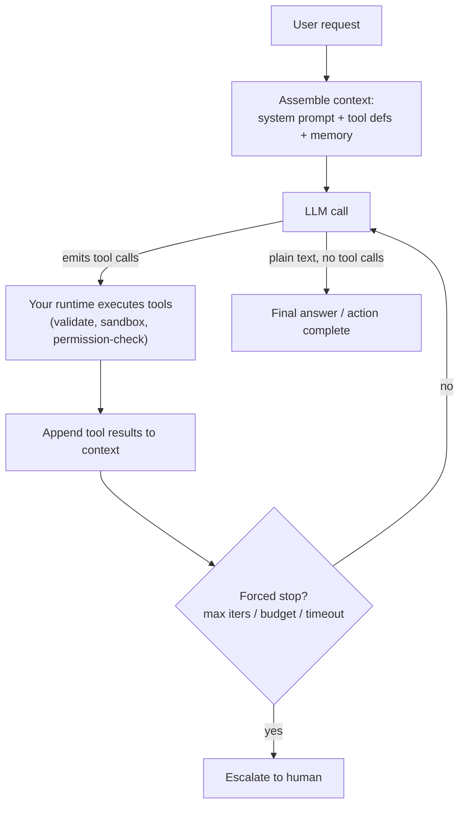

# 🤖 Agents, Tool Use & MCP

The hottest AI engineering interview topic of 2025-2026. Every frontier lab, big tech AI team, and agent startup asks about it, and it dominates system-design rounds for AI engineer, GenAI engineer, and LLM platform roles. Interviewers use it to separate people who have shipped an agent to production from people who have watched a demo - the questions probe reliability math, security, and cost engineering, not just vocabulary.

## Crash course

### Workflows vs agents

Anthropic's framing (from *Building Effective Agents*) is the standard interview vocabulary. **Workflows** orchestrate LLMs and tools through *predefined code paths* - prompt chaining, routing, parallelization, evaluator-optimizer. **Agents** let the LLM *dynamically direct its own process*: it decides which tools to call, in what order, and when it's done. Agency is a dial, not a binary. Every notch toward agency buys flexibility and costs predictability, latency, money, and evaluability.

**The most important design rule:** if you can draw the flowchart, write the workflow. Reach for an agent only when the number of steps and the branching genuinely can't be enumerated up front ("fix this failing test", "research this company"), and the value of solving it exceeds the cost of the loop.

### The core agent loop

An agent is: **a model + tools + context/memory, running in a loop, with stop conditions.** That's it.



The whole thing is ~50 lines of Python. Interviewers frequently ask you to sketch it:

```python
def run_agent(user_msg: str, tools: list, max_iters: int = 15):
    messages = [{"role": "user", "content": user_msg}]
    spend = Budget(max_tokens=500_000, max_cost_usd=5.0)
    for _ in range(max_iters):
        resp = llm(messages, tools=tools)        # model may emit tool calls
        messages.append(resp.message)
        spend.add(resp.usage)
        if not resp.tool_calls:                  # natural stop: text-only reply
            return resp.text
        for call in resp.tool_calls:             # YOU execute; the model never does
            result = execute(call.name, call.arguments)   # validate args, sandbox,
            messages.append(tool_result(call.id, result)) # gate irreversible actions
        if spend.exceeded():
            break
    return escalate_to_human(messages)           # never loop forever
```

### Tool calling mechanics

- You pass **tool definitions** - name, description, **JSON Schema** for parameters - with every request. They consume input tokens.
- The model doesn't execute anything. It emits a **structured message**: tool name + JSON arguments + a call ID. Models are post-trained (SFT + RL) to produce this format; providers can additionally use **constrained decoding** (e.g., OpenAI structured outputs `strict: true`) to guarantee schema-valid arguments.
- Your code executes the call and appends a **tool result message** keyed by the call ID. The loop continues.
- **Parallel tool calls:** the model can emit several independent calls in one turn (fetch three URLs); execute them concurrently and return all results.
- **Tool choice forcing:** `auto` (model decides), `required`/`any` (must call *some* tool), a specific named tool (classic trick for guaranteed structured extraction), or `none`.

### Tool design

The highest-leverage, least-glamorous part of agent engineering:

- **Few, distinct, well-named tools.** Overlapping tools ("search", "find", "lookup") cause wrong-tool errors. Namespace related tools (`jira_create_issue`).
- **Descriptions are prompts.** Write them like docs for a new hire: what it does, when to use it, when *not* to, argument semantics, an example.
- **Consolidate predictable chains.** `schedule_meeting(attendees, when)` beats `list_users` → `get_availability` → `create_event`: fewer round trips, fewer error opportunities. Keep tools granular only where the model genuinely needs to branch. Map tools to *intents*, not API endpoints.
- **Token-efficient outputs.** The agent pays for every result token for the rest of the trajectory. Paginate, filter, return semantic IDs, truncate with pointers, or write large results to a file and return the path.
- **Errors the model can act on.** Return failures as tool results, not crashes: "invalid `status`; valid values: open, closed, merged" turns a dead end into a course correction. Raw stack traces waste tokens and mislead.

### MCP (Model Context Protocol)

**Problem:** N apps × M integrations = N×M bespoke adapters. MCP (open standard, Anthropic, Nov 2024; since adopted across OpenAI, Google, Microsoft ecosystems) standardises the interface so it's N+M: build a server once, any MCP host can use it.

**Architecture:** a **host** (Claude Desktop, an IDE, your app) runs one **client** per connection to a **server** (which wraps a data source or API). Messages are JSON-RPC 2.0.

- **Server primitives:** **tools** (model-controlled actions), **resources** (app-controlled data/context), **prompts** (user-invoked templates).
- **Client primitives:** sampling (server requests an LLM completion from the host), roots (filesystem scoping), elicitation (ask the user for input).
- **Transports:** **stdio** (server as local subprocess - simple, inherits local privileges) and **Streamable HTTP** (remote servers, supports auth; replaced the older HTTP+SSE transport in the 2025-03-26 spec revision).

**Security:** a third-party MCP server injects untrusted text (tool descriptions, results) into your model's context and, over stdio, runs code on your machine. Tool poisoning, rug-pull description updates, and tool shadowing are real attack classes - audit, pin versions, run least-privilege.

### Planning patterns

- **ReAct** (Yao et al., 2022): interleave Thought → Action → Observation. Adaptive but myopic. Modern tool-calling and reasoning models internalise much of it.
- **Plan-then-execute:** produce a plan up front, execute steps (parallelizable, cheaper models per step), replan on failure. Better for long tasks and human review of plans; brittle when the environment surprises you.
- **Reflection / self-critique:** generate → critique → revise. Works best when verification is easier than generation and grounded in external signals (test results, compilers) - models grade their own work leniently. Returns diminish fast after 1-2 rounds.

### Multi-agent and subagents

The real win of **orchestrator-worker / subagent** patterns is **context isolation**: a worker burns 100k tokens searching and returns a 1k-token summary, keeping the orchestrator's context clean. Parallelism and specialisation are secondary.

Multi-agent **helps** on read-heavy, parallelizable work (research: many independent leads). It **hurts** on write-heavy work with shared state (multiple agents editing one codebase conflict), and it's expensive - Anthropic reported their multi-agent research system used ~15× the tokens of a chat interaction. **Handoffs** (transfer conversation control to a specialist agent) suit distinct domains like support triage; orchestration suits decomposable tasks. Default to a single agent with good tools until it demonstrably fails.

### Memory and context management

- **Working memory** = the context window. **Persistent memory** = files, databases, vector stores that survive sessions, retrieved back in on demand.
- Long trajectories degrade: context fills up and quality drops before the hard limit ("context rot"). Countermeasures: **compaction** (summarise old turns, keep recent ones + key decisions), **clearing stale tool results**, **structured note-taking** (todo lists and scratchpad files persist outside the context and survive compaction), and **subagent isolation**.
- Long-horizon agents (hours/days) need **checkpointing and durable execution**: persist state at boundaries, make tool calls idempotent, resume from event logs rather than praying the process never dies.

### Reliability, guardrails, security

- **The compounding-error math:** 95% per-step success over 20 steps = 0.95²⁰ ≈ **36%** end-to-end. This is why demos aren't products. Attack it by reducing steps, raising per-step reliability, and adding *recovery* (verification steps, actionable errors, checkpoints) so failures stop being terminal.
- **Guardrails:** max iterations, token/cost budgets, timeouts, duplicate-call detection, and **permission tiers** - reads auto-approved, writes gated, irreversible actions (send, delete, pay) behind human approval. Reversibility determines autonomy.
- **Prompt injection:** tool results are an attacker-controlled channel; models can't reliably separate data from instructions. Simon Willison's **lethal trifecta** - private data access + untrusted content + an exfiltration channel - is the design test: never let one agent hold all three. Defence in depth: least-privilege tools, egress controls, sandboxed code execution, approval gates. No prompt-level fix is sufficient.

### Evaluation, cost, observability

- Evaluate **final outcomes** (did the end state become correct?) for robustness, and **trajectories** (right tools, efficient path, policy compliance - often LLM-judged against a rubric) for diagnosis.
- **pass@k vs pass^k:** pass@k (any of k tries succeeds) measures capability; **pass^k** (all k trials succeed, popularised by τ-bench) measures the consistency users actually experience. Production agents are judged on pass^k.
- **Cost/latency engineering:** tier models per step (big model plans, small model extracts/routes), exploit **prompt caching** (system prompt + tool defs + history prefix are a stable cache hit on every loop iteration), parallelize tool calls, compact context. Measure **cost per successful task**, not per call.
- **Observability:** trace every LLM call and tool call (args, results, tokens, latency) as spans; support replay; track success rate, steps/task, token spend, tool error rates. You cannot debug an agent you didn't trace.

### Frameworks

LangGraph, OpenAI Agents SDK, Claude Agent SDK, CrewAI, and friends give you loop scaffolding, state/checkpointing, tracing, and handoff plumbing - at the cost of abstraction opacity and prompt control. The strong-candidate stance: **build the raw loop yourself first** (it's small), adopt a framework when you need its specific infrastructure, and keep prompts/tools framework-agnostic so you can swap.

## Interview questions

See [questions.md](questions.md) - **37 questions** with answers, from basic mechanics to advanced production design.

## Red flags interviewers watch for

- Saying the model "executes" tools - not knowing the model only emits structured intent and the client runtime executes, validates, and returns results.
- Reaching for a multi-agent framework on a task a single prompt or fixed workflow solves; unable to articulate when *not* to build an agent.
- Designing a loop with no stop conditions, budgets, or permission gating - "it runs until it's done."
- Failing the reliability math: treating 90-95% per-step success as production-ready for 20-step tasks, or having no answer for compounding errors beyond "better prompts."
- Claiming prompt injection is solved by instructing the model to ignore injected instructions; never having heard of the lethal trifecta or least-privilege tool design.
- Evaluating agents with pass@1 on final answers only - no trajectory evals, no consistency (pass^k) thinking, no tracing story.
- Dumping 50 granular tools into context and having no opinion on tool consolidation, description quality, or token cost of results.
- Framework name-dropping without being able to sketch the bare agent loop in Python.

## Further reading

- [Building Effective Agents - Anthropic](https://www.anthropic.com/engineering/building-effective-agents) - the canonical workflows-vs-agents essay.
- [How we built our multi-agent research system - Anthropic](https://www.anthropic.com/engineering/built-multi-agent-research-system) - honest numbers on multi-agent token costs and orchestration lessons.
- [Writing effective tools for agents - Anthropic](https://www.anthropic.com/engineering/writing-tools-for-agents) - tool design and evaluation guidance.
- [Model Context Protocol - official docs & spec](https://modelcontextprotocol.io) - architecture, primitives, transports.
- [ReAct: Synergizing Reasoning and Acting in Language Models - Yao et al.](https://arxiv.org/abs/2210.03629)
- [Reflexion: Language Agents with Verbal Reinforcement Learning - Shinn et al.](https://arxiv.org/abs/2303.11366)
- [τ-bench: A Benchmark for Tool-Agent-User Interaction in Real-World Domains - Yao et al.](https://arxiv.org/abs/2406.12045) - source of the pass^k reliability metric.
- [The lethal trifecta for AI agents - Simon Willison](https://simonwillison.net/2025/Jun/16/the-lethal-trifecta/) - the essential agent-security mental model.
