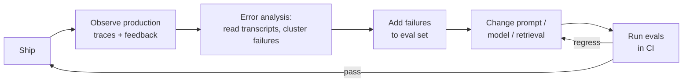

# 🧪 Evals & Observability

Nothing separates senior AI engineers from prompt hobbyists faster than this topic: anyone can demo an LLM feature, but only people who have shipped one can explain how they *knew* it worked, kept working, and got better. Expect eval questions in every serious loop - as conceptual probes ("how would you evaluate this?"), as the backbone of system-design rounds, and as debugging scenarios ("quality dropped after a model update, go"). Interviewers at frontier labs, big tech, and startups all use it because eval maturity is the single best proxy for having actually operated an LLM system in production.

## Crash course

### Evals are the moat

Models are rented; **your eval suite is the durable asset**. It encodes what "good" means for *your* product, which no foundation model provider can ship you. Teams with strong evals can swap models in a day, tune prompts with confidence, and turn every production failure into a permanent regression test. Teams without them re-litigate quality by vibes on every change.

The **eval-driven development loop**:



Every arrow matters. The most common broken link in real teams: production failures never make it back into the eval set.

### The eval taxonomy

| Method | Grader | Cost | Best for |
|---|---|---|---|
| **Code-graded** | Exact match, regex, `in`, JSON schema check, code execution | ~free, deterministic | Anything with a verifiable answer: classification, extraction, format, math, code |
| **Model-graded (LLM-as-judge)** | Another LLM + rubric | Cheap-ish, noisy | Open-ended quality: helpfulness, tone, faithfulness, instruction-following |
| **Human** | Domain experts / labellers | Expensive, slow | Ground truth for calibrating judges; high-stakes domains; final arbiter |
| **Online (A/B, interleaving)** | Real users, implicit signals | Needs traffic + time | What actually moves product metrics |

Rule of thumb: **prefer the cheapest grader that captures the criterion.** If you can write an assertion, write an assertion - reach for a judge only when the criterion is genuinely subjective, and use humans to check the judge, not to grade every run.

### Building an eval set

- **Start small and hard**: ~20-50 examples that represent real, difficult cases beat 5,000 easy synthetic ones. You can hand-build this in an afternoon and it will immediately change decisions.
- **Source from production**: failed transcripts, thumbs-down sessions, escalations, support tickets. Production failures are the highest-value examples because they're real and adversarial by construction.
- **Synthetic generation** fills coverage gaps (edge cases, rare intents, other languages): prompt a strong model to generate variations from a taxonomy of scenarios, then **human-review before admitting** - synthetic data inherits the generator's blind spots.
- **Statistical power grows with N**: with 50 examples, one flip is 2 points - you can only detect large effects. Grow toward hundreds as decisions get finer-grained.
- **Version it like code**: eval sets live in the repo (or a versioned store), changes go through review, and results always record *which* dataset version produced them - otherwise scores aren't comparable across time.
- **Keep it fresh**: an eval set you've optimised against for six months is partially memorised by your prompts. Rotate in new production failures; retire saturated cases to a regression suite.

### LLM-as-judge, properly

- **Pairwise beats pointwise.** Asking "is this a 7 or an 8?" yields poorly calibrated, drifting scores. Asking "which of A/B is better, or tie?" is a far more reliable elicitation - humans and models both do better at comparison than absolute scoring. Use pointwise only with a tightly anchored rubric (define what each score means with examples), or better, binary pass/fail per criterion.
- **Decompose the rubric**: one judge call per criterion (faithful? complete? correct format?) beats one "rate overall quality 1-10" call.
- **Chain-of-thought judging**: force the judge to write its analysis *before* the verdict; you get better judgments and auditable justifications.
- **Known biases** (documented in the MT-Bench/LLM-as-judge literature):
  - **Position bias** - favours the first (or last) response in pairwise comparison. Mitigate: run both orders, keep only consistent verdicts or average.
  - **Verbosity bias** - longer answers score higher, independent of quality. Mitigate: rubric explicitly penalises padding; control/report length.
  - **Self-preference / self-enhancement** - models prefer their own outputs. Mitigate: judge from a *different model family* than the generator.
- **Calibrate before trusting**: label 50-100 examples with humans, measure judge - human agreement (percent agreement or Cohen's kappa). GPT-4-class judges hit ~80% agreement with humans on chat quality - about the same as human - human agreement - but *your* task may differ. No agreement measurement → no judge in CI.

### Public benchmarks and their limits

| Benchmark | Measures | Status |
|---|---|---|
| **MMLU** | 57-subject multiple-choice knowledge | Saturated at the frontier; contaminated |
| **GSM8K** | Grade-school math word problems | Saturated; contamination well documented |
| **HumanEval** | 164 Python problems, pass@k | Saturated; tiny |
| **SWE-bench (Verified)** | Resolving real GitHub issues | Still discriminative; agent-harness-sensitive |
| **MT-Bench** | Multi-turn chat, LLM-judged | Judge biases apply |
| **Chatbot Arena (LMArena)** | Pairwise human preference → Elo/Bradley-Terry | Hard to contaminate, but measures *preference*, skewed prompt/voter population, style-sensitive |

Three failure modes to name in interviews: **contamination** (test data in pretraining - scores measure memorisation), **saturation** (top models cluster at the ceiling - no signal), and **Goodhart** ("when a measure becomes a target, it ceases to be a good measure" - labs optimise toward headline benchmarks). Use public benchmarks for coarse model shortlisting only; product decisions need *your* evals on *your* distribution.

### pass@k

pass@k = probability that at least one of k samples solves the problem. Naively generating exactly k samples per problem gives a high-variance estimate. The Codex paper's **unbiased estimator**: generate n ≥ k samples, count c correct, then

$$\text{pass@}k = 1 - \binom{n-c}{k} \Big/ \binom{n}{k}$$

```python
import numpy as np

def pass_at_k(n: int, c: int, k: int) -> float:
    """Unbiased pass@k: n samples generated, c of them correct."""
    if n - c < k:
        return 1.0
    return 1.0 - np.prod(1.0 - k / np.arange(n - c + 1, n + 1))
```

Related: for agents, reliability often matters more than best-case - **pass^k** (all k trials succeed, popularised by τ-bench) punishes inconsistency that pass@k hides.

### Application-specific evals

- **Code**: execution-based grading - run the output against **hidden tests** (visible tests invite overfitting) in a sandbox with timeouts and resource limits. String similarity to a reference solution is meaningless for code.
- **RAG - evaluate components separately, then end-to-end.** Retrieval: recall@k / MRR / nDCG against labelled query→relevant-chunk pairs (if retrieval doesn't fetch the answer, nothing downstream can fix it). Generation: **faithfulness** (is every claim supported by retrieved context? - judge-graded claim-by-claim) and **answer relevance**. End-to-end correctness ties it together. Frameworks like RAGAS package these metrics.
- **Agents**: grade the **outcome** (did the task complete? verifiable in a sandboxed environment simulator) and the **trajectory** (tool-choice accuracy, argument correctness, step efficiency, recovery from errors). Outcome-based is the gold standard when checkable; trajectory scoring diagnoses *why* failures happen. Run k trials - agent variance is enormous.

### Regression testing and CI

Treat prompts like code: **every prompt, model, or retrieval change runs the eval suite before merge.** Gate deploys on (a) hard guardrail assertions never failing and (b) quality scores not regressing beyond a noise threshold. Keep the CI subset small enough to run in minutes (a curated ~50-200 case suite), with the full suite nightly. When a provider bumps a model version, the same pipeline tells you within one run whether you're affected.

### Guardrail metrics vs quality metrics

- **Guardrail**: must-never-regress - jailbreak/policy-violation rate, PII leakage, harmful-content rate, p95 latency, cost per task, error rate. Binary gates; any regression blocks.
- **Quality**: what you're optimising - correctness, helpfulness, task resolution, faithfulness. Trade these off deliberately.

Conflating them is a classic failure: you don't "trade a little PII leakage for better helpfulness."

### Online evaluation

Offline evals predict; **online evals confirm**. A/B test with user-level randomisation on a metric that proxies real value (task completion, retention, resolution without escalation). **Implicit signals** are your friend because explicit feedback is sparse (thumbs ratings come from a tiny, biased slice of sessions): regeneration rate, copy-to-clipboard, response-abandonment, follow-up reformulations, edit distance on accepted output (acceptance rate for code assistants), escalation-to-human rate. For retrieval/ranking changes, **interleaving** (mix results from both systems, see which gets clicked) reaches significance with far less traffic than A/B.

### Monitoring and drift

- **Model drift**: providers deprecate and re-point model aliases; pin exact versions and re-run evals on any version change.
- **Data drift**: input distribution shifts (new user cohorts, languages, product surfaces) - monitor topic/intent distribution and eval on fresh samples, not just the frozen set.
- **Cost/latency drift**: prompt token creep, growing context, tool-call loops - track tokens per request and p50/p95 latency per route over time.
- Run a **canary eval on a schedule** (e.g., hourly/daily against prod config) so silent upstream changes page you instead of your users.

### Observability: tracing LLM apps

An LLM request is a **trace**: a tree of **spans** - one per model call, tool invocation, retrieval, guardrail check. Log per span: model + exact version, sampling params, prompt & completion (or a redacted/pointer form), input/output token counts, time-to-first-token and total latency, cost, prompt-template version, and user/session IDs for joining with feedback. **OpenTelemetry has GenAI semantic conventions** (attribute names like `gen_ai.request.model`, `gen_ai.usage.input_tokens`) so traces are portable across backends.

**PII in logs is the sharp edge**: prompts and completions routinely contain user data. Decide retention, redact or hash PII at ingestion, restrict access, and honour deletion requests - "log everything forever" is a compliance incident in waiting.

Tools landscape (know the names, don't marry a vendor): **LangSmith, Langfuse, Braintrust, W&B Weave, Arize Phoenix** - all give you tracing + eval runs + datasets with different open-source/hosted tradeoffs.

### Error analysis: the highest-ROI activity

Dashboards tell you *that* quality dropped; only **reading transcripts** tells you *why*. The practice: pull 50-100 failing traces, read them, write a one-line failure description each, cluster the descriptions (an LLM can help), rank clusters by frequency × severity, and **fix the top cluster first** - it's usually one prompt bug or one retrieval gap causing 30% of failures. This loop, done weekly, outperforms any amount of metric-staring.

### The maturity path

Teams evolve: **vibes** ("looks good to me") → **spot checks** (a doc of 10 favourite prompts) → **offline eval suite** (versioned dataset + graders in CI) → **online measurement** (A/B, implicit feedback) → **closed loop** (production failures automatically triaged into eval candidates). In interviews, place a described team on this ladder and say what you'd build next - that framing alone signals seniority.

## Interview questions

See [questions.md](questions.md) - 31 questions across basic, intermediate, and advanced levels.

## Red flags interviewers watch for

- Reaching for public benchmark scores (MMLU, Arena Elo) to decide whether a model fits a *specific product* - no mention of building a task-specific eval.
- No habit of reading actual transcripts - talks only in aggregate metrics and dashboards, never error analysis.
- Trusting an LLM judge without ever measuring its agreement against human labels, or being unable to name a single judge bias.
- Believing evals require thousands of labelled examples before starting (analysis paralysis) - or the opposite, shipping with zero and "iterating on user feedback."
- Treating a 2-4 point delta on a 50-example eval as a real improvement; no concept of variance, paired comparison, or significance.
- No CI story: can't explain how a prompt change gets gated before deploy, or what happens when the provider updates a model version.
- "We log all prompts and completions" with no answer for PII, retention, or access control.
- Conflating guardrail and quality metrics, or proposing to trade safety regressions for helpfulness gains.

## Further reading

- [Judging LLM-as-a-Judge with MT-Bench and Chatbot Arena](https://arxiv.org/abs/2306.05685) - Zheng et al.; the canonical LLM-as-judge paper: agreement rates, position/verbosity/self-enhancement biases.
- [Evaluating Large Language Models Trained on Code](https://arxiv.org/abs/2107.03374) - Chen et al. (Codex); defines HumanEval and the unbiased pass@k estimator.
- [SWE-bench: Can Language Models Resolve Real-World GitHub Issues?](https://arxiv.org/abs/2310.06770) - Jimenez et al.; the reference agentic coding benchmark.
- [Chatbot Arena: An Open Platform for Evaluating LLMs by Human Preference](https://arxiv.org/abs/2403.04132) - Chiang et al.; pairwise human votes and Bradley-Terry ranking.
- [Adding Error Bars to Evals](https://arxiv.org/abs/2411.00640) - Evan Miller (Anthropic); statistics for eval comparisons: clustered standard errors, paired analysis, power.
- [Your AI Product Needs Evals](https://hamel.dev/blog/posts/evals/) - Hamel Husain; the practitioner's guide to eval-driven development and error analysis.
- [Patterns for Building LLM-based Systems & Products](https://eugeneyan.com/writing/llm-patterns/) - Eugene Yan; evals as the first pattern, with a survey of methods.
- [OpenTelemetry Generative AI semantic conventions](https://opentelemetry.io/docs/specs/semconv/gen-ai/) - the emerging standard for tracing LLM calls.
