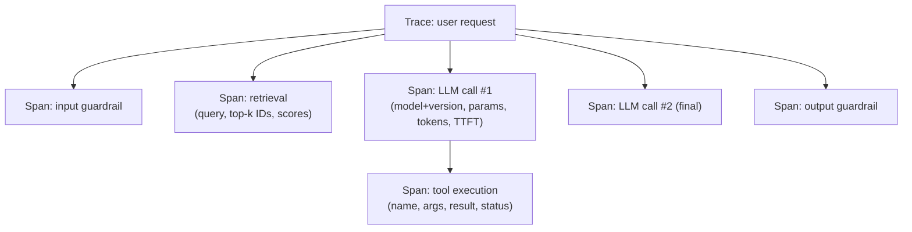

# Evals & Observability - Interview Questions

50 questions: 13 basic, 23 intermediate, 14 advanced.

## Basic

### 1. Why do people say "evals are the moat" for AI products? What makes them the core engineering artifact?

<details><summary><b>Answer</b></summary>

Because everything else is rented. The model comes from a provider, the serving stack is commodity, and prompts are copyable - but a versioned eval suite that encodes what "good" means for your specific task, built from your production failures, is proprietary and compounds over time. It's the artifact that lets you swap models in a day (rerun the suite, compare), tune prompts without fear (CI catches regressions), and convert every production incident into a permanent test.

Concretely, evals function the way unit tests function for conventional software, with one difference: for LLM systems the *spec itself* is fuzzy, so the eval set is often the closest thing to a spec that exists. When a PM says "the summaries should be better," the eval set is where "better" gets operationalised into graders and examples. That's why senior engineers treat eval design as a core design activity, not QA afterthought.

The engineering loop this enables - eval-driven development - is: ship → observe production traces and feedback → do error analysis on failing transcripts → add the failures to the eval set → change the prompt/model/pipeline → run evals → ship if no regression. Teams stuck at "vibes" re-litigate quality subjectively on every change and can't tell whether a model upgrade helped or hurt.

A good candidate also notes the limits: an eval suite only measures what you thought to encode, it goes stale as usage shifts, and you can overfit to it. So the moat needs maintenance - fresh examples rotating in from production, periodic human calibration of any model graders, and honest tracking of the gap between offline scores and online metrics.

**Follow-ups:** How would you convince a team shipping on vibes to invest in evals? What's the smallest useful eval suite you'd build in week one? Who should own the eval set - engineering, PM, or a dedicated team?

</details>

### 2. Walk me through the taxonomy of evaluation methods for LLM systems and when you'd use each.

<details><summary><b>Answer</b></summary>

Four tiers, ordered by cost and by how much human judgment they encode:

1. **Code-graded assertions** - exact match, regex/contains, JSON schema validation, numeric tolerance, executing generated code against tests. Deterministic, free, fast. Use whenever the criterion is objectively checkable: classification labels, extraction fields, output format, math answers, code correctness.
2. **Model-graded (LLM-as-judge)** - another LLM scores or compares outputs against a rubric. Cheap enough to run on every CI push, but noisy and biased (position, verbosity, self-preference), so it must be calibrated against human labels before you trust it. Use for genuinely subjective criteria: helpfulness, tone, faithfulness to sources, instruction-following nuance.
3. **Human evaluation** - expert or crowdworker labels, pointwise or pairwise. Slow and expensive, so use it strategically: to create ground truth for calibrating judges, for high-stakes domains (medical, legal), and as the periodic audit that keeps automated graders honest.
4. **Online evaluation** - A/B tests, interleaving, implicit feedback (thumbs, regeneration rate, task completion, escalations). The only tier that measures what users actually experience, but it needs traffic, time, and a shipped feature - and it can't tell you *why* something regressed.

The operating principle: **use the cheapest grader that faithfully captures the criterion.** If you can write an assertion, never use a judge. If a judge suffices, don't burn human hours on routine grading - spend them auditing the judge. And treat offline evals as predictors that online metrics must confirm; a persistent gap between offline scores and online outcomes means your eval set no longer represents production traffic.

Strong candidates add that these compose within one suite: a single test case might assert JSON validity (code), score faithfulness (judge), and feed an online resolution-rate metric once deployed.

**Follow-ups:** Give a concrete criterion that looks judge-worthy but can be reduced to an assertion. When would you pay for human eval even though your judge agrees with humans 85% of the time?

</details>

### 3. What kinds of code-graded assertions can you use on LLM outputs, and where do they break down?

<details><summary><b>Answer</b></summary>

The main families:

- **Exact match** - output equals reference. Works for classification, multiple choice, canonicalized short answers. Brittle to formatting ("$4.50" vs "4.5 dollars"), so normalize first (case, whitespace, number parsing).
- **Contains / regex** - the answer string appears somewhere; regex for structured patterns (dates, IDs). Prone to false positives ("the answer is not 42" contains "42") - anchor patterns and check for negations where it matters.
- **Structural validation** - parse the output: valid JSON, conforms to a schema/Pydantic model, required fields present, enum values legal. This is the workhorse for tool-calling and extraction tasks.
- **Numeric with tolerance** - extract the number, compare within epsilon; essential for math where formatting varies.
- **Execution-based** - run generated code against test cases in a sandbox; run generated SQL against a fixture database and compare result sets. The gold standard for code: functional equivalence, not textual similarity.
- **Property checks** - length bounds, no banned phrases, citation IDs actually exist in the retrieved set, links resolve. Cheap guardrail assertions.

```python
def grade(output: str, case: dict) -> bool:
    data = json.loads(output)                      # structural
    assert set(data) >= {"amount", "currency"}     # schema
    return abs(data["amount"] - case["amount"]) < 0.01  # tolerance
```

Where they break down: anything with many valid surface forms (summaries, explanations, conversational answers) - exact/contains checks either miss correct answers or pass wrong ones. Reference-based text metrics like BLEU/ROUGE correlate poorly with quality for open-ended generation, so the honest move is escalating those criteria to model-graded or human eval rather than pretending an n-gram overlap score means something.

The senior habit: design the *task output format* to be assertable - force JSON, force a final `Answer:` line, make the model cite chunk IDs - so more of your eval stays in the cheap deterministic tier.

**Follow-ups:** How would you grade a summarisation task without a judge? Your regex grader shows 95% pass but users complain - what's happening?

</details>

### 4. You're building evals for a new LLM feature from scratch. How many examples do you need, and where do they come from?

<details><summary><b>Answer</b></summary>

Start with **~20-50 hard, realistic examples** - you can build that in a day and it immediately changes decisions. The biggest eval mistake isn't small N; it's waiting for a large N that never arrives while shipping blind.

Sources, in order of value:

1. **Production failures** - thumbs-down sessions, escalations to humans, support tickets, incidents. These are real, adversarial by construction, and each one is a regression test that provably mattered.
2. **Dogfooding / internal red-teaming** - before launch you have no production data, so the team generates realistic tasks and deliberately probes edges.
3. **Synthetic generation** - prompt a strong model with a taxonomy of scenarios (intents × personas × difficulty) to fill coverage gaps; human-review before admitting anything, because synthetic data inherits the generator's blind spots and tends toward the median.
4. **Public datasets** - occasionally useful as scaffolding, usually off-distribution for your product.

On statistics: with 50 examples each case is worth 2 points, so you can only detect large effects - a 4-point delta is just two net examples flipping and is noise. That's fine early, when you're hunting 20-point problems. As decisions get finer (prompt A vs prompt B differing by a few points), grow toward hundreds of examples and add paired significance testing. Statistical power grows with N; buy power when you actually need the resolution.

Composition matters more than size: weight the set toward hard cases and known failure modes, keep a slice of easy cases as a smoke test, and stratify by the segments you care about (languages, intents, user tiers) so a regression in a small segment isn't averaged away. Version the set like code, and record dataset version alongside every score.

**Follow-ups:** How do you decide an example is "hard" before you have failures? Your eval is 95% passing and stops discriminating between candidate prompts - what do you do?

</details>

### 5. What is LLM-as-judge, and when is it the right tool?

<details><summary><b>Answer</b></summary>

LLM-as-judge uses a (usually stronger) model to grade outputs: given the input, the candidate response, a rubric, and optionally a reference answer, the judge emits a verdict - pass/fail, a score, or a preference between two responses. It exists because most interesting LLM outputs are open-ended: no assertion can check whether a summary is faithful or an answer is genuinely helpful, and humans are too slow and expensive to grade every CI run.

It's the right tool when three conditions hold: (1) the criterion is subjective or has many valid surface forms, (2) you can articulate the criterion as a rubric a careful human could apply, and (3) you've **validated the judge against human labels** - label 50-100 examples yourself, measure agreement (percent agreement or Cohen's kappa), and only automate once agreement is comparable to human - human agreement. The MT-Bench work found GPT-4-class judges agree with humans ~80% of the time on chat quality - roughly the human - human rate - but that's task-dependent, not a law.

Practical form matters: pairwise comparison ("which is better, A or B?") is more reliable than pointwise scoring ("rate 1-10"); binary pass/fail per decomposed criterion beats a single holistic score; and forcing the judge to write chain-of-thought reasoning before its verdict improves quality and gives you auditable justifications.

When it's the *wrong* tool: anything assertable (use code), high-stakes final decisions (judge assists, human decides), and grading the judge's own model family on comparative tasks (self-preference bias). Also remember the judge is itself a prompt+model that needs versioning - a judge model upgrade can shift all your scores with zero change in the system under test, so pin judge versions and re-calibrate when you change them.

**Follow-ups:** Your judge passes 90% of outputs but users are unhappy - how do you debug the judge itself? Would you use the same model as generator and judge?

</details>

### 6. Define pass@k. Why is the naive way of computing it problematic, and what's the fix?

<details><summary><b>Answer</b></summary>

pass@k is the probability that **at least one** of k independent samples from the model solves the problem - the standard metric for code generation (HumanEval popularised it), where you can cheaply verify each sample by running tests.

The naive computation - generate exactly k samples, score 1 if any passed, average over problems - is an unbiased-in-expectation but **high-variance** estimator: for each problem you get a single Bernoulli observation, so results swing run to run, especially for small eval sets and mid-range success probabilities.

The fix, from the Codex paper: generate **n ≥ k** samples per problem (say n = 200 for k ≤ 100), count c correct, and compute the probability that a random size-k subset contains at least one correct sample:

pass@k = 1 − C(n−c, k) / C(n, k)

This averages over all C(n, k) subsets analytically instead of sampling one, slashing variance. Computing binomials directly overflows, so use the numerically stable product form:

```python
import numpy as np

def pass_at_k(n: int, c: int, k: int) -> float:
    if n - c < k:
        return 1.0
    return 1.0 - np.prod(1.0 - k / np.arange(n - c + 1, n + 1))
```

Two things a strong candidate adds. First, sampling temperature interacts with k: higher temperature hurts pass@1 but helps pass@100 (more diversity), so report the temperature and tune it per k. Second, pass@k measures *best-case* capability - fine when you can verify and pick the winner (hidden tests, a compiler), misleading when you can't. For reliability-critical agent settings the complementary metric is **pass^k** - the probability that all k independent trials succeed (popularised by τ-bench) - which punishes the inconsistency that pass@k hides. A model with 80% per-trial success has pass^8 ≈ 17%: great demo, unreliable product.

**Follow-ups:** When is optimising pass@10 legitimate for a product? How does pass@k relate to best-of-n sampling with a verifier at inference time?

</details>

### 7. What's the difference between guardrail metrics and quality metrics? Give examples of each.

<details><summary><b>Answer</b></summary>

**Quality metrics** measure what you're optimising: answer correctness, faithfulness to sources, task resolution rate, user satisfaction, code acceptance rate. You expect to trade these off against cost and latency, and you celebrate when they go up.

**Guardrail metrics** are constraints that must never regress, regardless of quality gains: jailbreak/policy-violation rate, PII leakage in outputs, harmful-content rate, hallucinated-citation rate in regulated contexts, p95 latency, cost per request, hard error rate. They're asymmetric - nobody gets promoted for improving them, but any regression blocks a release.

The distinction matters operationally because the two get different treatment in the pipeline:

- **Gating**: quality regressions within a noise band are debatable; guardrail regressions are automatic deploy blockers. Your CI should encode this - guardrail evals as hard assertions, quality evals as scored comparisons against a baseline with a threshold.
- **Tradeoffs**: it's legitimate to ship "2 points less concise but 30% cheaper." It is never legitimate to ship "slightly more PII leakage but more helpful." If someone proposes trading a guardrail, the metric was misclassified or the org has a problem.
- **Measurement style**: guardrails are usually adversarial evals (red-team suites, known jailbreak corpora, synthetic PII probes) plus production monitors with alerting; quality metrics are representative-distribution evals plus A/B tests.

This mirrors classical experimentation practice - big-tech A/B platforms have long had "guardrail metrics" (crash rate, latency) that any experiment must not harm while moving its goal metric. LLM systems inherit the pattern with new content-safety guardrails on top.

A subtle point: some metrics switch categories by product. Latency is a guardrail for chat but *the* quality metric for an autocomplete product; refusal rate is a guardrail ceiling (over-refusal annoys users) and floor (under-refusal is unsafe) simultaneously - worth tracking as two directional metrics.

**Follow-ups:** How would you set the threshold for a guardrail like jailbreak rate - zero or nonzero? Your helpfulness A/B win ships and escalation rate rises 15% - what happened?

</details>

### 8. What should you log for every LLM call in production, and what are the pitfalls?

<details><summary><b>Answer</b></summary>

Per call, the useful minimum:

- **Identity & versions**: request/trace ID, user/session ID (pseudonymous), prompt-template name + version, model + *exact* version (not an alias), sampling params (temperature, max_tokens), tool/function schemas offered.
- **Content**: the full rendered prompt (system + messages) and completion - or redacted/pointer forms where policy requires. Also intermediate artifacts: retrieved chunks with IDs and scores, tool calls with arguments and results.
- **Performance & cost**: input/output token counts, time-to-first-token, total latency, retries, cache hits, computed cost.
- **Outcome signals**: finish reason (stop, length, tool_use, content_filter), guardrail check results, downstream feedback (thumbs, regeneration, escalation) joined by trace ID.

Structure it as a **trace**: a tree of spans, one per model call / retrieval / tool execution, so a multi-step agent request reads as a single navigable object. OpenTelemetry's GenAI semantic conventions standardise attribute names (`gen_ai.request.model`, `gen_ai.usage.input_tokens`, ...) so you're not locked to one observability vendor.

Pitfalls, in order of severity:

1. **PII.** Prompts and completions are user data - often the most sensitive text your company stores. You need a retention policy, redaction or tokenization of identifiers at ingestion, access controls (support engineers ≠ everyone), and the ability to honour deletion requests. "Log everything forever in plaintext" is a GDPR/compliance incident on a timer.
2. **Logging the alias, not the version.** `model: gpt-latest`-style logging makes provider-side upgrades invisible; you can't explain why quality shifted on a Tuesday.
3. **Missing the join keys.** If feedback events can't be joined back to the exact trace (prompt version, retrieved chunks), your error-analysis loop is dead.
4. **Volume/cost**: full prompt logging at scale is expensive - sample intelligently (keep 100% of errors and negative feedback, sample successes).

**Follow-ups:** How would you implement "delete this user's data" when their text appears inside other logged prompts? What would you log differently for a voice agent?

</details>

### 9. What is the difference between observability and evals? Vendors seem to sell one product for both.

<details><summary><b>Answer</b></summary>

Observability is descriptive: what happened on this request. Evals are evaluative: was the output good. Same data, different question, which is why every vendor ships them as one surface.

Observability is always-on and unsampled. It captures the trace: spans for each model call, retrieval, tool call and guardrail check, with tokens, latency, cost, errors, retrieved chunk IDs and the exact model version. It answers "why was this request slow", "what did retrieval actually return", "where did the agent loop".

Evals are sampled and scored against a criterion. They answer "is this correct", "is it grounded", "did the task complete". A score requires a grader and a notion of good, which observability has no opinion about.

The practical test I use: the metric that pages you at 3am is observability (error rate, p95 latency, cost spike). The metric that blocks a merge is an eval (pass rate on the golden set). Different consumers, different cadence, different failure mode when absent.

They depend on each other in one direction. You cannot build good evals without observability, because production traces are where eval examples come from. But observability without evals is the classic trap: dashboards stay green on volume and latency while quality quietly rots, because nothing in the stack is asking whether the answers are any good.

Online evals are where the line blurs, and that confuses people. Sampling 2% of production traces and scoring them with a judge is running an eval on top of observability data. That is one pipeline, but it is still worth keeping the concepts separate: if you conflate them, you end up believing a green latency dashboard means a healthy product.

**Follow-ups:** Which of the two would you build first on a brand new LLM feature, and why? If your observability bill got cut in half, what would you stop capturing?

</details>

### 10. What is the difference between reference-based and reference-free evaluation, and why do BLEU, ROUGE and exact match fail on LLM output?

<details><summary><b>Answer</b></summary>

Reference-based grading compares the output to a gold answer: exact match, BLEU, ROUGE, embedding similarity, BERTScore. Reference-free grading judges the output on its own merits against a criterion or against the input context: code execution, JSON schema checks, an LLM judge scoring faithfulness against retrieved chunks.

The n-gram metrics fail because they were designed for machine translation and summarisation, where references are dense and the output space is narrow. LLM output has an enormous space of correct phrasings. BLEU punishes a correct answer worded differently from the reference and rewards a wrong answer that happens to borrow the reference's vocabulary. ROUGE measures overlap with reference n-grams, so an extractive summary that copies phrases while inventing a relationship between them scores well. Neither has any notion of whether the claim is true.

BERTScore and embedding similarity are a real improvement because contextual embeddings catch paraphrase. But they are insensitive to exactly the things that matter most: negation, numbers, and entity swaps. "The dose is 5mg" and "The dose is not 5mg" sit close together in embedding space and are opposite in the only way anyone cares about. A high similarity score is not evidence of correctness.

Exact match is fine, but only where the answer space is genuinely closed: a classification label, an extracted field, a final numeric answer. Its failure mode is formatting, not semantics, so normalise first (case, whitespace, date and currency formats) or you will measure your parser.

What to do instead: decompose. Execute code against hidden tests. Extract atomic claims and check each against the source. Use a judge with a rubric for genuinely open-ended criteria. Keep reference-based grading where the answer is closed and the comparison is cheap and valid.

**Follow-ups:** When is BLEU still the right tool? How would you grade a summarisation feature where every summary is legitimately different?

</details>

### 11. Your eval reports 82% pass on 100 examples. What does that number not tell you?

<details><summary><b>Answer</b></summary>

Quite a lot, and the most important omission is precision. For a proportion, the standard error is sqrt(p(1-p)/n). At p=0.82 and n=100 that is about 0.038, so the 95% confidence interval is roughly 74% to 90%. The honest way to report it is "82% (95% CI ~74-90%)". Anyone treating 82% versus 78% on this set as an improvement is reading noise.

Second, it does not tell you the run-to-run variance. Sampling is stochastic and agents are flaky. Run the identical config five times and you might see 79% to 85%. That spread is your real noise floor and it is usually wider than people assume.

Third, it hides distribution. 82% aggregate could be 95% on the easy majority slice and 40% on the one segment that generates your revenue. An average over a mixed set is a weighted average of things you probably want to look at separately.

Fourth, it says nothing about whether the grader is right. If the judge agrees with humans 80% of the time, the 82% is measuring the judge as much as the model. Grader error is not noise, it is bias, and it does not shrink with more examples.

Fifth, it says nothing about whether those 100 examples resemble what users actually send this week.

And it says nothing about the failures. The 18 that failed are the whole value of the run. Reading them tells you what to fix; the number 82 tells you nothing actionable.

**Follow-ups:** How many examples would you need to detect a 3-point improvement? What would make you distrust the 82% even with a tight confidence interval?

</details>

### 12. Why do you version an eval dataset, and what exactly belongs in the version?

<details><summary><b>Answer</b></summary>

Because a score is meaningless without knowing what produced it. Comparing this quarter's 82% to last quarter's 76% is worthless if anything underneath moved, and something always moved.

The misconception is that the version is the examples. It is not. A score is a function of the examples, the expected outputs and rubrics, the grader code, the judge prompt, the judge model and its exact version, and the sampling parameters. Change any one and the number shifts with no change to the product. So all of it gets versioned together and recorded in every result row. If the grader prompt lives in someone's notebook, you do not have an eval, you have an anecdote.

Governance is the other half. Every example carries provenance: where it came from (production trace ID, hand-written, synthetic and from which generator), who reviewed it, when it was added. That matters because when an example turns out to be mislabelled, you need to know what else that annotator or generator touched. Changes go through review like code, with a changelog.

Retire, do not silently delete. Dropping the cases you fail is the easiest way to make a dashboard go up, and it happens by accident more than by malice. Tombstone them with a reason.

PII and consent apply here too: production-sourced examples inherit whatever obligations the original data had, including deletion requests.

Structurally I keep two things apart: a frozen regression suite that changes rarely and gates merges, and a living development set that absorbs new production failures. Mixing them means you can never tell a real regression from a set that got harder.

**Follow-ups:** How would you handle an example everyone agrees is mislabelled but that has been in the frozen suite for a year? What goes in the eval set versus a unit test?

</details>

### 13. What are OpenTelemetry's GenAI semantic conventions, and why should you care?

<details><summary><b>Answer</b></summary>

They are a standardised vocabulary for describing LLM operations in traces: agreed attribute names under a gen_ai.* namespace, such as gen_ai.request.model, gen_ai.usage.input_tokens and gen_ai.operation.name, plus conventions for how a model call, a tool call and an agent step should be shaped as spans.

Why care: it decouples instrumentation from backend. If your app emits standard OTel spans, you can point them at Langfuse, Phoenix, Datadog, Honeycomb or your own collector without touching application code. The alternative is a vendor SDK threaded through every call site, which quietly becomes the reason you cannot leave that vendor. It also means LLM spans sit in the same trace as your HTTP and database spans, so you can see that the 4 second p95 was 300ms of model and 3.7s of your own retrieval code. Many frameworks now emit compliant spans natively or through an instrumentation package, so you often get this close to free.

Two caveats worth raising. First, as of 2026 much of the GenAI convention set is still marked experimental, so attribute names do shift between releases. Pin your instrumentation version and expect some churn rather than treating the names as stable forever.

Second, and more important in interviews: the conventions cover mechanics, not quality. Tokens, models, parameters, latency, finish reasons. There is no standard for "was this answer correct" or "did this violate policy". Eval scores and safety verdicts are your own custom attributes layered on top. OTel gives you the skeleton and portability; the judgement is still yours to build.

Also note that capturing prompt and completion content is deliberately opt-in, because that content is where the privacy exposure lives.

**Follow-ups:** How would you attach an eval score to a span after the fact? What would you do when a convention you depend on changes names in a new release?

</details>

## Intermediate

### 14. Pointwise scoring vs pairwise comparison for LLM judges - which is more reliable, and why?

<details><summary><b>Answer</b></summary>

Pairwise is more reliable, and the gap matters in practice. Pointwise asks the judge to map one response to an absolute scale ("rate helpfulness 1-10"); pairwise asks it to pick between two responses (A better / B better / tie). Absolute scales are poorly anchored - what separates a 6 from a 7 is undefined, so scores compress toward the top of the scale, drift across runs and judge versions, and vary with irrelevant context. Comparison only requires detecting a *difference*, which is an easier cognitive task for models and humans alike; the same insight is why RLHF collects preference pairs rather than scalar rewards, and why Chatbot Arena is built on pairwise votes.

When to use which:

- **Pairwise** for A/B decisions: prompt v1 vs v2, model swap, regression vs baseline. Aggregate win rates, or fit Bradley-Terry if you're comparing many variants. Caveats: it's O(n²) across many systems (mitigate by comparing everything against one fixed baseline), it inherits **position bias** (always evaluate both orders and keep consistent verdicts or average), and a win rate hides *how much* better.
- **Pointwise** when you need an absolute quality signal per trace - monitoring production where there's no counterpart to compare against, or filtering individual bad outputs. Make it reliable by abandoning wide scales: use **binary pass/fail per decomposed criterion** ("does the answer cite only retrieved sources: yes/no") with a rubric that defines each verdict, and few-shot anchor examples. Binary judgments are dramatically more consistent than 1-10 scores.

A useful hybrid: pointwise binary criteria in CI (stable, interpretable, no baseline needed), plus a pairwise judge run when comparing two candidates head-to-head before a ship decision.

Whichever you pick, force chain-of-thought before the verdict, pin the judge model version, and calibrate against a human-labelled slice - pairwise reliability advantages don't exempt you from measuring judge - human agreement.

**Follow-ups:** How do you aggregate pairwise results across 5 candidate prompts efficiently? Your pairwise judge says B beats A 60/40 but binary criteria show identical pass rates - what do you conclude?

</details>

### 15. What are the known biases of LLM judges, and how do you mitigate each?

<details><summary><b>Answer</b></summary>

The big three, documented in the MT-Bench / LLM-as-judge literature:

1. **Position bias** - in pairwise comparison, judges systematically favour a position (often the first response). Mitigation: run every comparison twice with positions swapped; count a win only if the verdict is consistent across both orders (otherwise score a tie), or average the two. This doubles judge cost - accept it, it's the price of validity.
2. **Verbosity bias** - longer responses score higher independent of quality; judges read length as effort/completeness. Mitigation: rubric language that explicitly rewards concision and penalises padding; report response length alongside win rate so you notice when a "win" is just +40% tokens; length-controlled analysis (Arena-style style controls regress out length effects).
3. **Self-preference / self-enhancement bias** - models rate their own outputs (or their family's) higher, partly because familiar phrasing scores as higher quality. Mitigation: judge with a *different model family* than the generators, or use a panel of judges from multiple families and aggregate.

Second-order biases worth naming: **sycophancy toward stated positions** in the prompt (don't reveal which response is "ours" or what you hope wins); **format/style bias** (markdown, bullets, confident tone score higher - judges can prefer polished-wrong over plain-right); **limited grading ability on hard content** - a judge can't reliably verify math or niche facts it can't solve itself, so for reasoning-heavy tasks give the judge the reference answer and reduce its job to comparison-with-reference rather than solving.

Process-level mitigations that help across the board: chain-of-thought before verdict (forces engagement with content), decomposed binary criteria instead of holistic scores (less room for halo effects), few-shot anchor examples in the judge prompt, and - non-negotiable - **calibration against human labels** with agreement measured per criterion, so you know which of your judge's verdicts to trust and which to route to humans.

**Follow-ups:** Design a quick experiment to measure position bias in your own judge. Your judge is from the same family as your production model and switching families drops agreement with humans - what now?

</details>

### 16. How do you decide whether to trust your LLM judge? Walk me through calibration.

<details><summary><b>Answer</b></summary>

You trust a judge the same way you trust any model: measure it against ground truth. The process:

1. **Build a labelled calibration set.** Sample 50-100 real outputs stratified across difficulty and segments - crucially including borderline cases, not just clear passes/fails. Have humans (ideally 2-3 independent labellers with a shared rubric) grade them. Record inter-human agreement first - that's your ceiling; if humans agree only 70% of the time, the rubric is ambiguous and no judge can do better. Fix the rubric before blaming the judge.
2. **Run the judge, measure agreement.** Percent agreement is readable; **Cohen's kappa** corrects for chance agreement and is what you should quote when classes are imbalanced (a judge that always says "pass" gets 90% agreement on a 90%-pass dataset with kappa ≈ 0). For scored outputs, use rank correlation (Spearman/Kendall) rather than comparing raw scores.
3. **Look at the confusion matrix, not just the rate.** False passes (judge approves bad output) are usually far more costly than false fails in a CI gate. Read every disagreement transcript - half the time the *human* label is wrong or the rubric is underspecified, which is itself valuable signal.
4. **Iterate the judge prompt** (rubric wording, CoT, few-shot anchors, reference answers) against the calibration set - the judge is a prompt-engineering artifact like any other, with its own dev/test split so you don't overfit to the calibration labels.
5. **Re-calibrate on triggers**: judge model version change, rubric change, task drift, or any period where judge scores and online metrics diverge. Keep a small "judge regression suite" of past disagreements.

Reference point: the MT-Bench work found strong judges reach ~80% agreement with humans on chat quality - about the human - human rate. Matching inter-human agreement is the realistic bar; requiring 100% is incoherent since your ground truth doesn't achieve it either.

**Follow-ups:** Kappa is 0.45 - what specifically do you do next? How do you keep calibration current without a standing labelling team?

</details>

### 17. How do you design a good rubric for model-graded evals, and where does chain-of-thought fit?

<details><summary><b>Answer</b></summary>

A good rubric turns a vague quality goal into a decision procedure a careful stranger could execute. The design moves:

- **Decompose into single-criterion checks.** "Rate quality 1-10" invites halo effects and drift. Instead: one judge call per criterion - *faithful to retrieved context? complete per the user's request? correct format? appropriate tone?* - each returning binary pass/fail or a 2-3 level verdict. Composite scores, if needed, get computed in code with explicit weights, not inside the judge's head.
- **Define verdicts extensionally.** For each criterion, state what pass and fail mean and include 2-4 few-shot anchor examples, especially borderline ones - anchors do more calibration work than any adjective. If you must use a scale, anchor every point ("3 = at least one unsupported claim, core answer correct").
- **Tell the judge what to ignore.** Explicitly instruct it not to reward length, markdown polish, or confident tone, and not to penalise brevity - this partially counteracts verbosity/style bias.
- **Give the judge what it needs.** For factual or reasoning-heavy tasks, include the reference answer or the retrieved context; a judge grades "does this match the reference / is this supported by the context" far more reliably than it can solve the task itself.

**Chain-of-thought judging**: require the judge to produce its analysis *before* the verdict - e.g., "list each claim in the answer, mark whether the context supports it, then output PASS/FAIL as JSON." Verdict-first responses let the model rationalise a snap judgment; analysis-first forces engagement with the content, measurably improves agreement with humans, and - just as valuable - gives you an auditable justification for every grade, which is what makes judge-based CI failures debuggable rather than mysterious.

Finally, structure the output (JSON with `reasoning` and `verdict` fields) so parsing is deterministic, and version the rubric - a rubric edit changes your metric definition and must invalidate score comparisons across the boundary.

**Follow-ups:** How many criteria are too many per task? Your faithfulness judge passes an answer that hedges so much it says nothing - what rubric change fixes that?

</details>

### 18. What do MMLU, GSM8K, HumanEval, MT-Bench, and SWE-bench each measure - and why shouldn't you pick a model for your product based on them?

<details><summary><b>Answer</b></summary>

- **MMLU**: 57-subject multiple-choice exam (STEM, humanities, law, medicine) measuring broad knowledge recall and light reasoning. Frontier models cluster in the high 80s/90s - saturated, and heavily contaminated after years in every training corpus's blast radius.
- **GSM8K**: ~8.5k grade-school math word problems testing multi-step arithmetic reasoning. Also saturated at the frontier; contamination/overfitting is well documented - studies building fresh GSM8K-style problems (e.g., GSM1k) found several-point drops for some model families, i.e., part of the headline score was memorisation.
- **HumanEval**: 164 hand-written Python function-completion problems, execution-graded, reported as pass@k. Tiny, Python-only, single-function scope - long saturated and unrepresentative of real software work.
- **MT-Bench**: 80 multi-turn open-ended prompts graded by an LLM judge - measures conversational instruction-following, inherits all judge biases.
- **SWE-bench**: real GitHub issues from popular Python repos; the agent must produce a patch that passes the repo's held-out tests. Still discriminative and the reference agentic-coding benchmark - but scores are strongly harness-dependent (scaffolding, retries, compute budget), so cross-model comparisons often measure the agent framework as much as the model. **SWE-bench Verified** is the human-validated 500-issue subset that removes broken/underspecified cases.

Why they shouldn't drive product decisions: (1) **contamination** - public test sets leak into pretraining, so scores partly measure memorisation; (2) **saturation** - when everyone's at 90%+, ranking noise dominates; (3) **Goodhart** - labs explicitly optimise for headline benchmarks, so the metric's correlation with general quality degrades; (4) **distribution mismatch** - none of them contain your users, your domain, your tools, or your latency/cost constraints. A model two points "worse" on MMLU can be decisively better at your extraction task.

Right usage: coarse shortlisting and capability trend-watching. Then run the shortlist through *your* eval suite - that comparison is the one that matters.

**Follow-ups:** If public benchmarks are this compromised, why do labs keep reporting them? What properties make a benchmark resistant to saturation and contamination?

</details>

### 19. What is benchmark contamination, and how would you detect or protect against it?

<details><summary><b>Answer</b></summary>

Contamination is test data leaking into training data - the model has seen the benchmark's questions (or near-duplicates) during pretraining or fine-tuning, so its score measures memorisation rather than capability. It's endemic because benchmarks are published on the open web, get quoted in blog posts and GitHub repos, and pretraining corpora hoover all of it. It can be indirect too: paraphrases, translated versions, or training on model outputs that themselves solved the benchmark.

Detection approaches, none perfect:

- **Perturbation tests**: rewrite questions with changed surface form but identical logic - renamed variables, different numbers, paraphrased wording. A big score drop on perturbed versions indicates memorisation. The GSM1k study did exactly this for GSM8K (freshly authored equivalent problems) and found several-point drops for some model families.
- **N-gram / substring overlap** between the test set and the training corpus - the classic method labs report, but only available to whoever holds the corpus, and it misses paraphrase-level contamination.
- **Memorisation probes**: prompt the model with a question prefix and see if it completes the exact answer or the exact next test items verbatim; suspiciously high verbatim completion of test data is a smoking gun.
- **Temporal splits**: evaluate on data created *after* the model's training cutoff - new competitive-programming problems, newly filed GitHub issues (the logic behind fresh/rolling benchmarks like LiveBench-style designs and updated SWE-bench snapshots).

Protection, for your own evals:

- **Keep your eval set private** - never in a public repo, never in blog posts, and be careful about pasting it into third-party services whose terms allow training on inputs.
- **Refresh continuously** from production - new failures postdate any model's training data by construction, which makes a production-sourced eval set naturally contamination-resistant.
- **Hold out a never-published slice** used only for final model-selection decisions, distinct from the dev set your prompt iteration may have overfit to.

**Follow-ups:** Can contamination make a model look *worse*? Your vendor claims decontamination via 13-gram overlap - what does that miss?

</details>

### 20. How would you build an execution-based eval for a code-generation feature?

<details><summary><b>Answer</b></summary>

Execution-based grading is the only honest metric for code: run the model's output and check behaviour. Text similarity to a reference solution is meaningless - infinitely many correct implementations exist.

Core components:

1. **Task format**: each case has a problem statement, a code context (signature, repo snippet), **visible examples** the model may see, and **hidden tests** used only for grading. Hidden tests are essential: if graders are visible, models (and your prompt iteration) overfit to them - hardcoding expected outputs passes visible tests and is worthless. HumanEval and SWE-bench both grade on held-out tests.
2. **Sandboxed execution**: untrusted generated code gets run in isolation - containers or microVMs with no network, CPU/memory caps, and wall-clock timeouts (infinite loops are a common failure mode, not an edge case). Never exec model output in your CI runner's environment.
3. **Grading logic**: pass = all hidden tests green. Partial credit (fraction of tests passed) is useful signal for error analysis but keep the headline metric binary - "80% of tests" often means "wrong." For repo-level tasks, SWE-bench's pattern applies: apply the patch, run the repo's own test suite, require the previously-failing tests to pass (fail-to-pass) *and* the rest to keep passing (pass-to-pass, catching regressions).
4. **Metrics**: pass@1 at your production temperature for the honest product view; pass@k with the unbiased estimator (n ≥ k samples) if your product does best-of-n with verification. Track compile/parse rate separately - syntactically invalid output is a different failure class than logically wrong code.

Operational gotchas that bite in practice: **flaky tests** (time, randomness, ordering) create eval noise - pin seeds and clocks, quarantine flaky cases; **environment drift** - pin dependency versions in the image or scores shift when PyPI moves; **timeout calibration** - too tight and you fail slow-but-correct solutions, blurring correctness with performance.

**Follow-ups:** How do you eval code *edits* in a large existing repo versus writing functions from scratch? Your pass rate is 60% - how do you decompose that into actionable failure categories?

</details>

### 21. How do you evaluate a RAG pipeline? Why evaluate components separately from the end-to-end system?

<details><summary><b>Answer</b></summary>

Evaluate at two levels, because end-to-end scores can't tell you *which* component to fix.

**Component-wise:**

- **Retrieval**: build a labelled set of query → relevant-chunk(s) pairs (from human labelling, or LLM-assisted labelling with human audit; you can also generate questions *from* known chunks so relevance is by construction). Measure **recall@k** first - if the answer isn't in the retrieved set, generation cannot fix it; recall@k is the ceiling on end-to-end quality. Add MRR/nDCG when position in the context matters. Retrieval evals are cheap, deterministic, and run without touching the generator - you can sweep chunk sizes, embedders, hybrid weights, and rerankers offline in minutes.
- **Generation (given fixed context)**: **faithfulness/groundedness** - are the answer's claims supported by the provided chunks? (judge-graded, claim-by-claim); **answer relevance** - does it address the question?; **context utilisation** - did it use the right chunk when several were retrieved, and does it correctly say "not found" when the context lacks the answer (measured with adversarial cases where you deliberately retrieve nothing useful)?

**End-to-end:** correctness of the final answer against reference answers on a golden set, plus citation accuracy (do cited chunk IDs actually support the cited claims). This is the number leadership sees, and the one that correlates with users.

Why both: an end-to-end failure is ambiguous between "retrieval missed the document" and "generator ignored/contradicted the document" - the fixes are completely different (re-chunk/re-embed/rerank vs prompt/model changes). Component metrics localise the fault instantly. In practice most RAG quality loss is in retrieval (and upstream parsing/chunking), so component evals also tell you where to spend effort. Frameworks like RAGAS package these metrics (faithfulness, answer relevance, context precision/recall), but the concepts matter more than the tooling.

Classic interview trap: quoting only faithfulness. A system that answers "I don't know" to everything is perfectly faithful - pair faithfulness with answer relevance/completeness or you'll optimise into uselessness.

**Follow-ups:** Recall@10 is 95% but end-to-end correctness is 70% - where do you look? How do you keep retrieval labels valid when the corpus is re-chunked?

</details>

### 22. Which retrieval metrics would you use - recall@k, MRR, nDCG - and when does each matter?

<details><summary><b>Answer</b></summary>

- **Recall@k** - fraction of queries where a relevant chunk appears in the top k. The primary RAG metric, because the generator sees the whole top-k window: for RAG it usually doesn't matter whether the gold chunk is rank 1 or rank 7 if k = 10 and all of it goes into the prompt. Set k to what you actually stuff into context. Recall@k is your end-to-end ceiling - track it before anything else.
- **MRR (mean reciprocal rank)** - average of 1/rank of the *first* relevant result. Matters when rank 1 is special: single-chunk prompting, UI showing one top citation, or models that attend disproportionately to the top/beginning of context. Ignores everything after the first hit, so it's wrong for multi-evidence questions.
- **nDCG@k** - discounted cumulative gain, normalized: rewards putting *more relevant* items *higher*, supports graded relevance (perfect/partial/marginal) rather than binary. The right metric when multiple chunks have different degrees of usefulness and ordering inside the window matters - e.g., you retrieve 50, rerank, and keep 10; nDCG@10 is the natural reranker metric. Costs more to label (graded judgments).

Practical guidance: for a RAG pipeline, report **recall@k for the retriever** (binary labels, cheap) and **nDCG@k or MRR for the reranker**, and watch **precision@k / context precision** too - irrelevant chunks in the window aren't free, they dilute attention, add tokens, and seed hallucinations. A retriever tuned for recall alone will happily pad the context with noise.

Also name the labelling caveat: all of these are computed against *judged* relevance, and un-judged retrieved chunks are typically treated as irrelevant - which penalises a new retriever that finds genuinely relevant chunks your labels missed (the classic pooling problem from IR). Audit a sample of "misses" by hand before concluding a new embedder is worse.

**Follow-ups:** Your new embedder improves nDCG but end-to-end answers get worse - what mechanisms could explain that? Why might recall@5 matter more than recall@20 even though your context fits 20 chunks?

</details>

### 23. How do you measure faithfulness - whether the model's answer is actually grounded in retrieved context?

<details><summary><b>Answer</b></summary>

Faithfulness (groundedness) asks: is every factual claim in the answer supported by the retrieved context? It's the anti-hallucination metric for RAG, distinct from correctness - an answer can be faithful to a wrong document, or unfaithful yet accidentally correct from parametric memory. In RAG you usually want faithfulness, because supported-by-sources is what you promised the user.

The standard measurement is **claim-level judge grading**:

1. **Decompose** the answer into atomic factual claims (an LLM does this reliably).
2. **Verify each claim** against the retrieved chunks: a judge call per claim (or batched) with verdicts *supported / contradicted / not found*, forced to quote the supporting span - quoting is a strong honesty device, and it makes verdicts auditable.
3. **Score** = fraction of claims supported. Report contradicted separately from not-found; contradictions are the scarier failure class.

This decompose-then-verify pattern (as in RAGAS's faithfulness metric and NLI-based approaches before it) is far more reliable than one holistic "is this grounded? 1-10" judge call, which glosses over single fabricated details in an otherwise-grounded answer - and single fabricated details are precisely the dangerous case.

Design details that matter: exempt non-factual content (hedges, formatting, the question restated) from claim extraction; decide policy for "common knowledge" claims not in the context (strict mode fails them - right for legal/medical; lenient mode allows them - right for chat); and build **adversarial cases** where the context deliberately lacks the answer or contradicts popular knowledge, to test whether the model follows context or its priors.

Two traps to name: verifying with the *same* model that generated the answer inflates scores (self-preference - use another family); and optimising faithfulness alone drives the system toward vacuous hedging - an answer saying nothing is perfectly faithful. Always pair it with answer relevance/completeness. And calibrate the whole judge pipeline against ~50 human-labelled examples before wiring it into CI.

**Follow-ups:** How would you cheaply monitor faithfulness on live traffic where there's no reference answer? A claim is supported by chunk A but contradicted by chunk B in the same context - what should the metric do?

</details>

### 24. How do you wire evals into CI so that prompt or model changes can't silently regress quality?

<details><summary><b>Answer</b></summary>

Treat prompts, rubrics, and eval datasets as code: versioned in the repo, changed via PR, tested on every change. The pipeline:

1. **Trigger**: any change to a prompt template, model/version pin, decoding params, retrieval config, or tool schemas kicks off an eval run - same trigger discipline as unit tests. Also trigger on the *provider's* schedule: a scheduled (e.g., nightly) run against production config catches upstream model changes you didn't make.
2. **Tiered suites for speed/cost**: a PR-blocking suite of ~50-200 curated cases (guardrail assertions + key quality metrics) that finishes in minutes and modest dollars; the full suite (thousands of cases, k repeats, expensive judges) runs nightly or pre-release. Cache results keyed on (input, config hash) so unchanged paths don't re-run.
3. **Gating logic**: guardrail metrics gate hard - any jailbreak-suite failure, PII leak, or schema-validity regression blocks merge, no discussion. Quality metrics gate statistically - compare against the baseline run *on the same dataset version*, and block only if the drop exceeds a noise threshold you've established (paired comparison across cases; with judge-graded metrics, account for judge variance too, e.g., verdict flips on repeated judging). Otherwise you'll either rubber-stamp real regressions or cry wolf on noise until people ignore the gate.
4. **Reporting in the PR**: not just the aggregate score - the per-case diff (which cases flipped fail→pass and pass→fail) with links to transcripts. A reviewer can eyeball five flipped transcripts in two minutes; that's where bad changes actually get caught.
5. **Versioning discipline**: every result records prompt version, model version, dataset version, judge version. Change the dataset or judge → re-baseline; never compare scores across those boundaries.

The failure mode to avoid: an advisory eval job whose red X everyone merges past. Gates must block, and to keep blocking politically survivable, keep the blocking suite small, fast, stable, and visibly correlated with real quality.

**Follow-ups:** A PR improves the target task but flips two unrelated cases to failing - what's your process? How do you keep judge-based CI costs sane as the team's PR volume grows?

</details>

### 25. How do you evaluate an LLM feature online? Design the A/B test and name the implicit feedback signals you'd use.

<details><summary><b>Answer</b></summary>

Offline evals predict; online tests confirm on real users. Design:

- **Randomisation unit**: user (or session) level, not request level - LLM experiences are stateful, and request-level splits contaminate each user's experience and violate independence for session-level metrics.
- **Primary metric**: the closest honest proxy for task success - resolution rate without human escalation (support bots), acceptance rate of suggestions (code assistants), task-completion rate (agents). Not "thumbs up rate" alone - too sparse.
- **Guardrail metrics**: p95 latency, cost per session, safety-flag rate, escalation rate - the experiment auto-fails if these regress, whatever the primary metric does.
- **Power calculation before launch**: LLM quality deltas are often small (2-5% relative), so compute required sample size honestly; underpowered A/B tests generate noise dressed as decisions. Watch for novelty effects in week one and segment-level heterogeneity (a win on English traffic can hide a loss on Japanese).

**Implicit signals** - critical because explicit feedback is sparse (thumbs come from a low-single-digit percent of sessions) and biased (angry users click more):

- **Regeneration / retry rate** - the user rejected the answer; one of the strongest negative signals.
- **Copy-to-clipboard, code acceptance, edit distance** of accepted output before use - high edit distance means the output needed rework.
- **Follow-up reformulations** ("no, I meant...") - detectable with a cheap classifier; indicates failure to satisfy.
- **Abandonment** mid-response or immediately after; **session escalation** to a human channel.
- **Task-level outcomes** where instrumentable: ticket reopened, PR merged, booking completed.

For retrieval/ranking changes specifically, mention **interleaving**: mix results from both rankers into one list and see which side earns the clicks. It's within-user, so it reaches significance with an order of magnitude less traffic than A/B - the standard trick from web search, directly applicable to RAG retrieval.

Close the loop: log arm assignment into traces so offline error analysis can compare transcripts across arms, and track offline-eval-score vs online-outcome correlation - if they diverge, your eval set has drifted from production.

**Follow-ups:** Thumbs-up rate went up but escalation rate also went up - construct a story that explains both. When would you ship on offline evals alone, without an A/B?

</details>

### 26. You have 500 production transcripts flagged as failures. Walk me through your error-analysis process.

<details><summary><b>Answer</b></summary>

The goal is to leave with a ranked list of failure *modes* and fix the biggest one - not to fix 500 individual bugs.

1. **Read before you automate.** Personally read 30-50 transcripts end-to-end, including retrievals and tool calls, not just final answers. Write a one-line open-ended note per transcript ("ignored the second constraint in the request," "retrieval returned the 2023 policy doc"). Resist premature categories - open coding first, taxonomy second; predefined buckets make you blind to the failure modes you didn't anticipate.
2. **Cluster into a taxonomy.** Group the notes into failure modes. An LLM can help cluster all 500 once you've hand-derived the taxonomy from your 50 - but validate its assignments on a sample; don't outsource the understanding step. Typical output: 5-10 modes like *retrieval miss*, *instruction partially followed*, *wrong tool arguments*, *format violation*, *user intent misread*, *not-actually-a-failure* (mislabeled feedback - always a nontrivial slice; thumbs-down often means "I didn't like the policy," not "the model failed").
3. **Rank by frequency × severity × fixability.** A mode causing 30% of failures with a one-line prompt fix beats a 5% mode requiring a new model. Pareto is reliably your friend here: the top cluster is commonly a single prompt bug or retrieval gap.
4. **Fix the top cluster, verify, repeat.** Before fixing, convert 10-20 exemplars of that cluster into eval cases - that's your regression test and your success measure for the fix. Apply the fix, run evals, confirm the cluster shrinks without others growing, ship, and re-run the analysis next cycle.

Two senior habits: report base rates ("retrieval misses are 32% of failures affecting 4% of all sessions") so effort maps to impact; and institutionalise the loop - a weekly hour of transcript-reading for the whole team outperforms any dashboard, because dashboards tell you *that*, transcripts tell you *why*.

**Follow-ups:** How do you handle failure modes that only appear in multi-turn context? What do you do with the "not actually a failure" cluster?

</details>

### 27. How do you keep an eval set fresh over time, and how do you avoid overfitting to it?

<details><summary><b>Answer</b></summary>

An eval set decays two ways: the **world drifts** (new user intents, features, languages - the frozen set stops representing traffic) and **you overfit it** (months of prompt iteration against the same 200 cases means improvements are partly specific to those cases - Goodhart applied to yourself). Both produce the same symptom: offline scores rise or hold while online metrics don't.

Freshness practices:

- **Continuous inflow from production**: a standing pipeline routes thumbs-downs, escalations, regenerations, and guardrail triggers into a triage queue; someone reviews weekly and promotes real failures into the eval set. Fresh production data has a bonus property: it postdates any model's training cutoff, making it naturally contamination-resistant.
- **Retire saturated cases** - cases passing for months stop discriminating between candidates. Move them to a cheap smoke-test/regression tier rather than deleting (they still catch catastrophic breaks); keep the discriminative tier hard, targeting maybe 60-80% pass so there's headroom to measure improvement.
- **Coverage audits**: periodically compare the eval set's intent/topic/language distribution against current production traffic and backfill gaps, synthetically if needed.

Anti-overfitting practices, borrowed straight from ML hygiene:

- **Dev/test split**: iterate prompts against the dev slice; touch the held-out test slice only for ship decisions, at low frequency. If dev and test scores diverge, you've overfit dev - refresh it.
- **Rotate and expand**: newly promoted production cases land in the *test* slice first, keeping it representative and un-gamed.
- **Watch the offline - online correlation** explicitly: it's the canary for a stale suite.

**Versioning is what makes freshness safe**: every dataset change bumps a version, results always record dataset + prompt + model + judge versions, and score comparisons only happen within a version. Otherwise "we improved 5 points" is uninterpretable - you may have just swapped hard cases out. When you must compare across versions, re-run the baseline config on the new dataset.

**Follow-ups:** Concretely, how would you detect that your team has overfit the dev set? Who triages the production-failure queue, and what's the admission bar for a new eval case?

</details>

### 28. How would you use synthetic data to build or extend an eval set, and what are the failure modes?

<details><summary><b>Answer</b></summary>

Synthetic generation is how you get coverage before you have traffic, and how you fill distribution gaps after. Done well it's structured, not "generate 500 test questions":

1. **Build a scenario taxonomy first** - dimensions like intent × persona × difficulty × language × edge condition (ambiguous request, contradictory constraints, missing information, adversarial phrasing). Generate by sampling combinations, so coverage is by construction rather than hoping the model varies.
2. **Ground generation in real artifacts** where possible: for RAG, generate questions *from* actual corpus chunks - you get (question, gold chunk) pairs with relevance labels for free, which is the standard way to bootstrap retrieval evals. For agents, generate tasks from real tool schemas and environment states.
3. **Generate hard negatives deliberately**: questions the corpus *can't* answer (tests "I don't know" behaviour), near-miss queries, prompt-injection attempts for guardrail suites.
4. **Human review before admission.** Every synthetic case gets a pass by a person: is it realistic, is the expected answer actually correct, is it unambiguous? Budget for rejecting 20-40%. Unreviewed synthetic evals are how teams end up optimising against wrong reference answers.

Failure modes to name:

- **Distribution mismatch**: generated cases are cleaner, better-punctuated, more polite, and more solvable than real users - models look better on synthetic sets than on production traffic. Mitigate by seeding generation with real examples and mimicking their messiness (typos, fragments, mixed languages).
- **Mode collapse / low diversity**: LLMs produce the median case repeatedly; the taxonomy plus explicit diversity instructions plus dedup (embedding-similarity filtering) counteract it.
- **Generator - judge circularity**: if the same model family generates questions, answers them, and judges them, biases align at every stage and scores inflate. Cross families across roles.
- **Wrong labels at scale**: a subtly wrong synthetic reference answer silently corrupts your metric - worse than no case at all.

Position synthetic data honestly: a bootstrap and gap-filler that production failures progressively replace, not a permanent substitute for real data.

**Follow-ups:** How would you measure whether your synthetic set predicts production performance? Generate eval cases for a brand-new feature with zero users - walk me through it for a specific feature.

</details>

### 29. How do you measure inter-annotator agreement on a human labelling effort, and what do you do when your annotators disagree a lot?

<details><summary><b>Answer</b></summary>

Measure it before you trust any label, and never with raw percent agreement alone. On a task where 90% of examples pass, two annotators who both say "pass" reflexively agree 90% of the time while carrying zero information. Chance-corrected metrics fix this: Cohen's kappa for two annotators on categorical labels, Fleiss' kappa for more than two, Krippendorff's alpha when you have missing labels, more than two raters, or ordinal scales. Alpha is the most flexible and is what I would default to at production scale.

On interpretation, kappa between human pairs commonly lands somewhere around 0.5 to 0.8 depending on how subjective the task is. Objective extraction should be up near 0.9. Genuinely subjective preference work often sits lower, and that is not a defect.

When agreement is poor, it is diagnostic, not an annoyance. Two causes. Either the rubric is underspecified, which is the usual case and is fixable, or the task is irreducibly subjective, which is not. Distinguish them by reading the disagreements. If two reviewers split on "is this helpful" because one counts length as helpful, that is a rubric bug: define the criterion, add anchor examples of each verdict, decompose "quality" into separate binary criteria, and re-measure.

The process I run: ~50 overlapping items across three annotators, measure alpha, read every disagreement, rewrite the rubric, re-measure on fresh items. Only once agreement is acceptable do I scale to one annotator per item with a ~10% overlap sample to keep monitoring drift.

The payoff matters for judges: human-human agreement is the ceiling. If humans hit 0.65, a judge at 0.65 is at parity, not broken. Chasing 95% judge agreement on a task humans agree on 70% of the time means you are fitting one annotator's idiosyncrasies.

**Follow-ups:** Your annotators reach alpha 0.4 and the rubric rewrite does not help. What now? How would you detect one annotator drifting over a month?

</details>

### 30. You want to detect a 3-point improvement in pass rate. How many eval examples do you need, and how do you get that number down?

<details><summary><b>Answer</b></summary>

Work backwards from the minimum detectable effect rather than picking a round number like 100 and hoping.

For two independent proportions at ~80% power and 95% confidence, the required n per arm is approximately 2.5 / delta^2 when the base rate is around 80%. At delta = 0.03 that is roughly 2,800 examples per arm. At 2 points, ~6,300. At 7 points, ~500. This is the uncomfortable arithmetic behind most eval theatre: teams declare victory on 4-point deltas over 100 examples, where the noise floor is around 8 points.

The lever is pairing. You are not running two random groups of users, you are running both variants over the identical examples, so use that. In a paired design only the discordant pairs carry signal: examples where A passed and B failed, or the reverse. Everything both got right or both got wrong contributes nothing. McNemar's test on the discordant counts, or a bootstrap over the per-example paired delta vector, buys roughly an order of magnitude in sample size, because you have removed example difficulty as a source of variance. Detecting a few points of net difference can drop into the hundreds rather than thousands.

```python
import numpy as np

def paired_bootstrap(a, b, n=10_000):
    """a, b: per-example 0/1 outcomes on the SAME examples."""
    d = np.asarray(a, float) - np.asarray(b, float)
    idx = np.random.randint(0, len(d), (n, len(d)))
    boot = d[idx].mean(axis=1)
    return d.mean(), np.percentile(boot, [2.5, 97.5])
```

Ship when the interval sits entirely on one side of zero.

Two caveats. Sampling noise means you should average several runs per example, or the pairing is polluted. And if you peek repeatedly, correct for it, or your 5% false positive rate is not 5%.

**Follow-ups:** Your MDE calculation says you need 2,800 examples and you have 200. What do you actually do? When is a paired design not available to you?

</details>

### 31. You are swapping the model behind a live feature. Walk me through shadow, canary and A/B. When do you use each?

<details><summary><b>Answer</b></summary>

They are a sequence with increasing user exposure and increasing quality of evidence, and they answer different questions. Offline evals come first; these three are what you do after.

Shadow: mirror production traffic to the candidate, serve the incumbent's response to the user, score the candidate offline. It answers "does the candidate behave sanely on the real input distribution", which your eval set cannot tell you because your eval set is not your traffic. It catches crashes, format breaks, refusals, latency regressions and cost blowouts on real inputs, at zero user risk. Costs: you pay double inference, and there is one sharp edge people miss. If the feature has side effects, shadowing an agent means it actually issues the refunds and sends the emails twice. You need read-only mode or mocked write tools before you shadow anything agentic.

What shadow cannot tell you is whether users like it, because no user saw it.

Canary: serve the candidate to a small slice, ~1-5%, with guardrails wired to auto-rollback on error rate, latency, cost and safety violations. It answers "does this survive contact with users", and it is about blast radius, not statistics. A canary at 2% will almost never have the power to resolve a 2-point quality difference.

A/B: user-level randomisation, powered, run for one to two weeks against a north-star product metric plus guardrails. This is the only one that answers "is this better for users", and the only one that sees novelty effects and longer-horizon behaviour like retention and escalation rates.

Not every change earns all four stages. A prompt typo fix goes offline eval then ship. A model family swap gets the full ladder, because that is where behaviour shifts in ways your eval set has never seen.

**Follow-ups:** How would you shadow an agent that writes to a production database? Your canary looks fine at 2% and quality tanks at 50%. What happened?

</details>

### 32. How do you instrument cost and latency for an agentic feature, and what actually drives cost creep?

<details><summary><b>Answer</b></summary>

Instrument at the span level and aggregate at the task level. Every model call span carries input tokens, output tokens, cached tokens, model and version, and a computed cost. Every span also carries the dimensions you will want to group by later: route or feature, prompt template version, customer tier, and a task ID that ties the whole trace together. Watch cardinality; per-user labels on metrics will destroy your time series database, so keep high-cardinality attributes on traces and keep metrics dimensions coarse.

The headline metric is cost per resolved task, not cost per call. This is the distinction that separates people who have operated these systems from people who have not. A cheaper model that needs three extra tool-calling loops and still escalates to a human is more expensive on every axis, and cost per call says it got cheaper.

What actually creeps, roughly in order: prompt template growth, because every incident adds a paragraph and nobody removes one; context accumulation in multi-turn sessions, where turn 20 costs 10x turn 1; retrieval top-k raised during a recall panic and never lowered; agent step count, which has the fattest tail; and reasoning token budgets, which are billed and invisible to the user.

For latency, track time-to-first-token and total separately, at p50, p95 and p99. Streaming means TTFT is what users feel and total is what your timeouts hit. Also track prompt cache hit rate, since a prompt edit that busts the cache prefix can multiply cost overnight with no visible change.

Alert on distribution shape, not means. The mean step count is stable while a runaway loop burns thousands; p99 step count and a hard max-steps guard catch it. Track truncation and budget-exhaustion rates as first-class failures.

**Follow-ups:** Your cost per task doubled but every per-call metric is flat. Where do you look? How would you attribute cost to a specific customer without high-cardinality metrics?

</details>

### 33. Prompts and completions contain user data. How do you redact PII in traces without destroying your ability to debug?

<details><summary><b>Answer</b></summary>

Redact at ingestion, before persistence, not on read. Redaction on read means the raw data is already sitting in your trace store and every access control gap is now a breach. Once it is written, you own it.

The naive version, replacing everything with [REDACTED], makes traces useless. A conversation where every name is [REDACTED] cannot be followed. The fix is pseudonymisation rather than deletion: detect the entity, then replace it with a stable token derived from a keyed HMAC of the value, so the same person becomes PERSON_a91f consistently across the trace. You can still follow "the user asked about PERSON_a91f's order, and the tool returned the wrong record", which is the debugging question, without ever storing the name. Preserving shape helps too: keep type, rough length and position, since "the model hallucinated a 16-digit number" is a finding.

Detection is layered because the two approaches fail differently. Deterministic patterns catch structured data cheaply and reliably: emails, card numbers with a Luhn check, national IDs. An NER pass catches names, addresses and free-text mentions that patterns never will, at the cost of latency and recall gaps. Run patterns inline and the model pass inline if you can afford it, or asynchronously against a sample if you cannot.

Then tier the storage. Redacted traces get long retention and broad access. Raw capture, if you need it at all, gets a short TTL of days not months, encryption, access logging and a break-glass process, and I would scope it to error traces only.

Two things people forget. Index traces by user ID so a deletion request is a delete-by-key rather than a full scan. And do not ship raw prompts to a third-party judge or eval vendor without checking the data agreement covers it.

**Follow-ups:** Your NER redactor misses ~5% of names. Is that acceptable? How do you debug a failure whose root cause was the exact text you redacted?

</details>

### 34. Design a human review queue for a production LLM feature. What gets reviewed, and how much?

<details><summary><b>Answer</b></summary>

The first decision is what to sample, and the default answer of "random traces" wastes the budget. If the system succeeds 90% of the time, random sampling spends 90% of expensive human attention confirming things that worked.

I stratify into four streams. First, suspected failures: low judge scores, guardrail hits, tool errors, retries. Highest yield. Second, implicit negative signals: regenerations, abandonment, thumbs-down, escalation to a human agent, heavy editing of accepted output. These are cheap and honest. Third, high-risk routes regardless of signal, because a rare failure on a billing action costs more than a common one on a summary. Fourth, and non-negotiable, a small uniform random sample of maybe 5%.

That random slice is what keeps the system honest. The other three streams are filtered by your current beliefs about what failure looks like, so they are structurally blind to failure modes you have not imagined and to anything your judge scores as fine. The random sample is also the only stream that gives an unbiased estimate of the true failure rate. Teams drop it first when budget tightens, and then they cannot tell you how often the product works.

Queue mechanics: one item is a trace plus the rendered context the model saw, not a bare string. Reviewers give binary verdicts per criterion, never a 1-10, because pointwise numeric scoring drifts between reviewers and within one reviewer across a shift. Require a one-line free-text failure description; that text is the raw material for clustering.

Budget realistically: ~20-40 chat transcripts an hour, far fewer for agent trajectories, which can run 10 minutes each.

Most importantly, route the labels back: into the judge calibration set, into the eval set, and into prompt fixes. A queue that only produces a quality percentage is data entry.

**Follow-ups:** How would you keep two reviewers consistent over six months? What would you cut first if the review budget halved?

</details>

### 35. Your team ran a red-team exercise and found 30 ways to break the assistant. How do you turn that into something durable?

<details><summary><b>Answer</b></summary>

A red-team exercise finds problems once. An eval suite is what keeps them fixed. The conversion is the whole value, and most teams skip it: they patch the prompt, close the tickets, and regress silently three releases later.

Each finding becomes a test case with the attack input, the policy criterion it violated, and a grader. Prefer a deterministic grader where the violation is checkable (did a card number appear in the output, did it call the refund tool) and fall back to a judge with a tightly scoped rubric where it is not.

The critical move is generalising past the literal string. If you add the exact jailbreak prompt and nothing else, you will fix that string. The next release passes your suite and fails to the same attack rephrased. So each finding expands into ~5-20 mutations: paraphrases, a different language, a different framing, the same attack embedded in a retrieved document rather than typed by the user. Maintain the taxonomy behind them: roleplay framing, encoding tricks, indirect injection via retrieved content or tool output, multi-turn escalation where turn 1 is innocuous. The taxonomy is what generalises; the individual prompts are instances.

These belong in the guardrail suite, not the quality suite. Binary, must-pass, any failure blocks the merge. You do not trade a jailbreak for a helpfulness gain.

Cadence: humans red-team on a schedule and per major change, because they find new categories. The automated suite runs every CI, because it defends the old ones. Track attack success rate over the suite as a trend.

One caution: keep a private holdout and do not publish the whole set. A public attack suite ends up in the next pretraining run, and then it measures memorisation.

**Follow-ups:** How do you keep a red-team suite from going stale as models improve? Your attack success rate is 0% for six months. Good news or bad?

</details>

### 36. Your judge model is being deprecated and you have to move to a new version. How do you keep your scores comparable?

<details><summary><b>Answer</b></summary>

Start from the fact that the score is a function of the judge, not just the system. A judge version bump changes your numbers with zero change to the product. If the dashboard rebases silently, you will spend a week debugging a regression that never happened, or worse, miss a real one hiding under a judge shift.

Preventatively: pin the exact judge model version, never a floating alias. Aliases re-point under you, and that is one of the most common ways a team's eval history quietly becomes non-comparable. The judge prompt is code and gets versioned alongside. Every result row records dataset version, grader version, judge model version and sampling params.

For the migration itself, treat the judge change as a change requiring its own eval, because that is exactly what it is. Concretely: re-run the human-labelled calibration set under the new judge and compare agreement against the old one. The new judge is only acceptable if agreement with humans is at least as good; a newer, stronger model is not automatically a better judge for your rubric, and I have seen stronger models be worse judges because they reason past a rubric they consider wrong.

Then dual-run. Score the last several releases' eval sets under both judges and publish the offset, so you know whether the new judge simply runs 3 points stricter. Re-baseline explicitly and annotate the dashboard at the cutover date. Never mix judge versions within a single A-vs-B comparison, which is the actual cardinal sin.

One cheap ongoing safeguard: keep a judge sanity set of ~30 items with known, unambiguous verdicts and run it before every eval batch. If the judge fails those, the batch is void and something moved upstream.

**Follow-ups:** The new judge agrees with humans slightly less but is 5x cheaper. Do you take it? How would you detect a judge drifting if the version is genuinely pinned?

</details>

## Advanced

### 37. How do you evaluate agents? Compare trajectory-based and outcome-based approaches.

<details><summary><b>Answer</b></summary>

Agents make evaluation harder in three ways: many valid paths to success, state accumulates across steps (early errors compound or get recovered), and outcomes depend on an environment, not just text. Two complementary approaches:

**Outcome-based**: did the task actually complete? Verified programmatically against the environment's final state - tests pass on the patched repo (SWE-bench), the database row has the right booking (τ-bench), the file exists with correct contents, the order status changed. This is the gold standard when checkable: it's objective, it doesn't penalise unconventional-but-valid strategies, and it's what users care about. Its costs: you need a **sandboxed environment simulator** with realistic tools, seeded state, and reset-ability (evals must be repeatable and must not touch production systems); building and maintaining these simulators is most of the engineering work in agent evals. For multi-turn tasks you often also need a **simulated user** (an LLM playing the customer), which introduces its own variance and realism questions.

**Trajectory-based**: score the *path* - tool-choice accuracy (right tool for the step), argument correctness, step efficiency (steps taken vs a reasonable minimum; loop detection), error recovery behaviour, and safety along the way (an agent that succeeds but ran a destructive command en route is a failure). Graded by assertions against expected tool sequences where the path is constrained, or by judges over the trace where it isn't. Trajectory scoring is the *diagnostic* layer: outcome metrics tell you the 40% failure rate; trajectory analysis tells you it's mostly wrong arguments to the search tool at step 2.

Practices that matter: run **k trials per task** - agent variance is enormous, single runs are anecdotes; report pass@k *and* **pass^k** (all k succeed, per τ-bench) because reliability is the product metric - 80% per-trial success is pass^8 ≈ 17%. Grade partial credit via milestone/subgoal checkpoints so long tasks yield gradient, not just 0/1. And keep a transcript-reading habit: agent failure modes (loops, hallucinated tool outputs, giving up early) are obvious to a human reader and invisible in aggregates.

**Follow-ups:** How do you eval an agent whose tools hit non-resettable third-party APIs? Your agent scores well in the simulator and disappoints in production - enumerate the gaps.

</details>

### 38. How does Chatbot Arena - style evaluation work, and what are its strengths and limits?

<details><summary><b>Answer</b></summary>

Chatbot Arena (now LMArena) crowdsources pairwise human preference: a visitor submits any prompt, two anonymous models answer side-by-side, the human votes for the better response (or tie), and votes across many users aggregate into a leaderboard. The ranking is fit with a **Bradley-Terry model** - each model gets a strength parameter, and P(A beats B) is modelled as a logistic function of the strength difference; the project moved from incremental Elo updates to BT maximum-likelihood fitting because Elo's order-dependence adds noise when model strengths are static over the estimation window. Confidence intervals come from bootstrapping the votes.

Strengths: it measures **real human preference on an open prompt distribution** - no reference answers, no judge model biases; it's **contamination-resistant** (prompts are novel, live, and unbounded - you can't train on next week's questions); anonymity until after the vote suppresses brand bias; and it scales to fresh models cheaply.

Limits - where strong candidates earn points:

- **It measures preference, not correctness.** Voters reward confident, well-formatted, longer answers; they rarely verify facts. Verbosity and style effects are real, which is why **style control** (regressing out length and markdown effects in the BT model) was introduced - style-controlled and raw rankings visibly differ.
- **Population skew**: voters are AI enthusiasts; the prompt distribution over-represents casual chat, coding, and "test the model" prompts versus, say, enterprise document processing. Rankings may not transfer to your domain.
- **One number for a multi-dimensional object**: per-category boards help, but a global Elo hides "great at code, weak at long documents."
- **Goodhart pressure**: labs optimise for arena performance - tuning toward the voter population's taste (formatting, personality) rather than general quality; there's also documented concern about labs testing many private variants and releasing the best-scoring one, which inflates apparent rank.
- **No cost/latency axis**: a 10× more expensive model sits beside a cheap one as peers.

Net: excellent for tracking the frontier and coarse shortlisting; never a substitute for task-specific evals.

**Follow-ups:** Why is Bradley-Terry preferable to naive win-rate when comparison counts are uneven across model pairs? Design an internal arena for your company's use case - what breaks first?

</details>

### 39. Your new prompt scores 78% vs the old prompt's 74% on a 100-example eval. Do you ship it?

<details><summary><b>Answer</b></summary>

Not on that evidence alone - a 4-point gap on n=100 is comfortably within noise. The standard error of a proportion near 75% is √(0.75·0.25/100) ≈ 4.3 points, so each score's 95% CI is roughly ±8.5 points; the difference of two independent proportions with that n has a CI wider than the observed 4-point gap. Four points is four examples flipping.

But the right analysis is **paired**, and that's the senior move: both prompts ran on the *same* 100 examples, so ignore the aggregate scores and look at the per-case flips. Suppose 10 cases flipped fail→pass and 6 flipped pass→fail (net +4). The question is whether 10-vs-6 among 16 discordant cases beats a coin flip - that's **McNemar's test** (equivalently a sign test on discordant pairs), and 10/16 is nowhere near significant. Paired analysis is dramatically more powerful than comparing two independent proportions because it removes the shared variance of case difficulty - often turning an "insignificant" unpaired result into a clear one, or exposing that your gain is a handful of coin flips. A cheap alternative with the same spirit: **bootstrap the per-case score differences** and read the CI off the resampled distribution.

Also account for **sampling nondeterminism**: at temperature > 0 (and even nominally at 0, given serving-stack nondeterminism), the same prompt re-run flips cases. Run each config k times (even k=3) to estimate per-case flip variance; judge-graded metrics add judge variance on top - repeated judging of identical outputs shows verdict flips too. Anthropic's "Adding Error Bars to Evals" work is the reference for doing this properly (clustered standard errors, paired inference, power analysis).

What I'd actually do: (1) read the ~16 flipped transcripts - five minutes that often settles it (real fix vs noise vs new failure mode); (2) if the direction looks real but underpowered, grow n on the hard slice or accept-and-monitor if the change is low-risk and reversible; (3) never ship a guardrail-metric regression regardless of the topline win.

**Follow-ups:** How large would n need to be to reliably detect a true 4-point improvement (power)? How does per-case flip variance change your CI math?

</details>

### 40. Design the observability stack for a production LLM application. What does a good trace look like?

<details><summary><b>Answer</b></summary>

Model the system as **traces of spans**, exactly like distributed tracing - because an LLM request *is* a distributed computation. One user request = one trace; each unit of work = a span with start/end times, attributes, and parent links:



**Per-span attributes**: model and *exact* version (never just an alias), sampling params, rendered prompt and completion (or redacted pointers), input/output token counts, TTFT and total latency, cost, cache-hit status, finish reason, error details, prompt-template version, and for retrieval spans the chunk IDs + scores. Adopt **OpenTelemetry GenAI semantic conventions** (`gen_ai.request.model`, `gen_ai.usage.input_tokens`, etc.) so instrumentation is portable across backends and your LLM spans live in the same trace as your ordinary service spans - one trace from HTTP ingress through retrieval to token stream.

**Layers on top of raw traces**:

1. **Metrics/alerting**: per-route dashboards for p50/p95 latency, TTFT, tokens per request, cost per session, error and guardrail-trigger rates, plus drift alarms on their trends.
2. **Feedback joins**: thumbs, regenerations, escalations, and A/B arm assignment keyed to trace IDs - this join is what makes error analysis possible; without it the loop is dead.
3. **Online quality sampling**: run cheap judges (e.g., faithfulness) on a sample of live traces asynchronously - quality monitoring, not just ops monitoring.
4. **Dataset export**: one-click "send this trace to the eval set" - the mechanical link in the eval-driven development loop.

**Governance**: PII redaction at ingestion, retention limits, role-based access to raw prompt content, deletion-request support, and sampling policy (keep 100% of errors/negative-feedback traces, sample successes).

Tooling: LangSmith, Langfuse, Braintrust, W&B Weave, Arize Phoenix all implement this shape (tracing + datasets + eval runs) with different open-source/hosted tradeoffs - the architecture above matters more than the vendor.

**Follow-ups:** How do you trace streaming responses and attribute TTFT vs generation time? What sampling policy keeps costs sane at 10M requests/day without losing the failures?

</details>

### 41. How do you monitor a deployed LLM system for drift? What kinds of drift matter?

<details><summary><b>Answer</b></summary>

Four distinct drift classes, each needing its own detection:

1. **Model drift (upstream)**: providers re-point aliases, deprecate snapshots, and ship silent serving changes. Defences: **pin exact model versions** and treat any version change as a deploy that must pass the eval suite; run a **scheduled canary eval** (a fixed probe set hitting the production config hourly/daily) so behaviour shifts page you even when you changed nothing - the canary is your tripwire for silent upstream changes. Log model version per trace so any metric shift can be joined against version boundaries.
2. **Input/data drift**: the traffic changes - new user cohorts, new languages, seasonal topics, a new product surface funnelling different intents, or (for RAG) corpus growth into domains your chunking/embedder handles poorly. Detect by monitoring the *input* distribution: intent/topic mix via a cheap classifier over sampled traffic, language mix, prompt-length percentiles, embedding-distribution shift on queries. This is the drift your frozen eval set silently stops representing - which is why offline-score vs online-metric divergence is itself a drift alarm.
3. **Behavioural/output drift**: outputs shift even with pinned models - because inputs drifted, a prompt-template dependency changed, or context assembly changed. Track output-side distributions: response length, refusal rate, tool-call rate and mix, guardrail-trigger rate, judge-scored quality on a sampled slice. Refusal-rate and length shifts are cheap, sensitive canaries.
4. **Cost/latency drift**: the sneaky operational one - prompt token creep as engineers append instructions, growing conversation histories, agent loops taking more steps, cache-hit-rate decay. Track tokens per request, steps per task, TTFT/p95 latency, and cost per session over time, per route. A 30% cost increase from prompt bloat is common and invisible without trend lines.

Wiring: alerts fire on trend breaks, and the response runbook is always the same - join the shifted metric against version/config boundaries in traces, sample transcripts from before/after, do error analysis, and promote representative shifted cases into the eval set so the drift becomes a regression test.

**Follow-ups:** Your canary is green but user complaints are rising - what's your canary missing? How would you detect that a provider quietly changed a model behind a pinned version string?

</details>

### 42. Where does Goodhart's law bite in LLM evaluation? Give concrete examples and defences.

<details><summary><b>Answer</b></summary>

Goodhart: when a measure becomes a target, it ceases to be a good measure. LLM systems are unusually Goodhart-prone because optimisation pressure is high (RLHF, prompt iteration, leaderboard incentives) and most metrics are proxies with exploitable surface features.

Concrete instances:

- **Judge gaming**: optimise a prompt against an LLM judge and you'll harvest the judge's biases - outputs get longer (verbosity bias), more confident, more markdown-polished, and more sycophantic, without getting more correct. Reward hacking against a reward model in RLHF is the same phenomenon one level down.
- **Benchmark overfitting**: labs target headline benchmarks; scores rise faster than general capability. Contamination is Goodhart's degenerate limit - memorising the test. Arena variants: tuning models toward the voter population's stylistic taste, or testing many private variants and releasing the best-scoring one.
- **Internal eval overfitting**: months of prompt iteration against the same 200 cases yields improvements specific to those cases - your own private benchmark saturates and decouples from production quality.
- **Single-metric collapse**: optimise faithfulness alone → the model hedges into vacuity ("the document discusses several factors...") - perfectly grounded, useless. Optimise resolution rate alone → the bot prematurely declares tickets resolved. Optimise refusal-safety alone → over-refusal. Every unpaired metric has a degenerate solution.
- **Implicit-signal gaming**: optimise thumbs-up and you breed sycophancy; optimise session length and you breed rambling.

Defences:

1. **Metric pairs/portfolios**: every optimised metric ships with a counter-metric that its degenerate solution would tank (faithfulness + completeness; resolution + reopen rate; helpfulness + length).
2. **Held-out and rotating evals**: dev/test splits for your own suite; fresh production-sourced cases whose supply the optimizer can't see; private slices never used in iteration.
3. **Measure the proxy gap**: periodically re-calibrate judges against humans, and track offline-score vs online-outcome correlation - divergence means the proxy has been gamed or has drifted.
4. **Human transcript review as backstop**: humans notice "technically scores well but is worse" instantly; schedule that review, don't hope for it.
5. **Report distributions and slices, not single numbers** - gaming usually shows up as a weird distribution before it shows in the mean.

**Follow-ups:** How is RLHF reward hacking formally the same problem, and what do the mitigations share? Your judge-optimised prompt gained 6 points offline and flat online - walk through the diagnosis.

</details>

### 43. Evals are nondeterministic - temperature, sampling, flaky agents. How do you get trustworthy numbers?

<details><summary><b>Answer</b></summary>

Accept that each eval score is a sample from a distribution, then engineer the variance down and measure what remains.

**Reduce variance where it's free:**

- Grade at **temperature 0 / greedy** *if* that's how production runs; otherwise eval at the production temperature - measuring greedy while shipping t=0.8 is measuring a different system. Note that even t=0 isn't fully deterministic on real serving stacks (batching and floating-point non-associativity flip tokens occasionally), so determinism is an approximation, not a guarantee.
- Pin everything pinnable: model snapshot, judge snapshot, dataset version, tool/sandbox environment (dependency versions, seeds, clocks). In agent sandboxes, flaky tests and non-reset state are variance you can actually eliminate - do it.

**Measure the variance you can't eliminate:**

- **k repeats per case** (k=3-5 for LLM calls; more for agents, whose trial-to-trial variance is enormous - single-run agent scores are anecdotes). Report mean ± a bootstrap CI over cases *and* runs. Per-case flip rates tell you which cases are coin flips - segment them out or fix their ambiguity.
- Judges are stochastic too: repeated judging of *identical* outputs flips verdicts. Include judge variance in your error bars or force judge determinism (t=0, structured output) and validate that flip rates are near zero.
- For comparisons, use **paired analysis** (same cases, per-case deltas, McNemar/bootstrap-of-differences) - pairing cancels case-difficulty variance and is the single biggest power win available.

**Choose metrics that embrace stochasticity rather than hide it:**

- **pass@k** with the unbiased estimator (n ≥ k samples) when best-of-n reflects the product; **pass^k** (all k succeed) when *reliability* is the product metric - an agent at 80% per-trial is pass^8 ≈ 17%, and pass^k is the number that predicts user experience for repeated use.
- Report the distribution, not just the mean: a bimodal agent (great or catastrophic) and a uniformly mediocre one can share a mean and need different fixes.

Culture point: put error bars on every eval number shown in a decision context. Teams that see "78% ± 6" argue about different things - better things - than teams that see "78%."

**Follow-ups:** Your CI budget allows 1 run per case or 3 runs on a third of the cases - which and why? How do you handle cases that flip on identical inputs during error analysis?

</details>

### 44. A team ships prompt changes on vibes - the founder tries five favourite prompts and merges. How do you move them to eval maturity without halting shipping?

<details><summary><b>Answer</b></summary>

Meet them where they are and make each step pay for itself immediately - evals adopted as bureaucracy get abandoned; evals adopted because they caught a real regression become culture.

**Week 1 - formalise the vibes.** The founder's five favourite prompts *are* an eval set; nobody's written it down. Collect them plus ~20-40 real failure cases from support tickets and screenshots into a versioned dataset, define expected behaviour per case, and build a script that runs any prompt/model config against it and prints a per-case diff. No infra, no vendor, one day of work. The first time it catches a regression the founder's spot-check missed, you've won the argument empirically.

**Weeks 2-4 - cheapest graders first, then CI.** Add code-graded assertions for everything assertable (format, required fields, banned content); add one or two calibrated binary judges only for the genuinely subjective criteria - resist building a judge cathedral before trust exists. Wire the suite into CI on prompt-file changes: guardrail assertions block, quality shows a per-case diff in the PR. Keep it under five minutes so nobody routes around it.

**Month 2 - close the production loop.** Add tracing (even minimal: log prompts, completions, versions, latency, feedback with join keys), a thumbs-down → triage queue → eval-set pipeline, and a weekly 30-minute transcript-reading ritual with error-analysis notes. This is the step that converts evals from a gate into a flywheel: production failures become tests automatically.

**Month 3+ - online measurement.** A/B harness with a real task-success proxy and guardrail metrics; start tracking offline-score vs online-outcome correlation, which tells you when the eval set needs refreshing.

The maturity ladder you're walking: vibes → written spot-checks → versioned offline suite in CI → observability + closed feedback loop → online experimentation. Two anti-patterns to avoid: buying an eval platform before having ten good test cases (tools don't create judgment), and letting evals become a blocking gate before they're trusted (advisory first, blocking once they've caught two real bugs). Track adoption by one number: what fraction of quality decisions cite an eval result.

**Follow-ups:** The founder says "our users are the eval" - respond. Which single metric would you put on the team dashboard first, and why that one?

</details>

### 45. Your new prompt improves aggregate pass rate by 3 points, but one customer segment drops 8. How do you catch this before shipping, and what do you do about it?

<details><summary><b>Answer</b></summary>

Catch it by never gating on an aggregate. The aggregate is a weighted average over slices and it will happily hide a segment on fire, which is how you ship a win and lose a customer.

Define slices before the run, from dimensions that plausibly change model behaviour: language, customer tier, query intent, document source, context length bucket, modality, new versus returning. Report per-slice deltas with confidence intervals next to the aggregate, and gate on "no slice regresses beyond the noise floor" as well as "aggregate improves".

The hard part is that slicing destroys your sample size. 500 examples across 12 slices is ~40 each, where everything is noise and you have learned nothing. The fix happens at dataset construction, not analysis: allocate a floor of ~50-100 examples per slice you actually care about, which means deliberately oversampling rare slices relative to production, then reweight back to the production mix when computing the aggregate. Design the sampling for the question you intend to ask.

On Simpson's paradox specifically: an aggregate can move opposite to every individual slice only when the slice mix differs between the arms. Fixed per-slice counts across arms structurally prevent it, which is another reason for paired designs over the identical examples.

Watch multiple comparisons. Twelve slices at alpha 0.05 gives you roughly a 46% chance of at least one spurious alarm. So I treat slice results as a triage signal that tells me which transcripts to read, not as an automatic ship gate, and I apply a correction if I am making a formal claim.

Then decide. If the segment is small and the regression is cosmetic, ship with a follow-up. If it is your enterprise tier, do not ship. Usually reading those 8 points of failures reveals one fixable cause, like the new prompt assuming a formatting convention that only that segment violates.

**Follow-ups:** How do you pick slices for failure modes you have not thought of yet? The regressed slice has 12 examples total. What do you do?

</details>

### 46. Design the evaluation for a document understanding feature: users upload invoices and scanned forms and ask questions about them.

<details><summary><b>Answer</b></summary>

The structural decision is to separate perception from reasoning, because they fail differently and the fix is different.

Perception: can the model read what is on the page. Grade this as structured field extraction against annotated ground truth: invoice number, dates, line items, totals. Code-graded with normalisation, since dates, currency and whitespace differences are parser noise, not model error. Reasoning: given what it read, is the answer right. Run this against the ground-truth extraction to isolate it.

The split earns its keep in diagnosis. "Total is wrong" is useless. "It read 1,240 as 1.240 and then reasoned correctly" is a preprocessing fix; "it read every field correctly and summed wrong" is a different fix entirely. Without the split you will tune prompts against an OCR problem.

For open-ended questions you need a judge, and here is the trap: the judge has to see the image too. A text-only judge grading against a human caption inherits every blind spot of that caption, and you end up evaluating the caption. A vision judge is expensive and brings its own bias surface, so keep as much as possible on code-graded extraction.

Slices matter more here than in text, and they are physical: resolution and DPI, rotation and skew, handwriting versus print, multi-page versus single, language and script, photograph versus clean scan, and layout type (tables, dense prose, charts). Failures cluster hard on these.

Add perturbation robustness, which text evals rarely need: downscale, JPEG-compress, rotate a few degrees, and check the answer does not flip. If it does, you have a fragile feature regardless of pass rate.

Cost and latency: image tokens dominate, so track tokens per page and cost per document, not per request.

On ground truth, be realistic. Annotating one document is minutes, not seconds. Start at ~100-200 documents stratified across those slices, and buy the rest with production failures. Public multimodal benchmarks will not predict performance on your document distribution.

**Follow-ups:** How would you evaluate a 40-page document where the answer requires two facts from different pages? Your vision judge costs more than the feature. What now?

</details>

### 47. How does evaluating and observing a reasoning model differ from a standard one?

<details><summary><b>Answer</b></summary>

The core change is that quality is no longer a property of the model, it is a function of the thinking budget. So a single pass rate is the wrong artefact. You report a curve: pass rate against reasoning budget, or against samples for best-of-n. Choosing a model now means choosing a triple of model, budget and sampling strategy, and the interesting question is where the curve flattens, because that knee is your operating point. Frequently a mid-tier model at a high budget beats a frontier model at a low one for less money, and you cannot see that from a point estimate.

Observability changes concretely. Reasoning tokens are billed and invisible to the user, so track them as a separate dimension from output tokens. Your cost per task can multiply with no visible change to the response, which is the failure mode teams get surprised by on the invoice rather than the dashboard.

Latency is worse than the mean suggests. Thinking length has a much fatter tail than ordinary generation, so p50 looks healthy while p99 is hitting your timeouts. Instrument the distribution of reasoning tokens per route, and count budget-exhaustion and truncation as first-class failure events, since a run that hits the cap mid-thought is a distinct failure from a wrong answer and needs a different fix.

Variance rises, so you need more trials per item before any comparison means anything.

One trap to name: do not rubric-grade the reasoning trace as though it explains the answer. Reasoning traces are not reliably faithful to the computation, so grading them teaches you to optimise a surface that need not reflect the process. Grade outcomes; use traces as debugging artefacts and for clustering failures. Providers also summarise or restructure raw reasoning, so a grader that depends on its format will break without warning.

Finally, overthinking on trivial inputs is a real regression. Track budget spent against input difficulty.

**Follow-ups:** How would you set a reasoning budget per request rather than globally? Your pass-rate curve is still climbing at max budget. What does that tell you?

</details>

### 48. How would you build a deterministic replay harness for agent evals, and what does it genuinely buy you?

<details><summary><b>Answer</b></summary>

Record every non-deterministic boundary during a live run and stub it on replay. That means tool responses, retrieval results, model completions, clock reads, random seeds and simulated user turns, each keyed by a canonicalised call signature such as tool name plus normalised arguments. On replay, your orchestration code runs for real and everything it observes comes from the recording.

What it buys: CI runs in seconds with no API spend and no flakes; you can re-run a specific production failure a thousand times while changing only your code; and orchestration bugs get isolated from model variance, which otherwise swamp each other. When an agent fails, "is this my retry logic or did the model just roll badly" is the question that eats days, and replay answers it.

The limits are the more important half, and this is where candidates oversell it. Replay only exercises paths you recorded. Change the prompt and the agent asks a different question, your key misses, and you either hard-error or silently fall through to a live call and lose determinism. So replay is exact for "did I break the plumbing" and worthless for "is the new prompt better". Anyone gating prompt quality on a replay suite is measuring nothing.

So layer it. Replay for unit and integration tests on every commit. A stateful mocked sandbox for behaviour evals nightly: give the agent a simulated database it can actually write to, then grade the final world state against an annotated goal rather than grading the conversation. That is the tau-bench shape, and it tolerates novel trajectories, which is exactly what replay cannot. Live or staging integration for a small suite before release.

Practical details that bite: define miss policy explicitly (strict error versus record-and-passthrough in update mode); handle side effects and idempotency; and re-record on a schedule, because recorded tool responses rot as the real APIs drift, and a green replay suite against a stale recording is a false sense of safety.

**Follow-ups:** How do you detect that your recordings have gone stale? Where does the mocked sandbox stop being worth its maintenance cost?

</details>

### 49. Your eval suite is green, ship velocity is good, and users are complaining that quality got worse. Debug it.

<details><summary><b>Answer</b></summary>

Users are right and the eval suite has a bug. Start from that, because the alternative framing wastes a week.

First, get specific. Pull the actual complaints and the traces behind them and read 30 to 50. Vague dissatisfaction usually resolves into two or three concrete things.

Then the fastest diagnostic, which is usually the answer: take 20 traces users flagged as bad and run them through your grader. If the grader passes them, the grader is broken, not the model. You now know exactly what to fix and you have the test cases. I would do this before anything else.

If the grader correctly fails them, the problem is coverage, and I check in this order:

Distribution gap. Compare the eval set's slice mix to last week's actual traffic. Eval sets are built once and traffic moves: a new locale, a new surface, longer inputs, an upstream integration that changed the document format. The set is measuring last quarter's product.

Unmodelled dimensions. Most eval suites score correctness only. Users complain about latency, streaming stalls, truncation, markdown that renders badly, tone, and verbosity. "It got worse" is frequently "it got slower" or "it got preachy". Nothing in a correctness suite sees any of that.

Turn depth. Most eval sets are single-turn. Most complaints are turn four, where context has accumulated and the system has forgotten the constraint from turn one.

Concentration. Are complaints one customer, one language, one integration? Aggregate health is compatible with a segment burning.

Then fix in order: add the complaint traces to the set so the fix is verifiable, repair the grader, add the missing slice, promote the missing dimension to a guardrail.

The cultural point I would push: treat this as a P1 on the eval suite itself, not just on the feature. The feature bug is one incident; a suite that cannot see this class of bug will let the next ten through.

**Follow-ups:** How would you prevent this recurring without doubling eval cost? What if the complaints came from 3 users out of 50,000?

</details>

### 50. How do you evaluate your eval suite itself? What makes one good or bad?

<details><summary><b>Answer</b></summary>

Evals are code with no tests, which is a strange thing to run a company on. Six properties I would measure:

Discriminative power, the big one. Can the suite separate systems you know differ? Run a deliberately crippled config: a weaker model, retrieval ablated, the key instruction removed from the prompt. If the real system scores 91% and the crippled one 89%, the suite is decorative and every decision you made with it was a coin flip. This test takes an afternoon and almost nobody runs it. Saturation is the same disease: if everything scores 98%, retire the easy cases to a smoke suite and buy harder ones.

Noise floor. Run the identical config five times and measure the spread. That number is your ship threshold, and it is usually wider than the deltas people are shipping on.

Grader validity. Agreement with humans on a fresh sample, per criterion, re-measured on a schedule rather than once at inception.

Coverage against production, measured by escaped defects: of the last 10 quality bugs users found, how many would the suite have caught beforehand? If it is 2, your suite is 20% effective and each miss names exactly what to add. This is the single best health metric because it is grounded in reality rather than self-report.

Redundancy and cost. Items whose verdict has not changed across the last 20 runs are paying for no information. They belong in a nightly suite, not the pre-merge subset that gates your velocity.

Flakiness per item. Items whose verdict flips run to run with no change are either genuinely borderline or badly graded. Quarantine and diagnose. Flaky evals get ignored exactly like flaky tests, and one ignored suite means nobody reads any of it.

Cadence: audit quarterly, and re-run the crippled-config test whenever the suite changes materially. Track escaped defects continuously, since that is the one that tells you the truth.

**Follow-ups:** Your suite catches 9 of 10 escaped defects but takes 40 minutes in CI. Worth it? How would you build the crippled config without it being trivially detectable?

</details>
