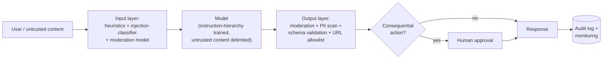

# 🛡️ Safety, Security & Responsible AI

Every company shipping LLM features now runs a security review, and "how would you stop prompt injection?" has become the AI-engineering equivalent of "how would you prevent SQL injection?" - except the honest answer is harder. This topic shows up in system-design rounds for AI/GenAI engineer roles, in dedicated security loops at frontier labs, and increasingly as a filter question anywhere agents touch real user data: interviewers want engineers who design for failure, not ones who believe a system prompt is a security boundary.

## Crash course

### The root cause: instructions and data share one channel

An LLM's context window has **no privilege separation**. System prompt, user message, retrieved documents, and tool results are all just tokens; instruction-following is a *trained behaviour*, not an enforced boundary. Anything the model reads can steer what it does. Nearly every problem in this topic - injection, leakage, agent hijacking - is a consequence of this one fact, and every defence is an attempt to bolt separation back on from the outside.

### Prompt injection: direct vs indirect

**Direct injection**: the attacker *is* the user ("ignore previous instructions and..."). **Indirect injection**: the attacker plants instructions in content your app will process on someone else's behalf - a web page, an email, a résumé, a PDF, a calendar invite, a tool result. Indirect is the dangerous one: the victim never sees the attack, and it scales (one poisoned page hits every agent that browses it). The term was coined by Simon Willison in 2022; the SQL-injection analogy is apt except there is **no equivalent of parameterised queries**. Training-time mitigations like OpenAI's instruction hierarchy (privileged system > user > tool content) reduce attack success rates but are probabilistic - and in security, a 99% filter just means the attacker iterates until they're in the 1%. **Design assuming injection succeeds.**

### Jailbreaks are a different attack

- **Jailbreak** = attack the *model's safety training* to elicit content the provider forbids. Attacker and victim: the user and the model provider.
- **Prompt injection** = attack the *application* to abuse the user's data and privileges. A third party attacks the user *through* your app.

Jailbreak families, conceptually: **roleplay/persona framing** (fiction wrapper vs. trained refusals), **many-shot** (hundreds of faux dialogue turns exploit in-context learning in long windows - Anthropic, 2024), **encoding/obfuscation** (base64, ciphers, low-resource languages - capability generalises further than safety training), **optimised suffixes** (GCG gradient-searched strings that transfer across models), **multi-turn escalation**, and **best-of-N** random perturbation. Common thread: safety training is distributional; attackers move off-distribution.

### Defence in depth

No single layer works. Stack them and shrink blast radius:

Principles that generate the layers: **least privilege** (minimal tool scopes, read-only defaults), **treat all model output as untrusted** (escape it, parameterise it, sandbox it - it's transitively attacker-controlled), **structural constraints** (a model forced to emit `{"category": one of 5 enums}` can't exfiltrate a secret no matter what's injected), **human approval for irreversible actions**, and **audit logging** for everything.

### The lethal trifecta

Simon Willison's design test for agents. An agent that combines **(1) access to private data**, **(2) exposure to untrusted content**, and **(3) an exfiltration channel** (send email, HTTP fetch, markdown images) is exploitable - full stop. The fix is architectural: **remove one leg**. Gate the exfil channel behind approval, don't feed untrusted content to the privileged agent, or don't give that agent private data. MCP's mix-and-match tool ecosystem makes it easy for *users* to assemble the trifecta by accident.

### Design-level defences

The **dual-LLM pattern**: a *privileged* LLM plans and calls tools but never reads untrusted content; a *quarantined* LLM processes untrusted content and returns results only as typed variables (`$email_summary`) the privileged side handles symbolically without reading. **CaMeL** (Google DeepMind, 2025) hardens this into plan-then-execute: the planner writes code from the trusted request alone, a custom interpreter runs it, and capability policies track which data may flow to which sink. Real prompt-injection resistance by construction - at the cost of flexibility (the plan can't adapt to what the data says) and engineering effort.

### OWASP Top 10 for LLM Applications (2025)

The shared vocabulary of AI security reviews: **LLM01 Prompt Injection**, **LLM02 Sensitive Information Disclosure**, **LLM03 Supply Chain**, **LLM04 Data & Model Poisoning**, **LLM05 Improper Output Handling**, **LLM06 Excessive Agency**, **LLM07 System Prompt Leakage**, **LLM08 Vector & Embedding Weaknesses**, **LLM09 Misinformation**, **LLM10 Unbounded Consumption**. For agent products, 01 + 05 + 06 form the critical chain: injected instructions → unsanitised output → over-privileged tools.

### Guardrails engineering

- **Input side:** cheap heuristics (regex denylists, length caps) → small injection/jailbreak classifiers (Prompt Guard-style, tens of ms) → moderation (OpenAI's free moderation endpoint; **Llama Guard**-style safeguard LLMs classifying against a hazard taxonomy).
- **Output side:** moderation, PII detection (e.g., Presidio), groundedness checks, **schema validation** - the highest-leverage guardrail because it's deterministic.
- **Latency math:** serial checks add up. Run input classifiers *in parallel* with the main generation and cancel on a hit; for output checks, streaming is the enemy - buffer and check sentence-by-sentence, or stream freely for chat but hard-gate anything that triggers an action. Tier by risk: cheap checks everywhere, expensive checks on triggers.
- Remember guardrail models are themselves attackable, and every classifier has a false-positive budget you pay in product quality.

### Data leakage & privacy

Sensitive data leaks through more paths than the model: **prompts to vendors, observability traces (they store full prompts!), logs, eval sets, fine-tuning data, caches, embeddings**. Controls: API/enterprise tiers don't train on your data by default; **zero-data-retention (ZDR)** agreements remove even the ~30-day abuse-monitoring window; DPAs/BAAs for regulated data. **Assume the system prompt leaks** - extraction is trivial, so no secrets in prompts, ever; keep authorisation server-side. Models also **memorise** training data - extraction attacks have recovered verbatim PII from production models - so dedup and scrub before any training/fine-tuning. Technique stack: **PII redaction pre-LLM** (NER → `[PERSON_1]` placeholders with a reversible map for re-hydration), pseudonymisation, **VPC/private deployment** (Bedrock, Azure OpenAI, Vertex) or on-prem open weights for sovereignty, and **per-tenant isolation** - separate vector-index namespaces, ACL filters at query time, never a shared cache across tenants.

### Agent & supply chain security

- **Tools:** least-privilege scopes per task (read-only default, short-lived creds), validated arguments (path roots, URL allowlists, read-only DB users), approval gates for irreversible actions.
- **Code execution:** sandbox (container/gVisor/Firecracker/WASM), **no network egress by default**, resource limits, throwaway filesystems.
- **MCP/third-party tools:** tool *descriptions* enter your context - they're an injection vector (**tool poisoning**); servers can change descriptions after you approved them (**rug pull**) or instruct the model to misuse *other* tools (**shadowing**); a stdio server is arbitrary code on your machine. Pin versions, review descriptions, diff on change, allowlist registries.
- **Model artifacts:** pickle-based checkpoints execute arbitrary code on load - use **safetensors** (data-only format); recent PyTorch defaults `torch.load(weights_only=True)`. Pin revisions and verify hashes.

### Alignment, for engineers

Pretraining creates capabilities, including harmful ones. **RLHF** (and DPO/RLAIF successors) shapes the behaviour distribution - helpfulness *and* refusals live in the weights. **Constitutional AI / RLAIF** in one line: the model critiques and revises its own outputs against written principles, and AI preference labels replace most human ones. A system prompt merely *conditions* this trained policy; it can't remove a capability and it can be overridden - which is why "alignment via system prompt" is a red-flag phrase. The flip side is **over-refusal**: a model that refuses benign requests is trivially "safe" and useless, so safety evals must always pair harmful-compliance rates with benign-refusal rates.

### Hallucination is a safety problem

Confident fabrication burns users (lawyers have been sanctioned for filing fabricated citations). Mitigations: **grounding** (RAG with instructions to answer only from context), **citations** you actually verify exist in the sources, **abstention** - product flows and prompts that make "I don't know" a first-class answer - and post-hoc groundedness checks. Models hallucinate partly because training and benchmarks reward confident guessing over calibrated uncertainty; product design has to push the other way.

### Red-teaming and safety evals

**Pre-launch:** manual expert red-teaming (security + domain experts) plus automated scanners (garak, PyRIT) and attacker-LLM loops, covering OWASP categories and your app's specific worst-case harms. **Continuous:** re-run on every model swap, prompt change, and new tool - behaviour is not stable across versions. Convert every finding into a regression eval; track attack success rate over time. Know the benchmark names (HarmBench, StrongREJECT, AgentHarm for agents, XSTest for over-refusal) and their limits: static benchmarks go stale against adaptive attackers and never cover your domain.

### Responsible-AI process

**Model cards / system cards** document intended use, evals, and limitations (model card = the model; system card = your deployed system). **EU AI Act**: risk tiers - prohibited practices, high-risk (hiring, credit, medical - conformity assessments, logging, human oversight), transparency-tier (chatbots must disclose they're AI), minimal - plus separate obligations for general-purpose models, phasing in 2025-2027. **NIST AI RMF** in one line: a voluntary framework organised as Govern / Map / Measure / Manage. **Audit logging**: immutable records of prompts, outputs, tool calls, and approvals - with the privacy tension (log everything vs. retain nothing) resolved via redacted logs plus restricted raw access.

## Interview questions

See [questions.md](questions.md) - **26 questions** with answers, from injection basics to full secure-agent design.

## Red flags interviewers watch for

- Claiming prompt injection is solved by a system prompt instruction, a delimiter scheme, or "a better prompt" - or not knowing the difference between prompt injection and jailbreaking.
- Proposing to put API keys, credentials, or secret business logic in the system prompt; treating prompt secrecy as a security control.
- Designing an agent with the full lethal trifecta and no approval gates - or never having heard the term and having no equivalent mental model.
- Trusting model output: rendering it as HTML, executing generated SQL/code unsandboxed, or piping it into privileged tools without validation.
- No answer for guardrail latency and false positives - proposing five serial classifier calls on every request without discussing cost, streaming, or FP budget.
- Thinking "we don't train on your data" is the whole privacy story - ignoring logs, traces, retention windows, embeddings, and per-tenant isolation.
- One-time pre-launch red teaming with no regression evals, no monitoring, and no plan for re-testing after model or prompt changes.
- All-safety-no-product answers: unable to discuss over-refusal, guardrail UX cost, or where residual risk is consciously accepted.

## Further reading

- [The lethal trifecta for AI agents - Simon Willison](https://simonwillison.net/2025/Jun/16/the-lethal-trifecta/) - the essential agent-security mental model.
- [Prompt injection series - Simon Willison](https://simonwillison.net/series/prompt-injection/) - from the 2022 coinage through dual-LLM and CaMeL.
- [OWASP Top 10 for Large Language Model Applications](https://owasp.org/www-project-top-10-for-large-language-model-applications/) - the shared vocabulary for LLM security reviews.
- [Universal and Transferable Adversarial Attacks on Aligned Language Models - Zou et al.](https://arxiv.org/abs/2307.15043) - GCG; why prompt-level safety is brittle.
- [Many-shot jailbreaking - Anthropic](https://www.anthropic.com/research/many-shot-jailbreaking) - long context as an attack surface.
- [Constitutional AI: Harmlessness from AI Feedback - Bai et al.](https://arxiv.org/abs/2212.08073) - the RLAIF paper behind "alignment lives in the weights."
- [Scalable Extraction of Training Data from (Production) Language Models - Nasr et al.](https://arxiv.org/abs/2311.17035) - memorisation and extraction against deployed chat models.
- [NIST AI Risk Management Framework](https://www.nist.gov/itl/ai-risk-management-framework) - Govern / Map / Measure / Manage.
