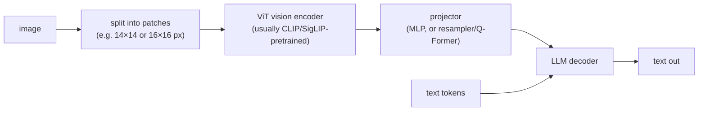

# 🖼️ Multimodal Models

Multimodal questions show up in two flavours: conceptual ("how does an image get into an LLM?", "explain diffusion") in screens and model-knowledge rounds, and applied ("design a document-extraction pipeline", "build a voice agent under a latency budget") in system-design rounds. Anyone interviewing for a GenAI product role gets the applied flavour - document AI, multimodal RAG, and voice agents are three of the most common real workloads in 2026 - and frontier-lab interviews add the architecture and generation depth.

## Crash course

### The VLM pattern: vision encoder → projector → LLM

Almost every vision-language model you'll use (LLaVA-family, Qwen-VL, InternVL, and the closed frontier models to a first approximation) follows one pattern: a **vision encoder** turns the image into a sequence of embeddings, a small **projector/adapter** maps those into the LLM's embedding space, and the **LLM** consumes them as if they were token embeddings - attention doesn't care that some "tokens" came from pixels.



- The **vision encoder** is a **ViT** (Vision Transformer): the image is chopped into fixed-size patches, each patch linearly embedded, and a standard transformer runs over the patch sequence. A 224×224 image with 16×16 patches → 196 patch tokens. The encoder is almost always pretrained with contrastive image-text learning (CLIP/SigLIP), which is what makes its features "language-aligned" and cheap to graft onto an LLM.
- The **projector** design space: a plain **MLP** (LLaVA) keeps every patch token - simple, lossless, but eats context; a **resampler / Q-Former** (Flamingo's Perceiver Resampler, BLIP-2) cross-attends a fixed number of learned queries into the patch features - compresses 100s of patches to e.g. 64 tokens, at some information loss. The modern default is MLP + tiling + light token pooling.
- **Training recipe** (LLaVA-style): stage 1 trains only the projector on image-caption pairs (both towers frozen) to align spaces; stage 2 unfreezes the LLM (sometimes the encoder too) for visual instruction tuning; later stages add high-resolution data and preference tuning.

The alternative is **native / early-fusion multimodality**: one transformer trained on interleaved modalities from scratch (Gemini, GPT-4o's audio, Meta's Chameleon; Fuyu even drops the vision encoder and feeds linearly-projected patches straight into the decoder). Deeper integration and unified generation+understanding, at much higher training cost.

### CLIP: why one model unlocked all of this

**CLIP** (OpenAI, 2021) trains an image encoder and a text encoder jointly on ~400M web image-text pairs with a **contrastive loss**: in a batch of N pairs, maximise similarity of the N matched (image, caption) embeddings and minimise the N²−N mismatched ones. Both modalities land in one shared embedding space.

```python
# zero-shot classification with CLIP - no training on the target classes
text_embs = encode_text([f"a photo of a {c}" for c in classes])  # (C, d)
img_emb   = encode_image(img)                                    # (d,)
pred = classes[(img_emb @ text_embs.T).argmax()]                 # nearest caption wins
```

Why it transfers: supervision is **open-vocabulary natural language**, not a fixed 1000-class head, so the encoder learns features organised around anything people write about images. That gives (a) **zero-shot classification** (~76% ImageNet top-1 without seeing a single ImageNet label, for the largest CLIP), (b) **text-to-image retrieval** for free, and (c) the standard **vision backbone for VLMs**. SigLIP (sigmoid loss instead of softmax contrastive) is the common modern replacement. Know the caveats: CLIP behaves bag-of-words-ish (weak at word order, relations, counting), and image/text embeddings occupy separated cones in the shared space (the "modality gap").

### Images are tokens, and resolution is money

Every provider converts images to tokens; the budget scales with resolution:

- **OpenAI** (GPT-4o-class, high detail): image is resized and cut into **512×512 tiles**, ~170 tokens per tile + 85 base tokens; newer models count small patches instead, but the principle - tokens scale with area - is the same.
- **Anthropic**: ~`(width × height) / 750` tokens, images over ~1568 px on the long edge get downscaled (≈1.6k tokens max per image).
- **Google Gemini**: small images ~258 tokens; larger ones tiled into 768×768 crops at ~258 tokens each.

So a readable full page of a document costs on the order of **1-2k tokens**; a 100-page PDF sent as images is ~150k tokens *per request*. This is why **tiling / dynamic resolution** exists (LLaVA-NeXT's AnyRes, Qwen-VL's dynamic resolution): the model sees a low-res global view plus high-res crops, spending tokens only where needed. The engineering tradeoff is always the same - more pixels means better OCR and fine detail but linearly more cost and latency, and past the model's training resolution extra pixels buy nothing.

### What vision models get wrong

Predictable failure modes, worth reciting in any design answer:

- **Counting** (more than ~4-5 objects) and **precise spatial relations** (left/right, above/below, relative sizes) - patch features and pooled attention are closer to a "bag of features" than a scene graph.
- **Small text / dense OCR** - quality collapses below a legibility threshold that depends on image token budget; digits are the scariest case because the model substitutes *plausible* numbers (silent numeric hallucination).
- **Charts** - reading values off axes, especially unlabelled points, is estimation, not extraction.
- **Object hallucination** - naming things that aren't there, especially objects that co-occur with the scene type in training data.

Mitigations: raise resolution/tiling, crop-and-re-ask on regions of interest, route text-dense pages through OCR and give the model both image and OCR text, use self-consistency for critical numbers, and validate extractions against schemas/checksums.

### Document AI: OCR pipeline vs OCR-free

Two roads to structured data from documents:

1. **OCR pipeline**: layout detection + text recognition (Tesseract/PaddleOCR, or managed: AWS Textract, Google Document AI, Azure Document Intelligence) → text with coordinates → LLM for extraction. Cheap at scale (~fractions of a cent per page), gives character-level bounding boxes (auditability, redlining), deterministic-ish. Breaks on: complex layouts, reading order across columns, handwriting, tables that span pages - and errors compound into the LLM stage.
2. **OCR-free VLM**: send the page image straight to a VLM with an extraction prompt. Handles layout, handwriting, checkboxes, stamps, and context jointly; one stage to maintain. Costs 10-100× more per page with frontier models (small VLMs narrow the gap substantially), hallucinates plausible values, and most models won't give you exact coordinates.

Production systems increasingly use a **cascade**: classify pages, run cheap OCR everywhere, escalate only hard/high-value pages to a VLM, and always feed the VLM *both* the image and the OCR text. For tables, validate structurally (row/column sums, schema types); for charts, treat VLM readings as estimates unless the values are printed.

### Image generation: diffusion in one screen

**Diffusion** intuition: define a *forward* process that gradually adds Gaussian noise to an image over T steps (per a **noise schedule**) until it's pure noise; train a network to *reverse* one step - given a noisy image and the timestep, predict the noise that was added. Generation = start from pure noise and iteratively denoise. Each step is a small, learnable correction, which is why training is stable: it's just regression on noise (DDPM, 2020).

- **Latent diffusion** (Stable Diffusion, 2022): running diffusion on 512×512×3 pixels is wasteful, so first a **VAE** compresses the image 8× per side into a 64×64×4 latent (~48× fewer values), diffusion happens in latent space, and the VAE decoder maps the final latent back to pixels. Components: VAE, denoising U-Net (now usually a **DiT** - diffusion transformer - as in SD3/Flux), text encoder (CLIP and/or T5), sampler.
- **Conditioning + classifier-free guidance (CFG)**: text conditioning enters via cross-attention. During training the condition is dropped ~10-20% of the time so one network learns both conditional and unconditional denoising; at sampling you extrapolate: `pred = uncond + s · (cond − uncond)`. Scale `s` (typically ~5-9) trades diversity for prompt adherence; too high → oversaturated, artifact-prone output. CFG doubles compute per step. "Negative prompts" are just swapping the unconditional branch for things you want to steer away from.
- **Step counts**: ~1000 training steps, 20-50 sampling steps with modern samplers, 1-4 with distilled models.

The **autoregressive alternative**: tokenize the image into discrete codes (VQ-VAE/VQGAN) and have a transformer predict them like text (DALL·E 1, Parti), or generate natively inside an omni-model (GPT-4o-style image generation). AR generation integrates with the LLM - better instruction following, text rendering, and conversational editing - at the cost of sequential decoding; diffusion refines the whole canvas in parallel. Frontier image generation in 2026 uses both camps.

### Audio: ASR, TTS, voice agents

- **ASR - Whisper's design**: an encoder-decoder transformer. Audio → log-Mel spectrogram (30-second windows) → encoder; the decoder is an autoregressive text model whose special tokens select the task (language, transcribe vs translate, timestamps). Trained on ~680k hours of weakly-supervised web audio, which is where the robustness to accents and noise comes from. Known failure: hallucinating text on silence or music. Metric: **WER** (word error rate).
- **TTS**: classically acoustic model (text → mel spectrogram) + neural vocoder (mel → waveform, e.g. HiFi-GAN). The modern approach is **neural codec language models**: compress audio to discrete codec tokens (EnCodec/SoundStream), then an AR transformer generates codec tokens conditioned on text and a few seconds of reference voice (VALL-E style) - which is also what makes zero-shot voice cloning easy, for better and worse.
- **Voice agents** - the design question that comes up constantly. Two architectures:

| | Pipeline: STT → LLM → TTS | Native speech-to-speech |
|---|---|---|
| Latency | each stage adds up; needs aggressive streaming | ~300ms-class voice-to-voice possible (GPT-4o Realtime-style) |
| Control | full text in the middle: guardrails, tools, logging are easy | harder to inspect/guardrail; tool use via API events |
| Voice quality | prosody/emotion lost at the STT boundary | hears tone, can laugh/whisper, preserves paralinguistics |
| Maturity | battle-tested, mix-and-match vendors | fewer options, harder eval |

Latency budget for natural conversation: humans leave ~200ms gaps between turns; **sub-second voice-to-voice is the bar**, ~500-800ms feels good. A pipeline spends it roughly: VAD/endpointing 100-300ms + streaming-ASR finalisation ~100-200ms + LLM time-to-first-token 200-500ms + TTS time-to-first-audio 100-300ms + network. So everything must stream, and you start TTS on the first sentence, not the full reply. **Interruptions (barge-in)**: run VAD continuously during playback (with echo cancellation so the agent doesn't hear itself), stop TTS immediately, cancel generation, and truncate the conversation state to what the user actually heard.

### Video: frames are expensive

Video understanding is mostly *frame sampling + image understanding + the audio track*. Typical: uniform sampling around ~1 fps (Gemini's default; ~258 tokens per frame there), so an hour of video is on the order of **~1M tokens** - cost and context are the binding constraints. Smarter sampling: scene-change/keyframe detection, dense sampling only around moments of interest, transcribe audio and align. Persistent weaknesses: fine motion between sampled frames, event counting, precise temporal ordering and causality over long horizons. Standard mitigation pattern: hierarchical - cheap pass to summarise/segment, then re-query specific windows at higher fps.

### Cross-modal retrieval and multimodal RAG

**Text-to-image search**: CLIP-style dual encoders give you it almost for free - embed images offline into an ANN index (HNSW/IVF), embed the text query at runtime, nearest neighbours. Practical gotchas: CLIP's 77-token text limit and caption-style bias, the modality gap, and domain shift (fine-tune with hard negatives for e.g. product search); rerank top candidates with a VLM when precision matters.

**Multimodal RAG** over visually-rich documents, three levels:
1. Parse to text and do normal RAG - loses figures/charts entirely.
2. **Caption/summarise** every image, table, and chart with a VLM at ingestion; embed the text descriptions; retrieve descriptions, then hand the original image to the VLM at answer time. The pragmatic default.
3. **Screenshot-based retrieval (ColPali-style)**: skip parsing - a VLM embeds each *page image* into many patch-level vectors, the query into token vectors, and scoring is ColBERT-style late interaction (sum of per-query-token max similarities). Retrieval quality on visually-rich docs is excellent because nothing is lost in parsing; costs are multi-vector storage and needing a VLM to read the retrieved pages.

### Evaluating multimodal systems

- **Understanding**: VQA-style benchmarks - VQAv2, DocVQA (ANLS metric), ChartQA, TextVQA, OCRBench, MMMU for expert-level reasoning. Treat public numbers with contamination scepticism; for products, build a labelled eval from your own traffic (per-field extraction accuracy for doc AI beats any public benchmark).
- **Generation**: FID (distribution-level realism - useless for judging one image), CLIPScore (prompt-image alignment), compositional checks (GenEval-style: right object counts, colours, positions), and ultimately **human preference** - side-by-side arenas remain the gold standard.
- **Judges**: LLM-as-judge works but the judge must actually see the image (use a strong VLM judge), and it inherits VLM blind spots - don't judge counting with a model that can't count.

### Safety: provenance, deepfakes, filtering

Generation-side safety is layered: prompt classifiers and policy filters on input (including uploaded reference images - real-person likeness, minors), output classifiers (NSFW; hash-matching against known CSAM), and refusal behaviour tuned into the model. **Provenance**: C2PA "Content Credentials" attach a cryptographically signed manifest saying who/what made the image - but it's metadata and strips on re-encode/screenshot; **invisible watermarking** (e.g. Google's SynthID) embeds a signal in pixels that survives common transforms. Know the honest limits: provenance proves *presence* of a claim, absence proves nothing; post-hoc deepfake *detection* classifiers are an arms race and unreliable as sole evidence. Voice cloning adds consent verification requirements, and regulation (e.g. EU AI Act transparency rules) increasingly mandates labelling synthetic media.

## Interview questions

See [questions.md](questions.md) - 21 questions with detailed answers, from basic to advanced.

## Red flags interviewers watch for

- Not knowing that images are billed as tokens and that resolution drives cost - proposing "send all 500 pages as images" with no budget math.
- Unable to explain CLIP's contrastive objective or why zero-shot classification works - it's the "explain attention" of multimodal rounds.
- Trusting VLM OCR blindly: no plan for numeric hallucination, no schema validation, no OCR+VLM hybrid for critical fields.
- Explaining diffusion as just "it denoises" without knowing what the network is trained to predict, what the noise schedule is, or what CFG scale does.
- Designing a voice agent with no latency numbers, no streaming at every stage, and no barge-in/interruption story.
- Ignoring the audio track and sampling strategy for video - treating video as "lots of images" with no cost estimate.
- Claiming watermarking or C2PA "solves" deepfakes, or conversely dismissing provenance entirely - both signal shallow safety thinking.
- Only knowing one vendor's stack; unable to compare adapter-based open VLMs with natively multimodal frontier models.

## Further reading

- [CLIP: Learning Transferable Visual Models From Natural Language Supervision](https://arxiv.org/abs/2103.00020) - the paper behind every modern vision encoder.
- [An Image is Worth 16x16 Words (ViT)](https://arxiv.org/abs/2010.11929) - patches as tokens.
- [Visual Instruction Tuning (LLaVA)](https://arxiv.org/abs/2304.08485) - the canonical encoder+projector+LLM recipe.
- [High-Resolution Image Synthesis with Latent Diffusion Models](https://arxiv.org/abs/2112.10752) - the Stable Diffusion paper.
- [What are Diffusion Models? - Lilian Weng](https://lilianweng.github.io/posts/2021-07-11-diffusion-models/) - the best single derivation-with-intuition writeup.
- [Robust Speech Recognition via Large-Scale Weak Supervision (Whisper)](https://arxiv.org/abs/2212.04356) - encoder-decoder ASR and why weak supervision scales.
- [ColPali: Efficient Document Retrieval with Vision Language Models](https://arxiv.org/abs/2407.01449) - screenshot-based retrieval and the ViDoRe benchmark.
- [C2PA specifications](https://c2pa.org/) - content provenance and Content Credentials.
