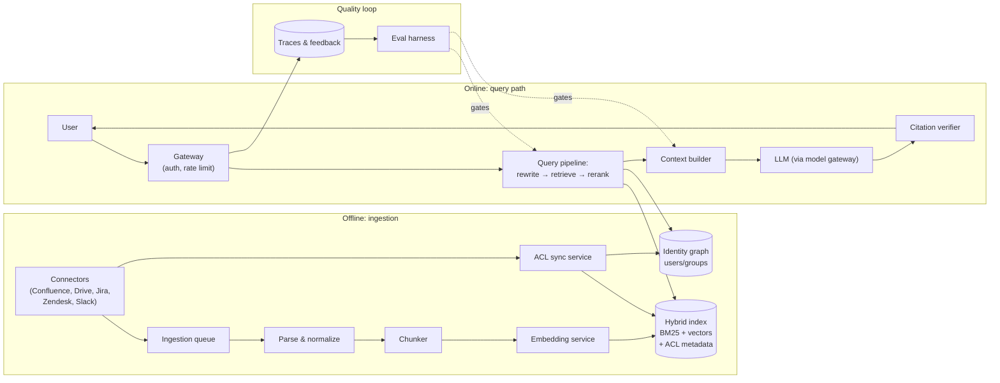

# Case Study 01: Enterprise RAG Assistant

> "Design a company-wide knowledge assistant. Employees should be able to ask questions and get accurate, cited answers from our wikis, docs, tickets, and Slack - without ever seeing content they don't have access to."

## Problem statement

A 20,000-person company has knowledge scattered across Confluence, Google Drive, Notion, Jira, Zendesk, and Slack. Employees waste time searching six tools or interrupting experts. Build an internal assistant that answers natural-language questions with citations, respects per-document permissions exactly, and stays fresh as content changes.

## Clarifying questions & assumptions

Questions I'd ask the interviewer, with the assumptions I'll proceed on:

| Question | Assumption |
|---|---|
| How many employees and how chatty are they? | 20k employees; ~30% weekly active; **~30k queries/day**, peak ~10 QPS |
| Corpus size and churn? | ~4M source documents (~15M after chunking); ~1-2% of docs change daily |
| How strict are permissions? | Hard requirement: a user must **never** see content (even a snippet or citation title) they can't open in the source system |
| Freshness SLA? | Edits visible within ~15 min; deletions/permission revocations within ~5 min |
| Latency expectations? | Chat UX: p95 time-to-first-token < 2s, full answer < 15s, streaming |
| Buy vs build? | Assume build (interview framing), external model APIs allowed if no training on our data |
| What does success look like? | ≥85% answer accuracy on a golden set, ≥40% of users returning weekly, measurable reduction in internal support tickets |

The permission question is the one that changes the architecture most - always ask it first for enterprise RAG.

## Requirements

### Functional
- Ask questions in chat; get streamed answers with **inline citations linking to source documents**.
- Multi-turn: follow-up questions resolve against conversation context.
- Federated ingestion from ≥6 source systems via connectors.
- Per-user permission enforcement identical to source-system ACLs (users, groups, sharing links).
- Feedback: thumbs up/down + "wrong/outdated source" flag on every answer.
- Admin: source-connector health, index stats, eval dashboards, content exclusion rules.

### Non-functional
- **Scale**: 30k queries/day, peak 10 QPS (bursty 9-11am), 15M chunks indexed, 150-300k chunk updates/day.
- **Latency**: p95 TTFT < 2s; retrieval stage < 500ms; p99 end-to-end < 25s.
- **Freshness**: content edits ≤ 15 min; **ACL revocations ≤ 5 min** (security-critical, tighter than content).
- **Quality**: ≥85% correct-and-faithful on golden set; ≥95% of factual claims backed by a retrievable citation.
- **Cost**: target < $0.05/query blended; < ~$50k/month all-in at this scale.
- **Compliance**: SOC 2 posture; no training on company data; full audit log of who asked what and what was retrieved.

## High-level architecture



The online path in sequence form, with per-stage latency budgets:

```mermaid
sequenceDiagram
    participant U as User
    participant GW as Gateway
    participant QP as Query pipeline
    participant IX as Hybrid index
    participant CB as Context builder
    participant M as LLM

    U->>GW: question + auth token
    GW->>QP: query + user principal set
    QP->>QP: conversational rewrite (small model, ~200ms)
    QP->>IX: hybrid search, ACL-filtered (top 50, ~150ms)
    IX-->>QP: candidate chunks
    QP->>QP: cross-encoder rerank to top 8 (~80ms)
    QP->>CB: chunks + conversation history
    CB->>M: assembled prompt (~7k tokens)
    M-->>U: streamed answer (TTFT < 2s)
    Note over U,M: citation verifier runs as the stream completes;<br/>trace written asynchronously
```

## Component deep-dives

### Connectors & ingestion pipeline

- One connector per source system, doing three jobs: **content sync** (initial crawl + webhooks/change feeds + periodic reconciliation crawl for missed events), **ACL sync**, and **deletion propagation**.
- Normalise everything to a common document model: `{doc_id, source, url, title, body, author, updated_at, acl: {allowed_users, allowed_groups, link_sharing}, labels}`.
- Ingestion is queue-backed (Kafka/SQS) with per-source rate limiting - Confluence and Jira APIs will throttle you long before your pipeline is the bottleneck.
- Two priority lanes: a **fast lane for deletions and ACL changes** (target < 5 min end-to-end) and a normal lane for content updates. Never let a backfill starve revocations.
- Tradeoff: webhooks are fresh but unreliable (dropped events, missed subscriptions); polling is reliable but slow and API-expensive. Do both - webhooks for latency, nightly reconciliation for correctness.

### Chunking & embedding

- Structure-aware chunking: split on headings/sections, ~300-800 tokens per chunk with ~10-15% overlap; keep tables intact; prepend a breadcrumb header (`Space > Page > Section`) to each chunk so it's self-describing.

| Source | Chunking approach | Typical chunk size | Notes |
|---|---|---|---|
| Wiki pages | Heading-based sections | 300-800 tokens | Breadcrumb prefix; tables kept whole |
| Google Docs | Heading + paragraph groups | 300-600 | Strip comments/suggestions |
| Jira/Zendesk tickets | Whole ticket or issue+top comments | 200-1,000 | Status/date in metadata; downweight closed-stale |
| Slack | Thread-level aggregation | 200-800 | Skip channels < N members by policy; authority downweight |
| PDFs/slides | Layout-aware parse, per-section | 300-800 | OCR fallback; figures get caption text |

- Store chunk → parent-document mapping so we can do **small-to-big retrieval**: match on the chunk, optionally feed the surrounding section to the model for better context.
- Embeddings: a strong off-the-shelf embedding model; 15M chunks × ~500 tokens = ~7.5B tokens for a full re-embed. Batchable, cheap relative to query-time costs (math below). Version-pin the embedding model; a model swap means a full re-index, so run **blue/green indexes** for that.
- Tickets and Slack need different handling: thread-level aggregation (a lone Slack message is useless), and an authority downweight - a wiki page should usually outrank a two-year-old Slack guess.

### ACL enforcement (the make-or-break component)

- **Filter at retrieval time, before ranking** - every index query carries the user's permission context; the index only returns chunks the user can read. Post-filtering after retrieval leaks information through ranking behaviour and breaks top-k (you retrieve 10, filter to 2).
- Mechanics: each chunk carries `allowed_principals` (user IDs + group IDs, flattened). At query time, expand the user to their principal set (user + all transitive groups, cached ~5-15 min in the identity graph service) and filter with a terms match. Both OpenSearch-style engines and modern vector DBs handle metadata filters at reasonable scale; verify filtered-ANN recall doesn't crater when filters are highly selective.

```python
def retrieve(user, query_text, query_vec, k=50):
    principals = identity_graph.expand(user)   # user + transitive groups, cached ~10 min
    flt = {"allowed_principals": {"any_of": principals}}
    dense = vector_index.search(query_vec, k=k, filter=flt)    # filter INSIDE the ANN search,
    sparse = bm25_index.search(query_text, k=k, filter=flt)    # never after top-k
    return rrf_fuse(dense, sparse)
```
- **Late-binding recheck**: before rendering citations, re-verify the top documents against the live source ACL (or a seconds-fresh cache) - this closes the gap between revocation and index update.
- Group explosion: a doc shared with "all-engineering" (8k members) stores the group ID, not 8k user IDs; expansion happens on the query side.
- Tradeoff: strict ACLs mean two users asking the same question get different answers - this breaks naive response caching. Cache per-permission-set (hash of the sorted principal set), or only cache within a user session.

### Hybrid retrieval & reranking

- **BM25 + dense, fused with Reciprocal Rank Fusion (RRF)**. BM25 wins on exact identifiers ("error `AUTH_407`", "project Falcon Q3"), dense wins on paraphrase ("how do I get reimbursed" → "expense policy"). Enterprise queries are full of jargon and IDs - pure dense retrieval measurably underperforms here.
- Query pipeline before retrieval: conversational **query rewrite** (resolve "what about for contractors?" using chat history - small fast model, ~200ms), optional decomposition for multi-part questions, and metadata extraction (source/date hints → filters).
- Retrieve top ~50 hybrid → **cross-encoder reranker** → top 6-10 chunks into context. Reranking is the highest-ROI quality step in most RAG systems: often a double-digit gain in precision@k/nDCG for ~50-100ms of added latency.
- Recency prior: boost recently updated docs for policy-type queries; the "correct" answer to "what's the travel policy" is the newest one.

### Generation & citations

- Context builder assembles: system prompt (grounding rules, refusal policy, citation format) + top chunks with IDs + conversation history, under a ~12-16k token budget. Order matters - put the strongest chunks first and last ("lost in the middle").
- Prompt contract: *answer only from provided context; every factual claim cites `[chunk_id]`; if context is insufficient, say so and name what's missing*. A grounded "I don't know" is a success mode, not a failure - say this explicitly in the interview.
- **Citation verifier** post-step: check every cited chunk_id exists in the retrieved set (catches hallucinated citations cheaply); optionally run a small-model entailment check that each claim is supported by its cited chunk - run async and sampled if latency-sensitive, inline for high-stakes surfaces.
- Model tiering: default to a mid-tier model (most Q&A doesn't need frontier reasoning); route to a frontier model on signals like multi-document synthesis, long context, or a retry-after-thumbs-down.

### Multi-turn handling

- Conversation state lives server-side keyed by session; each turn's context = rewritten standalone query + last N turns verbatim + compacted summary of older turns (small model, offline).
- The **query rewrite step is what makes multi-turn RAG work**: "does that apply to interns?" retrieves nothing; the rewritten "does the remote-work policy apply to interns?" does. Evaluate the rewriter separately (rewrite-accuracy on a labelled multi-turn set) - it's a common silent failure point.
- Retrieval runs fresh every turn; never reuse the previous turn's chunks blindly (the follow-up usually needs different documents).
- Session TTL ~24h; users can pin/share conversations, which makes conversations themselves permission-scoped artifacts (shared conversation must re-check the *viewer's* ACLs before rendering citations - a subtle leak path worth naming).

## Data & context strategy

- **RAG, not fine-tuning, for knowledge** - corpus churns 1-2% daily and is permission-bound; fine-tuned weights can't enforce per-user ACLs and go stale immediately. This is the canonical "why RAG" scenario; state it crisply.
- Fine-tuning only appears later, if at all: possibly a small fine-tuned query-rewriter or a distilled reranker once we have traffic data.
- Context budget per query: ~500-token system prompt (shared prefix → **provider prompt caching** cuts its cost ~90%) + ~6-8 chunks × 500 tokens ≈ 3-4k + history ≈ 1-2k → **~6-8k input tokens typical**.
- Corpus hygiene beats model cleverness: dedupe near-identical pages, exclude archived spaces by default, let admins blocklist known-bad content. Most "the AI is wrong" reports trace back to the corpus containing two contradictory pages.
- Structured sources (Jira, HR systems) may be better served by **tools** (live API lookup) than by indexing snapshots - mention this as a v2 direction rather than complicating v1.

## Evaluation plan

**Offline, component-level (run in CI on every prompt/retrieval/model change):**
- *Retrieval*: golden set of ~300-500 (query → relevant doc IDs) pairs, built from search logs + expert labelling. Metrics: recall@10, nDCG@10, MRR. Evaluate retrieval separately from generation - otherwise you can't tell which stage failed.
- *End-to-end*: ~300 (question → reference answer + required citations) pairs across departments and difficulty tiers, including **unanswerable questions** (correct behaviour: refuse) and **permission-trap questions** (correct behaviour: no leak - this is a hard security test, gate releases on 100%).
- *Judging*: LLM-as-judge with a rubric scoring correctness, faithfulness-to-citations, and completeness; calibrate the judge against ~100 human-labelled examples and report agreement (target ≥ ~85% agreement before trusting it).

**Online:**
- Thumbs up/down rate, "outdated source" flags, citation click-through (are people verifying?), session follow-up rate (immediate rephrase ≈ failure signal), weekly retention.
- A/B test retrieval and prompt changes on real traffic; sample 1-2% of traces (with consent/policy sign-off) into a labelling queue that continuously grows the golden set.

**Metric summary:**

| Layer | Metric | Target | Cadence |
|---|---|---|---|
| Retrieval | recall@10 on golden set | ≥ 0.9 | Every CI run |
| Retrieval | nDCG@10 | track trend | Every CI run |
| Answer | correctness (judge, calibrated) | ≥ 85% | Every CI run |
| Answer | faithfulness-to-citations | ≥ 95% | Every CI run |
| Security | permission-trap leak rate | 0 (hard gate) | Every CI run |
| Online | thumbs-up rate | ≥ 80% of rated | Daily dashboard |
| Online | citation click-through | track trend | Weekly |
| Online | weekly active users retention | ≥ 40% | Weekly |
| Ops | freshness lag per connector | ≤ 15 min p95 | Real-time alerting |

**Quality flywheel**: traces + feedback → new eval cases → fix (usually retrieval or corpus, sometimes prompt) → CI proves no regression → ship. Saying this loop out loud is worth more than any single metric.

## Cost estimate

Illustrative token math with assumed ~prices (state your assumptions; exact prices change):

| Item | Math | ~Cost |
|---|---|---|
| Generation input | 30k q/day × 7k tokens × ~$3/M (frontier-mid tier) | ~$630/day |
| - with prompt caching + 70% mid-tier routing (~$0.5/M) | blended ~$1.2/M effective | ~$250/day |
| Generation output | 30k × 400 tokens × ~$10/M blended | ~$120/day |
| Query rewrite + rerank (small models) | 30k × ~1.5k tokens × ~$0.15/M + reranker infra | ~$10-30/day |
| Embeddings (steady state) | ~200k chunk updates/day × 500 tokens × ~$0.05/M | ~$5/day |
| Full re-embed (rare) | 7.5B tokens × ~$0.05/M | ~$375/event |
| Search infra | 15M chunks ≈ 60-100GB index → 3-6 node cluster | ~$3-5k/mo |
| **Blended per query** | | **~$0.015-0.03** |
| **Monthly total** | LLM ~$8-12k + infra ~$5k + connectors/ops | **~$15-25k/mo** |

Key levers, in order of impact: model tiering/routing, prompt caching on the shared prefix, retrieved-chunk count (context length dominates input cost), response caching where ACLs permit. At ~$20k/mo for 20k employees, this costs ~$1/employee/month - an easy ROI story if it saves minutes per week; interviewers like hearing the business framing.

## Failure modes & mitigations

| Failure | Impact | Mitigation |
|---|---|---|
| **ACL leak** (user sees unauthorised snippet) | Severity-1 security incident | Retrieval-time filtering + late-binding recheck + permission-trap eval suite gating every release + audit logs |
| Stale answer after doc update | Wrong policy guidance | Webhook + reconciliation ingestion; freshness SLA monitoring per connector; "last updated" shown in citations |
| Hallucinated or wrong citation | Trust collapse (users verify early on) | Grounding prompt contract; citation-ID verification; sampled entailment checks; faithfulness metric in CI |
| Retrieval miss (answer exists, not found) | "It's useless" perception | Hybrid + reranker; query rewrite; log zero-recall queries into retrieval eval set |
| Contradictory sources in corpus | Confidently inconsistent answers | Dedupe; recency prior; surface both sources with dates when conflict detected |
| Prompt injection via ingested content (a wiki page saying "ignore instructions and...") | Manipulated answers | Treat retrieved text as data: delimited, non-executable framing in prompt; output moderation; no tool-execution from retrieved content in v1 |
| Provider outage / model deprecation | Assistant down | Model gateway with cross-provider fallback; pinned versions; eval-gated migration playbook |
| Connector auth expiry / silent sync failure | Slowly rotting index | Per-connector freshness lag alerting; document-count drift detection |

## Scaling & ops

- **Traffic**: 10 QPS peak is small; the online path scales with stateless replicas. The real scaling problems are ingestion backfills (initial crawl of 4M docs - rate-limit against source APIs, expect days) and index growth.
- **Index ops**: blue/green indexes for embedding-model or chunking changes - build the new index in parallel, shadow-query it, compare retrieval evals, flip an alias, keep the old one warm for rollback.
- **Model version pinning**: pin exact model versions; when a provider announces deprecation, run the full eval suite on the candidate, diff per-category scores, then canary 5% → 50% → 100%.
- **Observability**: per-stage latency (rewrite / retrieve / rerank / TTFT / total), retrieval score distributions (a drop in mean reranker score often precedes user complaints), token usage per query, per-connector sync lag, ACL-recheck failure rate.
- **Degradation ladder**: reranker down → serve RRF order; LLM down → fallback provider; retrieval down → "search is degraded" honesty, never answer from parametric memory alone.
- **Rollout plan** - lead with this sequencing; it signals pragmatism:

| Phase | Scope | Exit criteria |
|---|---|---|
| Weeks 1-4 | Confluence connector only, 100-user pilot, golden set v1, tracing from day one | ≥ 75% correct on golden set; pilot NPS positive |
| Quarter 1 | All connectors, ACL sync hardened, feedback loop live, eval CI gating | 85% correctness; permission-trap suite at zero leaks; freshness SLAs met |
| Quarter 2 | Model tiering + routing for cost, response caching, multi-turn polish | Cost < $0.03/query at stable quality |
| Later | Structured-source tools (live Jira/HR lookups), proactive surfacing | Justified by logged demand, not speculation |

## Likely interviewer follow-ups

- *"A VP's strategy doc was shared with 5 people. Walk me through exactly how you guarantee the other 19,995 never see any trace of it - including in citations, autocomplete, and caches."* (Retrieval-time filter, principal expansion, late-binding recheck, per-permission-set caching, permission-trap evals.)
- *"Your users say answers are outdated. How do you debug: ingestion lag, retrieval ranking, or the model ignoring dates?"* (Freshness dashboards per connector → check if the new doc is indexed → check if it's retrieved → check if it's cited. Component evals make this a 10-minute triage.)
- *"How would you cut cost 5x if finance pushed back?"* (Routing more traffic to small models with eval-verified quality, aggressive prompt caching, fewer/shorter chunks via better reranking, response caching per permission-set, distill a small model on traced frontier outputs.)
- *"Why not fine-tune on the wiki?"* (Freshness, ACLs, attribution, and cost of continuous retraining; fine-tuning stores knowledge unverifiably and can't unlearn a revoked doc.)
- *"How do you bootstrap the golden set before you have users?"* (Expert-authored questions per department, synthetic questions generated from sampled docs then human-filtered, dogfood pilot traffic.)
- *"Slack says you can't index DMs. Does your design change?"* (Connector-level scoping; the ACL model already handles it - index only channels meeting policy; call out legal/works-council review as a real-world gate.)
- *"What breaks at 10x scale - 200k employees, 150M chunks?"* (Index sharding and filtered-ANN recall under selective ACL filters; identity-graph expansion caching; ingestion parallelism against API rate limits; cost forcing more aggressive tiering.)
