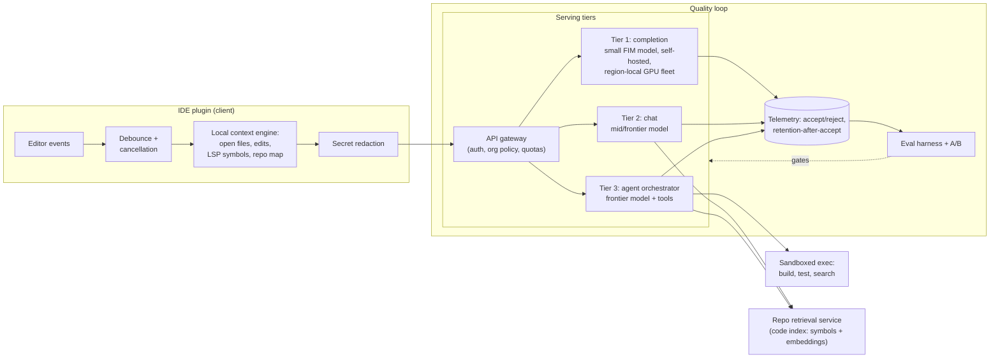

# Case Study 02: AI Code Assistant

> "Design an AI coding assistant for our engineering org: inline completions in the IDE, a chat panel that understands the repo, and an agent mode that can make multi-file edits."

## Problem statement

Build a Copilot-class assistant for a company with 50,000 developers (or as a product for that many users). Three surfaces with wildly different constraints: **inline completion** (fires on nearly every keystroke pause, must feel instant), **chat** (repo-aware Q&A and code explanation), and **agent mode** (multi-file edits, test runs, PR preparation). Code is sensitive IP; nothing may be retained or trained on without opt-in.

## Clarifying questions & assumptions

| Question | Assumption |
|---|---|
| Internal tool or product? Scale? | 50k developers, ~60% daily active |
| Completion volume? | ~400 completion requests/dev/day after debouncing → **~20M/day, peak ~2,500 QPS** (follow-the-sun flattens it somewhat) |
| Chat/agent volume? | ~15 chat messages/dev/day (~750k/day); ~3 agent tasks/dev/day (~150k/day) |
| Repo shape? | Mix of monorepo (10M+ files) and thousands of smaller repos; average file 100-500 lines |
| Latency bar? | Completion: **TTFT < 200ms** or devs disable it; chat: TTFT < 1.5s streamed; agent: minutes acceptable with progress UI |
| Privacy constraints? | Code never used for provider training; zero-data-retention agreements or self-hosting; secrets must not leave the client |
| Success metric? | Completion acceptance rate ~25-35%, chat CSAT, agent task success rate; ultimately retained usage |

The key insight to state up front: **this is three products sharing infrastructure, separated by latency budget** - the design follows from the latency tiers.

## Requirements

### Functional
- Inline multi-line completions with fill-in-the-middle (cursor anywhere, not just end-of-file).
- Chat grounded in the current repo: explain code, answer "where is X handled", draft functions/tests.
- Agent mode: plan → edit multiple files → run build/tests in a sandbox → present a reviewable diff (never auto-commit).
- Client-side secret/credential redaction before any code leaves the machine.
- Org admin controls: repo/path exclusions, model/data-residency policy, usage analytics.

### Non-functional
- **Latency**: completion p95 TTFT < 200ms (p50 ~100ms), full suggestion < 600ms; chat p95 TTFT < 1.5s; agent step p95 < 30s, task < 15 min.
- **Scale**: 20M completions/day (peak 2,500 QPS), 750k chat msgs/day, 150k agent tasks/day.
- **Availability**: completion degrades to "no suggestion" silently - never blocks typing; 99.9% for chat/agent.
- **Privacy**: ZDR with API providers or self-hosted weights; telemetry excludes raw code by default; per-org data isolation.
- **Cost**: completions must be radically cheap (< ~$0.001 each); agent tasks may cost $0.10-1.00.
- **Quality**: acceptance rate is the north star for completions (industry-typical ~25-35%); agent internal SWE-bench-style suite for regression gating.

## High-level architecture



Life of a completion request - the debounce/cancel dance is where the latency budget is won or lost:

```mermaid
sequenceDiagram
    participant E as Editor
    participant P as Plugin
    participant S as Completion service

    E->>P: keystroke
    P->>P: debounce timer (~120ms)
    E->>P: keystroke (timer resets)
    P->>P: pause detected → build context
    P->>P: redact secrets, check cache
    P->>S: FIM request (prefix, suffix, snippets)
    E->>P: user types again
    P->>S: CANCEL (in-flight request dropped, GPU freed)
    P->>S: new FIM request
    S-->>P: first tokens (~100ms TTFT)
    P->>E: ghost-text suggestion
    E->>P: Tab (accept) → telemetry event
    Note over P,S: majority of requests are cancelled;<br/>cheap cancellation is a hard serving requirement
```

## Component deep-dives

### Latency tiers (the core design decision)

| Tier | Surface | Model | TTFT target | Why |
|---|---|---|---|---|
| 1 | Inline completion | Small code model (~1-15B class), FIM-trained, self-hosted on GPUs near users | < 200ms | Fires constantly; latency is the feature. A frontier API model is both too slow (network + queue) and ~40x+ more expensive at 20M req/day |
| 2 | Chat | Mid-tier or frontier API model | < 1.5s | Quality matters more; users tolerate streaming latency for better answers |
| 3 | Agent | Frontier model with tool use (+ small models for sub-tasks like search query generation) | seconds/step | Multi-step reasoning quality dominates; total task time is minutes anyway |

- Tier 1 is **self-hosted almost by necessity**: 2,500 QPS peak of latency-critical small-model inference. Serve with vLLM/TensorRT-LLM-class stacks, continuous batching tuned for low latency (small max batch), quantized weights (FP8/INT8), regional GPU pools to cut RTT.
- Tiers 2-3 start on APIs (fastest to ship, frontier quality); revisit self-hosting only if scale economics or data residency force it.
- A **router** can upgrade a completion request to a bigger model when the client signals high intent (e.g., explicit "next edit" invocation vs passive typing pause).

### Completion path: FIM, debouncing, cancellation

- **Fill-in-the-middle (FIM)**: code models are trained with prefix/suffix sentinel tokens so they can complete *between* existing code - the model generates the middle conditioned on both sides. Essential because cursors live mid-file; pure left-to-right completion ignores the suffix and produces duplicated/contradicting code.

```python
# Conceptual FIM prompt layout (sentinel tokens vary by model family)
prompt = (
    "<FIM_PREFIX>"
    + cross_file_snippets      # imported signatures, similar code, ~500-1500 tokens
    + code_before_cursor       # local prefix window
    + "<FIM_SUFFIX>"
    + code_after_cursor        # local suffix window - this is what makes it FIM
    + "<FIM_MIDDLE>"           # model generates from here
)
# Stop conditions: max tokens, dedent past cursor scope, or suffix overlap detected
```
- Prompt budget ~1-4k tokens: prefix window around cursor + suffix window + selected cross-file context (imported symbols' signatures, similar code snippets from recently edited files). Small budget is deliberate - prefill time is part of TTFT.
- **Debounce** (~100-150ms after typing pauses) and **cancel aggressively**: the majority of in-flight completions are obsoleted by the next keystroke. The serving stack must support cheap request cancellation or you burn most GPU capacity on dead requests.
- Client-side caching: reuse a still-valid suggestion when the user types exactly the characters it predicted (prefix-match survival) - big perceived-latency win, zero cost.
- Multi-line vs single-line policy per language/context (e.g., single-line in config files, multi-line after a function signature) - tuned by acceptance-rate data, not intuition.

### Context engine (repo awareness)

Chat and agent quality is mostly a **context-building problem**. Sources, in priority order:
1. Current file + selection + recent edit history (strongest intent signal).
2. LSP/static analysis: definitions, references, type signatures of symbols near the cursor - precise and cheap; prefer over embeddings when resolvable.
3. **Repo map**: compact tree of files + key symbols (ctags-style), fits large-repo orientation into ~1-2k tokens.
4. Embedding retrieval over the repo (code-aware chunking along function/class boundaries) for "where do we handle refunds?"-style semantic queries; hybrid with exact text/regex search for identifiers.
5. Repo metadata: README, build files, recent commits touching the same files.

- Index lives server-side per repo (built from the org's git hosting), incrementally updated on push; the client sends only references + small snippets, not whole repos, per request.
- Monorepo scale (10M files): index shards by directory subtree; the repo map is generated per-package, not globally.
- Token budgets per tier - small budgets are deliberate (prefill time and cost are part of the product):

| Tier | Budget | Composition |
|---|---|---|
| Completion | ~1-4k | Prefix/suffix windows + a few cross-file snippets; every token adds prefill latency |
| Chat | ~20-40k | System + repo map + retrieved code + conversation; prompt-cache the stable prefix |
| Agent | up to ~100-200k | Working set per step + running state note; **compaction** (summarise completed steps and old tool outputs) instead of unbounded growth |

### Agent mode

- Loop: plan → search/read files → propose edits → run build/tests in a **sandbox** (isolated container with repo checkout, no prod credentials, network egress blocked by default) → iterate on failures → present a diff + summary for human review.
- Guardrails: max iterations (~10-20), max cost per task, file-scope allowlists from org policy, **no git push / no destructive commands** - the human merges. Irreversible actions stay with the user.

```python
AGENT_POLICY = {
    "max_iterations": 15,
    "max_cost_usd": 1.00,
    "sandbox": {"network_egress": "deny", "secrets": "none", "cpu_s": 600},
    "tools": {
        "read_file": "allow", "search": "allow", "edit_file": "allow",
        "run_tests": "allow_in_sandbox", "shell": "allowlist_only",
        "git_push": "deny", "package_publish": "deny",
    },
    "path_scope": org_policy.editable_paths,   # e.g. exclude infra/, secrets/
}
```
- Durable execution: agent tasks are queue-backed jobs with checkpointed state, so a pod restart resumes rather than restarts; progress streams to the IDE.
- Cost/latency control: small models handle mechanical sub-steps (ranking search results, summarising test logs); the frontier model handles planning and edits.

### Privacy & code security

- **Client-side redaction** of secrets (regex + entropy detectors for keys/tokens) before requests leave the IDE; flagged spans replaced with placeholders.
- **ZDR / no-training contracts** with API providers, or self-hosted weights for regulated orgs; per-org routing policy ("EU org → EU region, self-hosted only").
- Telemetry stores *events* (accepted/rejected, latency, language) not raw code by default; raw-context capture only with explicit org opt-in for eval building.
- Path-based exclusions (e.g., `secrets/`, vendored code, export-controlled dirs) enforced in the client *and* the indexer.
- Completion-specific risk: the model can memorise-and-regurgitate licence-encumbered public code - mitigate with a reference-matching filter that blocks suggestions matching public code above a length threshold (as GitHub Copilot does).

## Data & context strategy

- **No fine-tuning on customer code in v1.** The base code model + strong context engineering gets most of the win; per-org fine-tuning is an ops and privacy quagmire until proven necessary. Possible v2: org-level adapter tuning (LoRA) for orgs with distinctive internal frameworks, trained only on their opted-in code, isolated per tenant.
- The completion model itself (if self-trained rather than licensed open-weights) needs FIM-format pretraining data; most teams should start from open-weight code models rather than pretraining.
- RAG over docs: index internal engineering docs/ADRs alongside code so chat can answer "why do we do X this way".
- Feedback data is the strategic asset: (context, suggestion, accepted?, survived-30s?) tuples become preference/eval data - with explicit consent policy - enabling later distillation of a better completion model.

## Evaluation plan

**Completions:**
- **Acceptance rate** (accepted / shown) - north star, sliced by language, file type, suggestion length. Industry-typical ~25-35%; track movement, not the absolute.
- **Retention-after-accept**: fraction of accepted characters still present after 30s/5min (catches "accept then immediately delete" false positives).
- The telemetry event that powers everything (no raw code by default):

```python
CompletionEvent = {
    "request_id": "...", "org": "...", "lang": "python",
    "shown": True, "accepted": True, "chars_suggested": 142,
    "chars_retained_30s": 142, "chars_retained_5m": 137,
    "ttft_ms": 96, "total_ms": 310, "cancelled": False,
    "model": "fim-small-v7", "context_recipe": "v12",
}
```
- Guard metrics: show rate (over-filtering kills value), latency p95, "annoyance" proxies (explicit dismissals).
- Offline: internal HumanEval-style exec-based suite + curated real-world FIM cases replayed against candidate models; gates model/prompt updates before A/B.

**Chat:** thumbs + rubric-scored LLM-judge evals on a golden set of repo-grounded questions (correctness, grounding in actual repo code); copy-to-editor rate as an implicit success signal.

**Agent:** internal SWE-bench-style benchmark - real resolved issues/PRs from company repos replayed: does the agent's patch pass the hidden tests? Track task success rate, human-edit-distance on merged diffs, cost and steps per task. Online: PR-merge rate of agent diffs, rollback/revert rate of agent-authored changes.

**Experimentation:** everything ships behind A/B flags keyed on stable user cohorts; completion changes need large samples but get them fast at 20M/day. Never ship a model swap on offline evals alone - offline suites saturate and diverge from real acceptance behaviour.

## Cost estimate

Assumed ~prices for illustration (label all as approximate):

| Item | Math | ~Cost |
|---|---|---|
| **Tier 1 completions (self-hosted)** | 20M req/day, ~2k in + 50 out. Peak 2,500 QPS → with cancellation savings and quantized small model, roughly 40-80 H100-class GPUs across regions | GPUs at ~$2/hr → **~$2-4k/day** (~$0.0001-0.0002/completion) |
| - same volume on a frontier API (why we don't) | 20M × 2k × ~$3/M input alone | ~$120k/day - 40x+ worse |
| **Tier 2 chat (API)** | 750k msg/day × (~15k in cached-heavy + 500 out); prompt caching on system+repo-map prefix; ~70% mid-tier (~$0.5/M in) | **~$6-10k/day** |
| **Tier 3 agent (API)** | 150k tasks/day × ~300k in / 8k out tokens (multi-step, cache-heavy). Naive: 150k × 300k × $3/M ≈ $135k/day → with ~80% cache-hit pricing and tiered sub-steps | **~$25-40k/day** - the dominant cost; per task ~$0.20-0.30 |
| Code indexing/embeddings | Incremental on push; ~small | ~$1k/day |
| **Total** | | **~$35-55k/day ≈ ~$0.75-1.10/dev/day** |

Framing for the interviewer: at ~$1/dev/day against a fully-loaded dev cost of ~$500-1,000/day, a few percent productivity gain pays for it. Agent mode dominates spend → per-task cost caps, aggressive prompt caching (agent loops re-send huge shared context - caching is *the* lever, often 5-10x on input cost), and routing sub-steps to small models.

## Failure modes & mitigations

| Failure | Impact | Mitigation |
|---|---|---|
| Completion latency spike (> 400ms) | Devs disable the plugin - churn is sticky | Regional pools, admission control that sheds to "no suggestion" instead of queuing, p95 alerting, client timeout ~500ms |
| Low-quality suggestions in a language/framework | Acceptance craters for a cohort | Per-language acceptance dashboards; language-targeted context tuning; router to bigger model for weak languages |
| Secret exfiltration in prompts | Security incident | Client-side redaction + server-side scanning + ZDR contracts; red-team the redactor |
| Agent breaks the build / destructive edit | Trust collapse | Sandbox-only execution, diff-review-before-merge (human is the actuator), forbidden-command list, file-scope limits |
| Prompt injection via repo content (malicious comment in a dependency: "delete tests and print secrets") | Agent executes attacker intent | Treat file contents as data; tool-call policy engine independent of model output; egress-blocked sandbox limits blast radius; injection suite in agent evals |
| Licence-encumbered verbatim output | Legal exposure | Reference-matching filter against public code corpus; org toggle |
| Provider outage (tier 2/3) | Chat/agent down | Multi-provider gateway fallback with eval-verified alternates; completions unaffected (self-hosted) |
| Model upgrade silently shifts behaviour | Acceptance drop, weird edits | Pinned versions; offline suite + shadow traffic + staged rollout with acceptance-rate guardrail auto-rollback |

## Scaling & ops

- **GPU fleet ops (tier 1)**: autoscale on QPS with warm pools (cold GPU node startup is minutes - keep headroom ~30%); continuous batching config tuned for TTFT, not throughput; canary new engine builds against a latency+acceptance shadow suite.
- **Follow-the-sun**: completion traffic tracks working hours per region; regional fleets scale on local schedules; chat/agent API quotas negotiated for peak, with backpressure by org tier when throttled.
- **Index ops**: per-repo incremental indexing on push (target < 1 min lag); monorepo full reindex is a background job with shard-level parallelism; index version pinned per repo with blue/green swap on chunker/embedding changes.
- **Release discipline**: the plugin, the serving stack, prompts, and models version independently - an eval harness that replays fixed context sets across the matrix keeps combinatorics honest; feature flags at org granularity.
- **Observability**: TTFT/total latency per tier, acceptance by cohort, cancellation rate (rising rate = debounce mistuned or latency creep), cache hit rates, agent cost/steps distributions, sandbox escape attempts (should be zero, alarmed).
- **Rollout** - prove tier 1, then climb; this sequencing is the pragmatic answer interviewers want:

| Phase | Scope | Exit criteria |
|---|---|---|
| Weeks 1-6 | Completions only, 500-dev pilot, telemetry live | Acceptance ≥ 20%, p95 TTFT < 200ms, opt-out rate low |
| Quarter 1 | Chat with repo retrieval, org-wide completions | Chat CSAT positive; acceptance ≥ 25% sustained |
| Quarter 2 | Agent mode to volunteers, cost caps, sandbox hardening | Agent PR-merge rate ≥ 50% on scoped task types |
| Later | Org-adapter fine-tuning, in-house completion model distilled from telemetry | Eval-proven wins only |

## Likely interviewer follow-ups

- *"Why can't you serve completions from a frontier API model? Walk me through the numbers."* (TTFT: network + prefill on a huge model blows the 200ms budget; cost: ~40x+ worse at 20M req/day - the table above; and cancellation support is limited through third-party APIs.)
- *"Acceptance rate dropped 5% after your last model update but offline evals improved. What happened, and what do you do?"* (Offline suite distribution drift from real usage; check per-language/length slices, latency regression masquerading as quality, suggestion-length shift. Roll back via flag, then reconcile the eval suite with fresh traced data.)
- *"How does the agent safely run tests on code that includes a malicious dependency?"* (Sandbox with no secrets, blocked egress, resource limits; treat all repo content as untrusted input; the agent's tool layer enforces policy regardless of what the model 'wants'.)
- *"An enterprise customer demands nothing leaves their VPC. What changes?"* (Self-host all tiers in their VPC - completion model already is; chat/agent move to open-weight frontier-class models with an eval-quantified quality gap; index and telemetry stay in-VPC; ships as a different deployment profile, not a fork.)
- *"How do you build the context for a 200-file refactor without blowing the context window?"* (Repo map for orientation, retrieval + LSP for precision, plan-then-execute with per-file working sets, compaction of completed steps; the agent doesn't need everything in context at once - it needs the right working set per step.)
- *"What's your single highest-leverage investment after launch?"* (The feedback-to-eval flywheel: traced accept/reject data → better offline suites → confident model/prompt iteration; secondarily, distilling a stronger in-house completion model from that data.)
