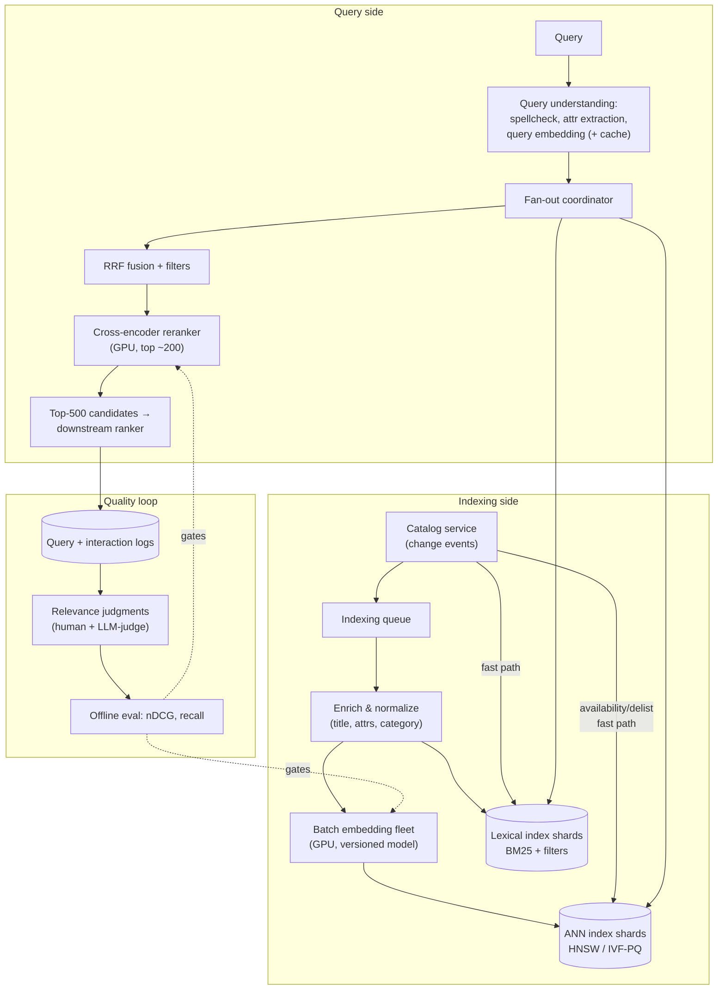

# Case Study 04: Semantic Search at Scale

> "Our e-commerce search is keyword-based and users complain that 'warm jacket for rainy commute' returns nothing useful. Design semantic search for a 100M-item catalog at 5,000 QPS with a sub-100ms latency budget."

## Problem statement

Replace/augment lexical product search with semantic retrieval for a large marketplace: 100M active listings, heavy query volume, hard latency budget (search is on the critical path of every shopping session - latency is directly revenue-correlated). Must handle both semantic queries ("gift for someone who likes hiking") and exact ones ("iPhone 15 Pro Max 256GB blue", SKU codes) - which immediately implies hybrid, not pure-vector, retrieval. Unlike the RAG case studies, there's no generation step in the hot path: this is retrieval *as the product*, where the interesting problems are index ops, latency budgets, and evaluation.

## Clarifying questions & assumptions

| Question | Assumption |
|---|---|
| Catalog size and churn? | 100M active items; ~2M new/updated/delisted per day; price/stock change far more often than descriptions |
| Query volume and latency? | 5,000 QPS peak (steady ~2,000); **p95 < 100ms** for the retrieval service (the search page has its own budget on top) |
| Query mix? | ~40% exact-ish (brand/model/SKU), ~45% broad category, ~15% truly semantic/long-tail |
| Personalisation / business ranking in scope? | A downstream ranking layer exists (CTR models, business rules); we own **candidate retrieval + first-stage relevance**, returning top ~200-500 candidates |
| Multi-language? | Yes eventually; assume English first, design must not preclude multilingual |
| Success metrics? | Online: search CTR, add-to-cart rate, conversion per search, zero-results rate, abandoned-search rate. Offline: nDCG@10, recall@100 |
| Infra preferences? | Self-hosted OK; this scale justifies owning the stack |

Stating the retrieval/ranking boundary ("I return calibrated top-500 candidates; the ranker owns final order") keeps the design scoped - say it explicitly.

## Requirements

### Functional
- Hybrid retrieval: lexical (BM25) + dense (embeddings), fused; structured filters (category, price, size, availability, region) composable with both.
- First-stage semantic reranking of fused candidates.
- Near-real-time indexing: new/updated listings searchable < 15 min; delisted items gone < 2 min (selling unavailable items is a trust problem).
- Query understanding: spell correction, category/attribute extraction, embedding of the (rewritten) query.
- Typeahead can reuse the stack but is out of scope here.

### Non-functional
- **Latency**: p95 < 100ms end-to-end for retrieval service; internal budget below.
- **Throughput**: 5,000 QPS peak, 2x headroom → design for 10,000 QPS.
- **Freshness**: content updates ≤ 15 min; availability/delisting ≤ 2 min (via a cheap doc-level update path, not re-embedding).
- **Quality**: +X% add-to-cart per search vs lexical baseline in A/B (the launch criterion); zero-results rate cut meaningfully on long-tail queries.
- **Availability**: 99.95%; search down = revenue down; degrade to lexical-only before failing.
- **Cost**: index infra + embedding compute; target well under $0.001/query serving cost.

### Latency budget (p95, the table interviewers want to see)

| Stage | Budget |
|---|---|
| Query understanding + query embedding (small model, GPU/ONNX-optimised, or cache hit) | 15ms |
| Lexical retrieval (BM25, sharded) - parallel with → | 25ms |
| Dense ANN retrieval (sharded, scatter-gather) | 30ms (overlapped) |
| Fusion (RRF) + filter application | 5ms |
| First-stage rerank (lightweight cross-encoder on top ~100-200) | 30ms |
| Assembly, hydration of doc fields | 10ms |
| **Total** | **~90ms** |

## High-level architecture



## Component deep-dives

### Hybrid retrieval: why both, and how to fuse

- **BM25** wins on exact matches: SKUs, model numbers, brand names, rare tokens. Dense embeddings famously fumble "SM-G998B" - it tokenizes into meaningless pieces. ~40% of e-commerce queries are this type; pure-vector search is a quality regression for them.
- **Dense** wins on vocabulary mismatch and intent: "warm jacket for rainy commute" → waterproof insulated commuter jackets that share zero keywords.
- **Fusion: Reciprocal Rank Fusion** is the pragmatic default: rank-based (no score-scale calibration between BM25 and cosine similarity, which live on incomparable scales), robust, one hyperparameter. Learned score fusion is a later optimisation once the reranker exists (and the reranker largely subsumes it).

```python
def rrf_fuse(result_lists, k=60):
    scores = defaultdict(float)
    for results in result_lists:                  # e.g. [bm25_top50, dense_top50]
        for rank, doc_id in enumerate(results, start=1):
            scores[doc_id] += 1.0 / (k + rank)    # rank-based: score scales never compared
    return sorted(scores, key=scores.get, reverse=True)
```
- **Filters** (price, size, in-stock, region) must be **pre-/in-filter for ANN**, not post-filter: post-filtering top-k after ANN collapses recall when filters are selective ("red size-XS raincoat under $50" may filter out 95% of the top-k). HNSW with filter-aware traversal or IVF with filtered scan; benchmark filtered recall explicitly - this is a classic hidden failure.

### Embedding model & representation

- A dual-encoder ("two-tower") setup: item text (title + key attributes + condensed description) and query embed into the same space. Start from a strong open-weight text-embedding model; **fine-tune on your own click/purchase pairs** - domain fine-tuning on real engagement data is one of the biggest quality levers, typically worth more than a bigger base model.
- Dimensionality is a cost knob: 768d float32 = ~300GB raw for 100M vectors (before index overhead); 384d + int8/PQ quantization brings a shard set into commodity-RAM territory. Matryoshka-style truncatable embeddings let you retrieve coarse at low dims and refine at full dims.
- Item text construction matters more than model choice at the margin: structured attributes flattened into text ("Category: rain jackets. Waterproof: yes. Insulation: fleece.") measurably beats raw description dumps.
- Query embedding at serve time: small encoder, quantized, ONNX/TensorRT on CPU or small GPU, ~5-10ms; plus a **query-embedding cache** - query traffic is Zipfian, and a normalised-query cache hits 30-60%, cutting both latency and encoder fleet size.
- Query understanding ahead of embedding, all budgeted inside the 15ms stage:

```python
def understand(raw_query: str) -> Query:
    q = normalize(raw_query)                    # lowercase, unicode, whitespace
    q = spell_correct(q)                        # noisy-channel / small model, ~2ms
    attrs = extract_attrs(q)                    # "under $50", "size XS" → filters, ~2ms
    residual = strip_attr_spans(q, attrs)       # embed only the semantic residue
    vec = embed_cache.get_or_compute(residual)  # ~5-10ms on miss, 30-60% hit rate
    return Query(text=q, vector=vec, filters=attrs.to_filters())
```

### ANN index: structure, memory math, ops

- Candidates: **HNSW** (great recall/latency, memory-hungry, costly deletes/rebuilds) vs **IVF-PQ/OPQ** (compact, fast bulk builds, slightly lower recall at same latency) vs **DiskANN-style** (SSD-resident, cheap at huge scale, higher tail latency). At 100M vectors with 2M daily updates and tight p95: a common pragmatic choice is **sharded HNSW with scalar/product quantization**, or IVF-PQ if memory dominates cost.
- Memory math to say out loud (the point is showing you can do it):

| Configuration | Vector storage | With HNSW graph (~1.5-2x) | Notes |
|---|---|---|---|
| 100M × 768d × fp32 | ~300GB | ~500GB+ | Naive baseline - don't |
| 100M × 384d × fp16 | ~77GB | ~130-150GB | Reasonable |
| 100M × 384d × int8 SQ | ~38GB | ~80-100GB | Common sweet spot; ~1-2% recall cost |
| 100M × 384d PQ (64 bytes/vec) | ~6.4GB | ~20-30GB | IVF-PQ route; more recall loss, cheapest |

- Take the int8 row: ~100GB → **8-16 shards of 8-16GB**, replicated 3x for QPS and availability → ~30-50 serving nodes. Entirely feasible on commodity memory-optimised instances.
- **Scatter-gather**: query fans out to all shards, each returns top-k, coordinator merges. Tail latency is governed by the slowest shard → hedge requests, tight per-shard timeouts, return-what-you-have on stragglers (slightly degraded recall beats a timeout).

```python
async def query_shard_hedged(shard, q, hedge_after_ms=20, timeout_ms=40):
    primary = shard.replica().search(q)
    try:
        return await wait_for(primary, hedge_after_ms)
    except Timeout:
        hedge = shard.other_replica().search(q)     # fire second replica
        done = await first_completed([primary, hedge], timeout_ms)
        return done or PARTIAL_MISS                  # coordinator merges what it has
```
- Tune `ef_search`/`nprobe` per traffic tier: recall@100 vs exact-KNN ≥ 95-98% on a sampled ground-truth set is the standing SLO; this is a *measured* quantity, re-verified per index build.
- Deletes/updates: HNSW handles in-place inserts but degrades with heavy churn → tombstone deletes + periodic segment rebuilds (nightly compaction), plus the fast doc-level path for availability flags (stored as filterable metadata, not baked into vectors).

### Reranker

- Cross-encoder (query and item text jointly encoded) over the top ~100-200 fused candidates. Cross-encoders are far more accurate than bi-encoder similarity but O(candidates) model calls → only affordable post-retrieval.
- Latency: a distilled ~100-400M-parameter reranker, batched on GPU, scores 200 pairs in ~20-30ms. Distill it from a large teacher (or an LLM judge) on your own click data.
- ROI framing: reranking typically delivers the largest single offline-nDCG jump in the stack; if forced to cut scope in the interview, cut learned fusion, keep the reranker.
- Cache reranked results for hot queries (again Zipf: high hit rates for head traffic) with short TTLs and availability-aware invalidation.

### Embedding refresh & index lifecycle

Two very different "refresh" problems - distinguish them explicitly:

1. **Item churn (continuous)**: 2M items/day → ~23 items/sec average embedding throughput; trivially handled by a small batch-GPU fleet (thousands of embeddings/sec/GPU for a small encoder). Updates flow: catalog event → re-embed if text changed → upsert to shard; availability/price changes skip embedding entirely (metadata-only fast path, < 2 min).
2. **Model version change (episodic, the dangerous one)**: embeddings are only comparable within one model version - you **cannot** mix v1 and v2 vectors in an index, and the query encoder must match the item encoder exactly. Version-stamp every vector and enforce encoder-version match at query time (a mismatch bug fails silently as "search feels worse" - nasty to debug, worth an assertion). The migration runbook:

| Step | Action | Gate |
|---|---|---|
| 1 | Full re-embed of 100M items with v2 (a few GPU-days, parallelize to hours) | Vector-norm distributions sane vs v1 |
| 2 | Build v2 index blue/green alongside v1 | ANN recall vs exact-KNN ≥ SLO |
| 3 | Shadow: mirror 100% of queries to v2, log both result sets | Offline nDCG on judgement set ≥ v1 per segment |
| 4 | Interleave v1/v2 on a traffic slice | Neutral-or-positive engagement |
| 5 | Flip serving alias to v2; v1 kept warm | Instant rollback available for ~1 week |
| 6 | Decommission v1; update query-encoder pin atomically with alias | - |

## Data & context strategy

- **Training data from behaviour logs**: (query → clicked/purchased item) pairs for embedding fine-tuning and reranker training; hard negatives mined from same-SERP-shown-but-skipped items (in-batch negatives alone are too easy and plateau quality).
- Bias correction: click data is position-biased - debias (e.g., inverse-propensity weighting from position randomisation on a small traffic slice) or your models learn "whatever was ranked first is relevant."
- **Item enrichment**: an offline **LLM batch pipeline** is the modern move - normalise titles, extract structured attributes from free-text descriptions, generate query-like synonyms per item. Batch API pricing makes 100M-item enrichment feasible (math below); this indirectly lifts both lexical and dense retrieval and is often the highest-leverage "AI" in the whole system.
- Cold-start items (no clicks): rely on content embeddings + category priors; boost exploration slightly in the downstream ranker so new items collect signal.
- Multilingual path: swap to a multilingual embedding model (one shared space, queries and items cross-lingual) - a model-version migration via the blue/green machinery above, which is why that machinery must exist from day one.

## Evaluation plan

**Offline:**
- **Judgement set**: ~5-10k queries stratified by segment (head/torso/tail, exact/semantic, per top category) × pooled candidates, graded 0-3 relevance. Human labels for a core set; **LLM-as-judge to scale labelling** (calibrated against the human core, ≥85% agreement target) - this is the 2026-standard way to afford tail coverage.
- Metrics: **nDCG@10** (ordering quality), **recall@100** (candidate-generation quality - the retrieval layer's own metric, measured before reranking), zero-results rate on the tail set.
- **ANN recall vs exact KNN** as a separate infra metric (index quality, not relevance quality - don't conflate them).
- Every change (embedding model, ef_search, fusion, reranker) runs the offline suite in CI with per-segment breakdowns; a global +1% nDCG hiding a -10% on SKU queries is a launch blocker.

**Metric summary:**

| Layer | Metric | Role |
|---|---|---|
| Infra | ANN recall@100 vs exact KNN | Index-quality SLO (≥ 95-98%) |
| Retrieval | recall@100 on judgement set | Candidate-generation quality |
| Ranking | nDCG@10 per segment | Ordering quality, CI gate |
| Coverage | zero-results rate (tail slice) | Long-tail health |
| Online | add-to-cart / conversion per search | North star |
| Online | reformulation + abandonment rate | Dissatisfaction signals |
| Guardrail | latency p95/p99, revenue per session | Never trade silently |

**Online:**
- Primary: add-to-cart per search, conversion per search session; secondary: CTR@k, zero-results rate, reformulation rate (quick re-query ≈ dissatisfaction), abandoned-search rate; guardrails: latency p95/p99, revenue per session.
- **Interleaving** (team-draft) for sensitive ranking comparisons - orders of magnitude more statistically efficient than A/B for ranking changes; conventional A/B for anything touching latency or UI.
- Long-term holdout (~1%) on the old system to measure cumulative drift and keep the offline suite honest.

## Cost estimate

Assumed ~prices, illustrative:

| Item | Math | ~Cost |
|---|---|---|
| ANN + lexical serving | ~40-60 nodes (memory-optimised + some GPU for rerank/encode) | ~$40-70k/mo |
| Query embedding compute | 5k QPS peak, ~50% cache hit → small GPU/CPU fleet | ~$3-5k/mo |
| Reranker GPUs | 5k QPS × 200 pairs, batched → ~10-20 inference GPUs | ~$15-30k/mo |
| Continuous re-embedding | 2M items/day × ~200 tokens; self-hosted encoder | ~$1k/mo |
| Full re-embed (episodic) | 100M × 200 tokens = 20B tokens; self-hosted ≈ few hundred GPU-hours, or API at ~$0.02-0.10/M | ~$400-2,000/event |
| LLM catalog enrichment (one-time + deltas) | 100M items × ~1k tokens through a small model via batch API at ~$0.10/M in (batch discount) | ~$15-25k one-time; deltas negligible |
| **Serving cost per query** | ~$100k/mo ÷ ~5B queries/mo | **~$0.00002/query** |

Two framing points: (1) unlike the generation-heavy case studies, cost here is **infra-shaped, not token-shaped** - capacity planning looks classic; (2) the episodic costs (re-embeds, enrichment) are noise next to serving, so never let "re-embedding is expensive" block an embedding-model upgrade that evals justify.

## Failure modes & mitigations

| Failure | Impact | Mitigation |
|---|---|---|
| Filtered-ANN recall collapse on selective filters | "No results" for narrow queries despite matching items | Filter-aware ANN benchmarking in CI; fall back to lexical-only for ultra-selective filter combos; category-scoped shard routing |
| Encoder/index version mismatch | Silent global relevance degradation | Version-stamped vectors, hard assertion at query path, blue/green flips as the only migration mechanism |
| Hot-shard / straggler tail latency | p99 blows the budget | Hedged requests, per-shard timeouts with partial-result merge, replica autoscaling, shard rebalancing |
| Delisted/out-of-stock items in results | Trust damage, dead clicks | 2-min metadata fast path; availability check at hydration as belt-and-braces; staleness monitors |
| Embedding drift vs catalog language (new product lines, slang) | Slow relevance decay | Scheduled fine-tune refreshes from recent logs; tail zero-results monitoring; offline suite refreshed quarterly |
| Click-bias feedback loop (models learn position, popular items entrench) | Long-tail quality stagnates | Propensity-debiased training, exploration traffic slice, per-segment eval gates |
| Index build pipeline failure | Freshness silently rots | Build lineage checks (doc counts, vector norms distribution), canary queries against every new segment, lag alerting |
| Reranker outage | Quality dip | Degrade to fused order (RRF) - measurably worse but fine; feature-flag kill switch |
| Adversarial sellers (keyword stuffing, embedding gaming) | Spam in results | Enrichment-time normalization, spam classifiers feeding an index-exclusion list, reranker trained with spam negatives |

## Scaling & ops

- **Sharding strategy**: random/hash sharding for uniform load (scatter-gather all shards) vs category-based routing (query fewer shards, but hot categories create hot shards) - start random, add routing only if fan-out cost dominates. Replicate shards for QPS: throughput scales linearly with replicas.
- **10x growth path** (1B items): quantize harder (PQ), move cold tail to SSD-resident ANN (DiskANN-style) keeping the head in RAM, more shards; the architecture doesn't change, the memory math does.
- **Deploys & index lifecycle**: immutable index segments, versioned builds with lineage metadata, alias-flip promotion, previous version retained for rollback; nightly compaction merges tombstones; every build passes canary + recall-vs-KNN checks before promotion.
- **Autoscaling**: query-side stateless services scale on QPS; ANN nodes scale by replica; batch embedding fleet scales to queue depth (bursts on big seller uploads).
- **Observability**: per-stage latency histograms, per-shard recall spot checks, cache hit rates (query-embedding + result caches), zero-results rate in real time (a spike is the best early-warning for index breakage), freshness lag from catalog event → searchable.
- **Rollout**: launch semantic as **candidate augmentation** behind the existing lexical system (union the candidate sets, let the ranker decide) - near-zero downside risk, clean incremental A/B; only later consider retiring lexical-primary. Interviewers reward this "strangler-fig" deployment answer.

## Likely interviewer follow-ups

- *"Your p99 is 250ms but p95 is fine. Where do you look?"* (Scatter-gather stragglers: slowest-shard distribution, GC/compaction pauses on index nodes, hedging misconfigured, reranker batch queuing at peak. Fix order: hedged requests, partial-result merges, isolate compaction to replicas out of rotation.)
- *"Why not just use one of the vector-DB SaaS products?"* (Fair at 1-10M vectors; at 100M × 5k QPS × sub-100ms with heavy filters and custom fusion/rerank, cost and control favor self-hosting - but I'd prototype on managed to validate quality first. Give the honest scale-dependent answer.)
- *"How do you evaluate the tail where you have no clicks?"* (LLM-judge-scaled judgements calibrated on human labels, zero-results and reformulation-rate monitoring, targeted human eval on stratified tail samples, exploration traffic to gather signal.)
- *"The embedding model upgrade improves nDCG +3% offline but interleaving is flat. Ship it?"* (Investigate segment mix first - offline suite may over-represent tail; check latency regression eating the quality gain; if truly flat online at equal cost, ship only if it unlocks something else, e.g. multilingual. Offline metrics are means, not ends.)
- *"How would filters interact with HNSW exactly - what goes wrong?"* (Post-filtering: top-k shrinks after filter → recall collapse. In-traversal filtering: graph connectivity breaks under selective filters → traversal dead-ends; needs filter-aware algorithms, higher ef, or pre-partitioned indexes per coarse facet. This is a depth-check question - the failure mechanism is the answer.)
- *"Personalised embeddings per user?"* (Not in retrieval v1: personalisation lives in the downstream ranker where it's cheaper and safer. Retrieval-layer personalisation - user-conditioned query embeddings - is a research-grade complexity jump; consider a user-segment feature in the reranker as middle ground.)
- *"What breaks when marketing runs a Super Bowl ad?"* (10x query spike, head-heavy → caches absorb most of it - hit rate climbs during spikes; query-encoder fleet is the scaling pinch point; pre-scale on schedule, shed to lexical-only under extreme load, protect indexing pipeline from being starved by serving.)
